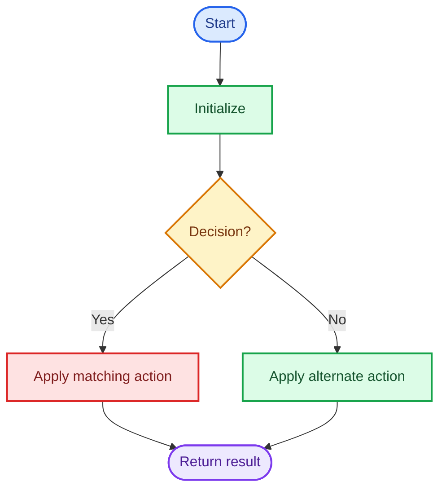
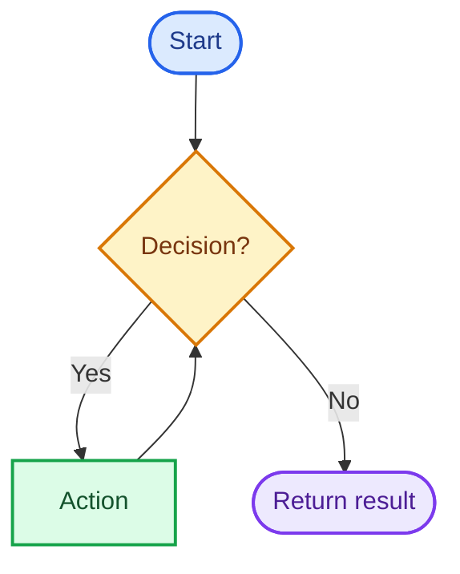

# Cornell Notes

## Topic: Leetcode - {{NUMBER}} - {{TITLE}}

## Date: {{DD/MM/YYYY}}

---

<p align="center"><strong><em>"DO NOT JUST TALK ABOUT IT — SHOW IT"</em></strong></p>

---

### Problem Description

{{PROBLEM_STATEMENT}}

#### Example 1

```text
Input:  {{INPUT}}
Output: {{OUTPUT}}
```

{{EXPLANATION}}

#### Constraints

- {{CONSTRAINT}}

#### Function Contract

- **Input:** {{INPUT_CONTRACT}}
- **Output:** {{OUTPUT_CONTRACT}}
- **Mutation:** {{MUTATION_CONTRACT}}
- **Ordering:** {{ORDERING_CONTRACT}}

---

### Cue Column (Questions, Keywords, or Prompts)

- {{PATTERN_QUESTION}}
- {{INVARIANT_QUESTION}}
- {{COMPLEXITY_QUESTION}}
- {{EDGE_CASE_QUESTION}}

---

### Notes Section (Main Notes)

## Mindset First (language-agnostic)

- Pattern: {{PATTERN}}
- Invariant: {{INVARIANT}}
- Target time: `{{TIME_COMPLEXITY}}`
- Target auxiliary space: `{{SPACE_COMPLEXITY}}`

## Strategy A: {{OPTIMAL_STRATEGY}}

- Core idea: {{CORE_IDEA}}
- Algorithm:
	1. {{STEP_1}}
	2. {{STEP_2}}
	3. {{STEP_3}}
- Correctness: {{CORRECTNESS}}
- Complexity: `{{TIME_COMPLEXITY}}` time, `{{SPACE_COMPLEXITY}}` auxiliary space.

### Strategy A Flow



## Strategy B: {{ALTERNATIVE_STRATEGY}}

- Core idea: {{CORE_IDEA}}
- Trade-off: {{TRADE_OFF}}
- Complexity: `{{TIME_COMPLEXITY}}` time, `{{SPACE_COMPLEXITY}}` auxiliary space.

### Strategy B Flow



<!-- Add Strategy C and its Mermaid-only flow only when meaningful. -->

## Common Failure Points (all languages)

- {{FAILURE_POINT}}

## Edge Cases to Test

| Case | Input | Expected | Notes |
|------|-------|----------|-------|
| {{CASE}} | `{{INPUT}}` | `{{EXPECTED}}` | {{NOTES}} |

## Why {{OPTIMAL_STRATEGY}} is Interview Gold

1. {{REASON}}

## Implementation Checklist

- [ ] Handle minimum input.
- [ ] Handle boundary positions.
- [ ] Verify repeated patterns.
- [ ] Verify time and auxiliary-space complexity.

---

### Summary Section (Summary of Notes)

{{SUMMARY}}
