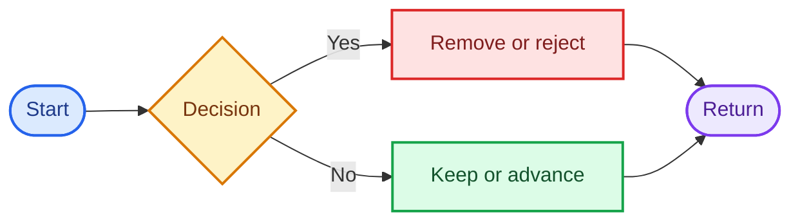
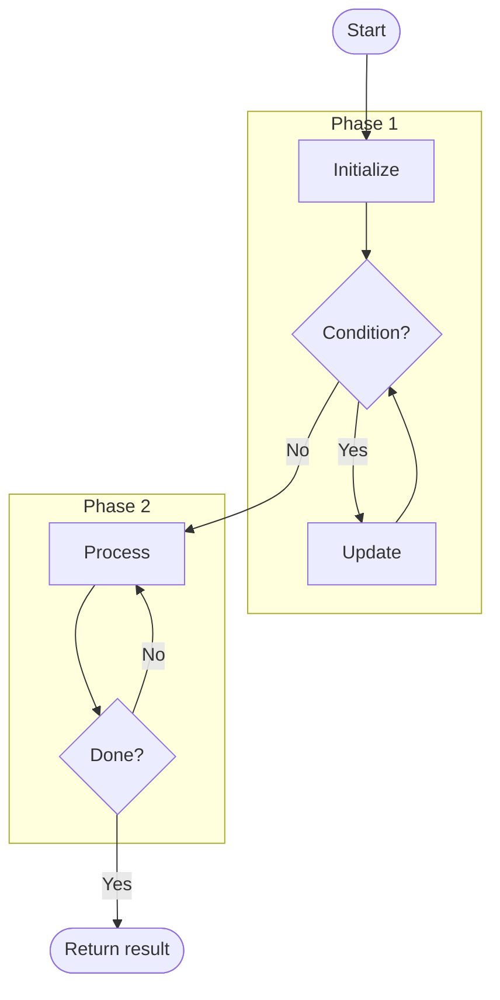

# Mermaid Flow Standard

## Diagram Rules

- Use `flowchart TD` unless another direction materially improves clarity.
- Show start, decisions, state changes, loops, and returns.
- Label decision edges `Yes` and `No`.
- Use rounded nodes for start and return.
- Use subgraphs for phases, multiple passes, or recursion descent/unwind.
- Keep node labels short and technically exact.
- Use Mermaid `classDef`.
- Do not use HTML `<style>` blocks or external CSS.
- Keep only Mermaid fence inside each `### Strategy X Flow` section.

## Paired Generic and Worked-Example Flows

Create two separate diagrams for every documented strategy:

1. `### Strategy X Flow` explains the reusable algorithm with symbolic variables and loop or recursion structure.
2. `### Strategy X Worked Example Flow` executes one concrete valid input with real values.

Never replace the generic diagram with the worked example.

In each worked-example diagram:

- Begin with the concrete input and initial variable, pointer, index, or structure state.
- Label the actual result of each decision edge.
- Show saved values before destructive updates.
- Show state after every meaningful mutation or movement.
- Continue until the concrete return value or output is visible.
- For recursion, use descent and unwind subgraphs; show the base-case result and the changes performed by each returning frame.
- Prefer one compact update node per iteration or recursive frame when separate assignment nodes would make the diagram unreadable.

Keep only one Mermaid fence inside each `### Strategy X Worked Example Flow` section.

## Semantic Palette

Color meanings:

- Blue: start or initialization.
- Yellow: decision.
- Red: removal, rejection, or failure.
- Green: keep, accept, or advance.
- Cyan: recursion or subproblem.
- Purple: return or completion.

## Multi-Phase Pattern

Add semantic `classDef` declarations and class assignments to every final flow.
