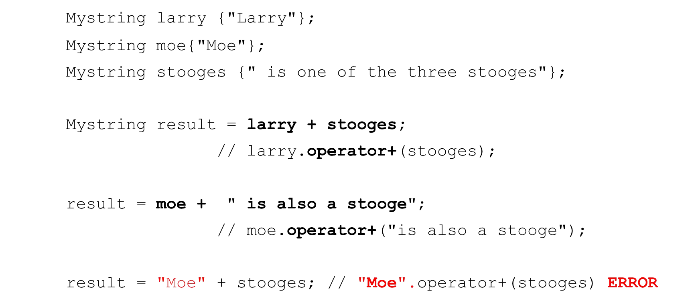

# Cornell Notes

## Topic: OVerloading Operators as Member Functions

## Date: 29/05/2026

---

### Cue Column (Questions, Keywords, or Prompts)

- [Insert question or keyword]
- [Insert question or keyword]
- [Insert question or keyword]

---

### Notes Section (Main Notes)

#### Unary operators as member methods (++, --, -, !)

#### Mystring operator- make lowercase

#### Binary operators as member methods (+,-,==,!=,<,>, etc.)

#### Mystring operator==

#### Mystring operator+ (concatenation)

---

### Summary Section (Summary of Notes)

[Insert a brief summary of the key ideas and takeaways]