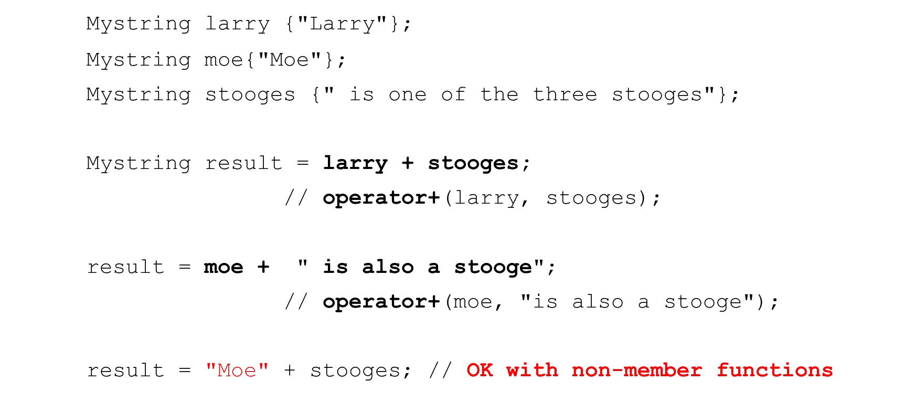

# Cornell Notes

## Topic: Overloading Operatiors as Global Functions

## Date: 29/05/2026

---

### Cue Column (Questions, Keywords, or Prompts)

- [Insert question or keyword]
- [Insert question or keyword]
- [Insert question or keyword]

---

### Notes Section (Main Notes)

#### Unary operators as global functions (++, --, -, !)


#### Mystring operator- make lowercase


- Often declared as friend functions in the class declaration

```cpp
Mystring operator-(const Mystring &obj) {
    char *buff = new char[std::strlen(obj.str) + 1];
    std::strcpy(buff, obj.str);
    for (size_t i=0; i<std::strlen(buff); i++)
        buff[i] = std::tolower(buff[i]);
    Mystring temp {buff};
    delete [] buff;
    return temp;
}
```

#### Binary operators as global functions (+,-,==,!=,<,>, etc.)


#### Mystring operator==

```cpp
bool operator==(const Mystring &lhs, const Mystring &rhs){
    if (std::strcmp(lhs.str, rhs.str) == 0)
        return true;
    else
        return false;
}
```
- If declared as a friend of `Mystring` can access private str attribute
- Otherwise we must use getter methods

#### Mystring operator+ (concatenation)




---

### Summary Section (Summary of Notes)

[Insert a brief summary of the key ideas and takeaways]