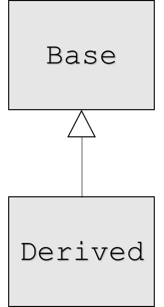
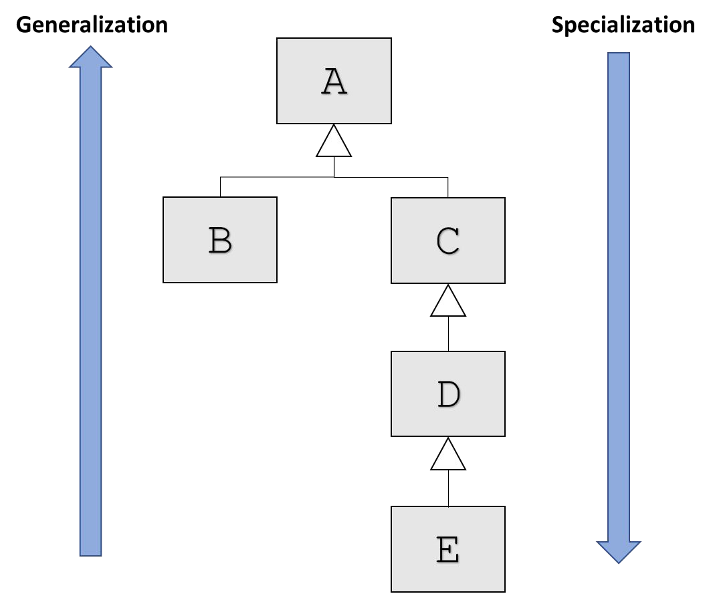
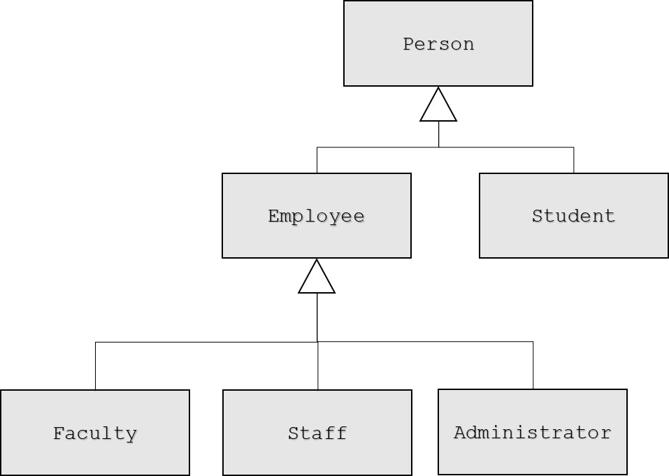

# Cornell Notes

## Topic: Terminology and Notation

## Date: 29/05/2026

---

### Cue Column (Questions, Keywords, or Prompts)

- [Insert question or keyword]
- [Insert question or keyword]
- [Insert question or keyword]

---

### Notes Section (Main Notes)

#### Terminology
- Inheritance
  - Process of creating new classes from existing classes
  - Reuse mechanism
- Single Inheritance
  - A new class is created from another ‘single’ class
- Multiple Inheritance
  - A new class is created from two (or more) other classes

- Base class (parent class, super class)
  - The class being extended or inherited from
- Derived class (child class, sub class)
  - The class being created from the Base class
  - Will inherit attributes and operations from Base class
- “Is-A” relationship
  - Public inheritance
  - Derived classes are sub-types of their Base classes
  - Can use a derived class object wherever we use a base class object
- Generalization
  - Combining similar classes into a single, more general class based on common attributes
- Specialization
  - Creating new classes from existing classes proving more specialized attributes or operations
- Inheritance or Class Hierarchies
  - Organization of our inheritance relationships

#### Class hierarchy

- Classes:
  - A
  - B is derived from A
  - C is derived from A
  - D is derived from C
  - E is derived from D

- Classes:
  - Person
  - Employee is derived from Person
  - Student is derived from Person
  - Faculty is derived from Employee
  - Staff is derived from Employee
  - Administrator is derived from Employee

---

### Summary Section (Summary of Notes)

[Insert a brief summary of the key ideas and takeaways]