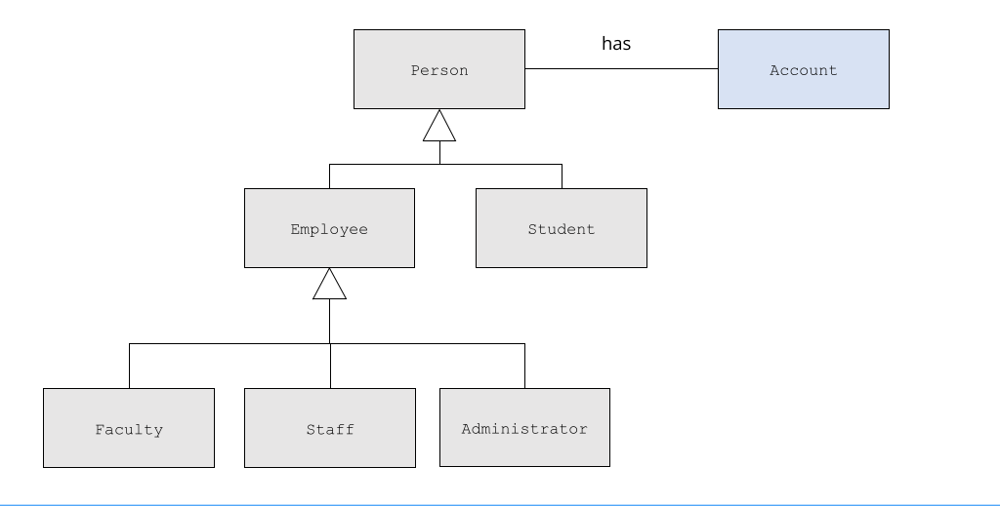

# Cornell Notes

## Topic: Inheritance vs. Composition

## Date: 29/05/2026

---

### Cue Column (Questions, Keywords, or Prompts)

- [Insert question or keyword]
- [Insert question or keyword]
- [Insert question or keyword]

---

### Notes Section (Main Notes)

#### Public Inheritance vs. Composition
- Both allow reuse of existing classes
- Public Inheritance
  - “is-a” relationship
    - Employee ‘is-a’ Person
    - Checking Account ‘is-a’ Account
    - Circle “is-a” Shape
- Composition
  - “has-a” relationship
    - Person “has a” Account
    - Player “has-a” Special Attack
    - Circle “has-a” Location

#### Public Inheritance vs. Composition



```cpp
class Person {
private:
    std::string name; // has-a name
    Account account; // has-a account
};
```

---

### Summary Section (Summary of Notes)

[Insert a brief summary of the key ideas and takeaways]