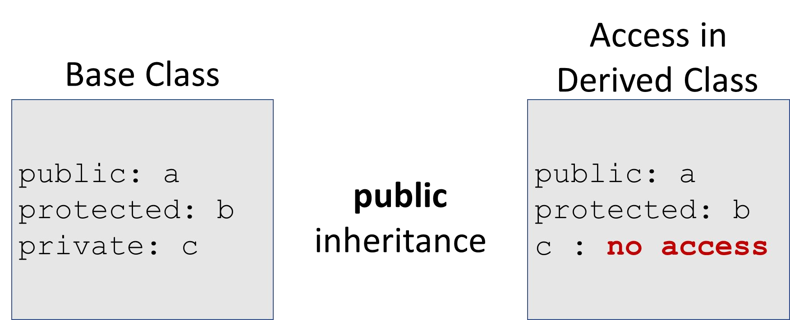
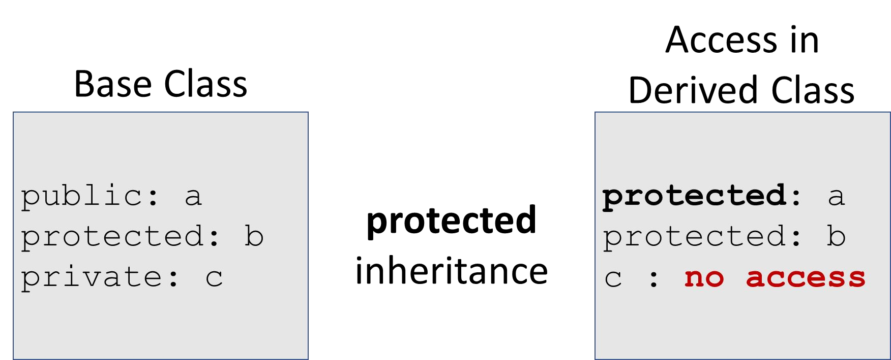
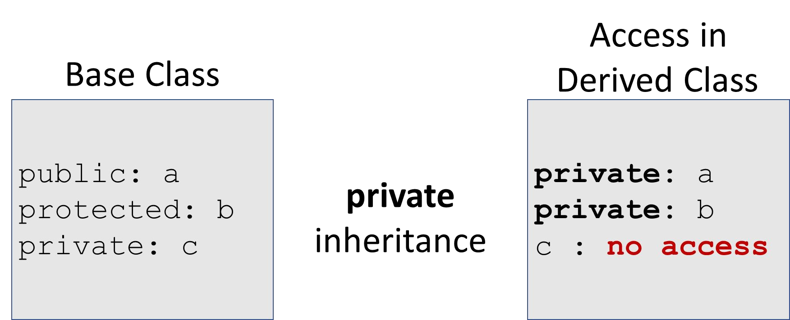

# Cornell Notes

## Topic: Protected Members and Class Access

## Date: 03/06/2026

---

### Cue Column (Questions, Keywords, or Prompts)

- [Insert question or keyword]
- [Insert question or keyword]
- [Insert question or keyword]

---

### Notes Section (Main Notes)

#### The protected class member modifier

```cpp
class Base {
protected:
    // protected Base class members . . .
};
```
- Accessible from the Base class itself
- Accessible from classes Derived from Base
- Not accessible by objects of Base or Derived

```cpp
class Base {
public:
    int a;
    // public Base class members . . .
protected:
    int b; // protected Base class members . . .
private:
    int c; // private Base class members . . .
};
```

#### Access with `public` inheritance



#### Access with `protected` inheritance




#### Access with `private` inheritance



---

### Summary Section (Summary of Notes)

[Insert a brief summary of the key ideas and takeaways]