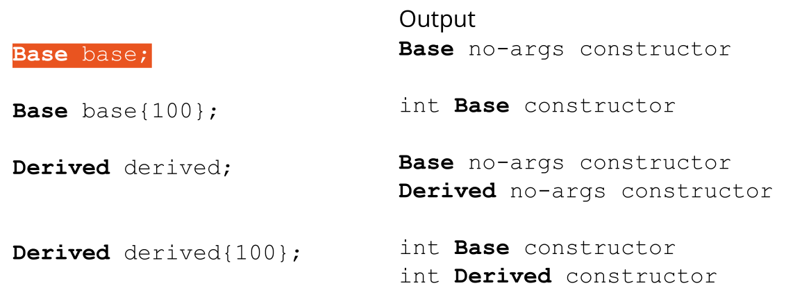

# Cornell Notes

## Topic: Passing Arguments to Base Class Constructors

## Date: 05/06/2026

---

### Cue Column (Questions, Keywords, or Prompts)

- [Insert question or keyword]
- [Insert question or keyword]
- [Insert question or keyword]

---

### Notes Section (Main Notes)

#### Passing arguments to base class constructors

- The Base part of a Derived class must be initialized first
- How can we control exactly which Base class constructor is used during initialization?
- We can invoke the whichever Base class constructor we wish in the initialization list of the Derived class

```cpp
class Base {
public:
    Base();
    Base(int);
    . . .
};
Derived::Derived(int x)
    : Base(x), {optional initializers for Derived} {
    // code
}
```

#### Constructors and class initialization

```cpp
class Base {
    int value;
public:
    Base(): value{0} {
    cout << "Base no-args constructor" << endl;
    }
    Base(int x) : value{x} {
    cout << "int Base constructor" << endl;
    }
};
```
```cpp
class Derived : public Base {
    int doubled_value;
public:
    Derived(): Base{}, doubled_value{0} {
    cout << "Derived no-args constructor " << endl;
    }
    Derived(int x) : Base{x}, doubled_value {x*2} {
    cout << "int Derived constructor " << endl;
    }
};
```


---

### Summary Section (Summary of Notes)

[Insert a brief summary of the key ideas and takeaways]