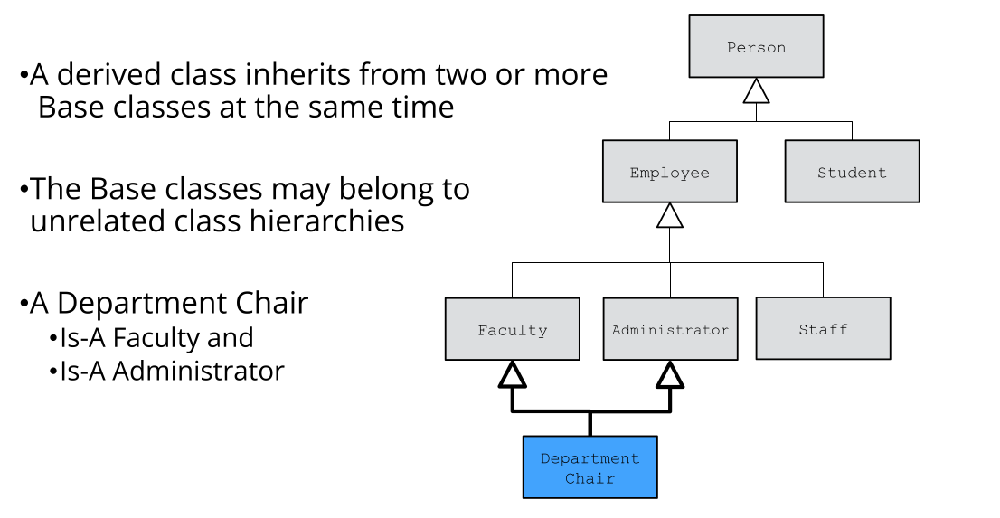

# Cornell Notes

## Topic: Multiple Inheritance

## Date: 05/06/2026

---

### Cue Column (Questions, Keywords, or Prompts)

- [Insert question or keyword]
- [Insert question or keyword]
- [Insert question or keyword]

---

### Notes Section (Main Notes)

#### Multiple Inheritance



#### C++ Syntax

```cpp
class Department_Chair:
    public Faculty, public Administrator {
    . . .
};
```
- Beyond the scope of this course
- Some compelling use-cases
- Easily misused
- Can be very complex


---

### Summary Section (Summary of Notes)

[Insert a brief summary of the key ideas and takeaways]