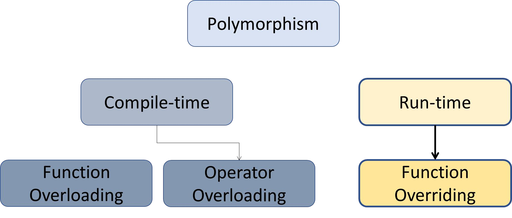
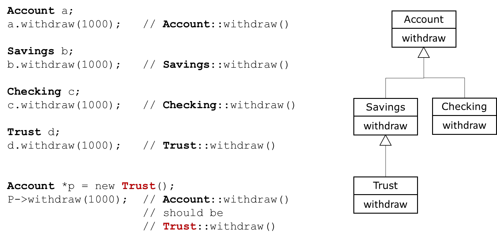
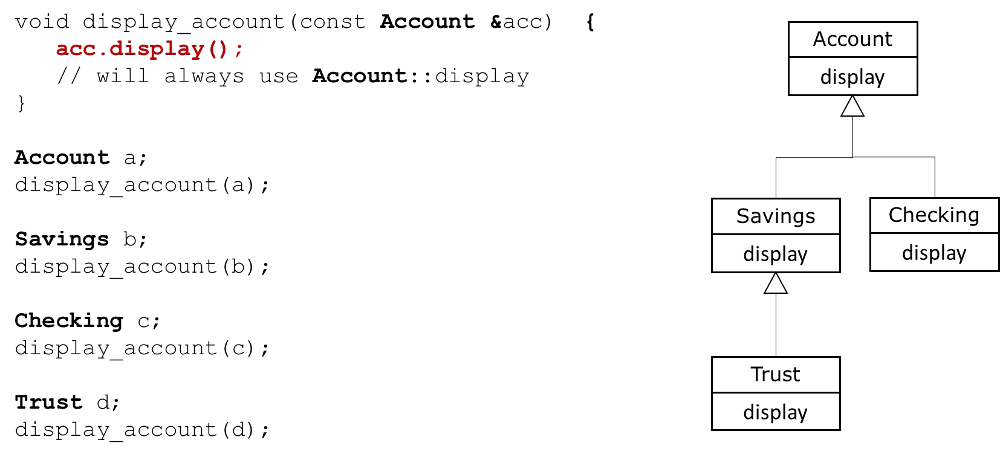
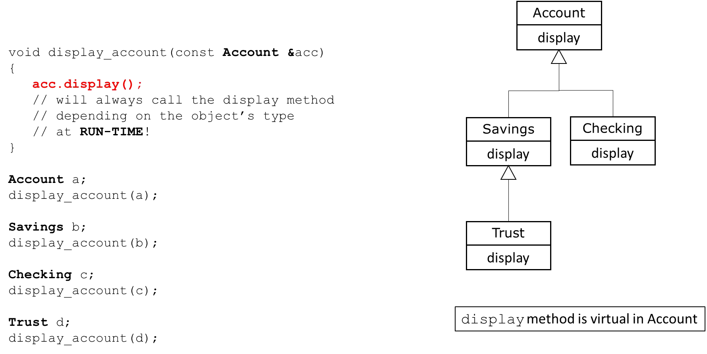

# Cornell Notes

## Topic: What is Polymorphism?

## Date: 07/06/2026

---

### Cue Column (Questions, Keywords, or Prompts)

- [Insert question or keyword]
- [Insert question or keyword]
- [Insert question or keyword]

---

### Notes Section (Main Notes)

#### What is Polymorphism?

- Fundamental to Object-Oriented Programming
- **Polymorphism**
  - Compile-time / early binding / static binding
  - Run-time / late binding / dynamic binding
- Runtime polymorphism
  - Being able to assign different meanings to the same function at run-time
- Allows us to program more abstractly
  - Think general vs. specific
  - Let C++ figure out which function to call at run-time
- Not the default in C++, run-time polymorphism is achieved via
  - Inheritance
  - Base class pointers or references
  - **virtual functions**

#### Types of Polymorphism in C++

#### An non-polymorphic example – Static Binding

#### A polymorphic example – Dynamic Binding

---

### Summary Section (Summary of Notes)

- Polymorphism is a core concept in Object-Oriented Programming.
- It allows functions to have different behaviors based on the object that invokes them.
- Compile-time polymorphism is achieved through function overloading and operator overloading.
- Run-time polymorphism is achieved through inheritance, base class pointers or references, and **virtual functions**.
