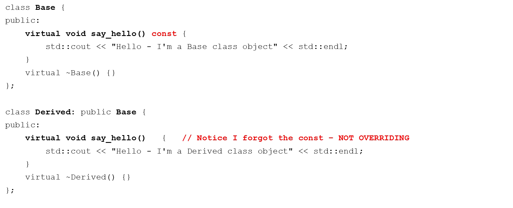
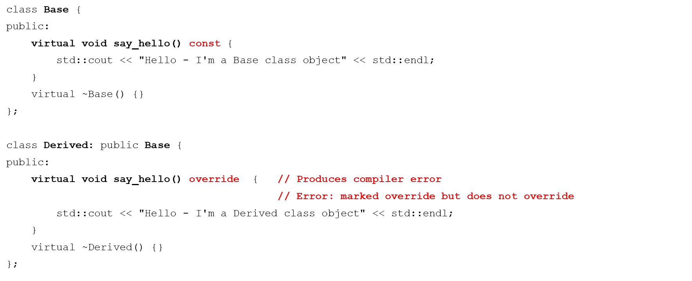

# Cornell Notes

## Topic: Using the Override Specififer

## Date: 07/06/2026

---

### Cue Column (Questions, Keywords, or Prompts)

- [Insert question or keyword]
- [Insert question or keyword]
- [Insert question or keyword]

---

### Notes Section (Main Notes)

#### The override specifier

- We can override Base class virtual functions
- The function signature and return must be EXACTLY the same
- If they are different then we have redefinition NOT overriding
- Redefinition is statically bound
- Overriding is dynamically bound
- C++11 provides an override specifier to have the compiler ensure overriding




```cpp
Base *p1 = new Base();
p1->say_hello(); // "Hello - I'm a Base class object"

Base *p2 = new Derived();
p2->say_hello(); // "Hello - I'm a Base class object"
```

- Not what we expected
- `say_hello` method signatures are different
- So `Derived` redefines `say_hello` instead of overriding it!



---

### Summary Section (Summary of Notes)

[Insert a brief summary of the key ideas and takeaways]