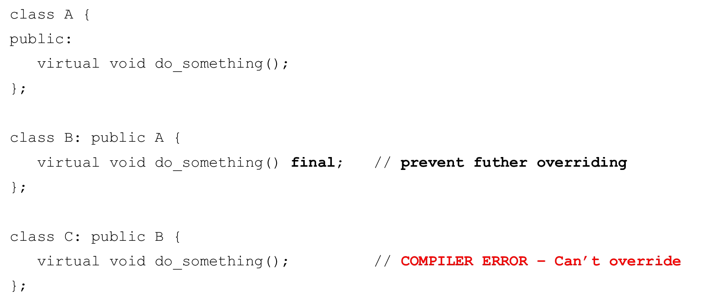

# Cornell Notes

## Topic: Using the Final Specifier

## Date: 07/06/2026

---

### Cue Column (Questions, Keywords, or Prompts)

- [Insert question or keyword]
- [Insert question or keyword]
- [Insert question or keyword]

---

### Notes Section (Main Notes)

#### The `final` specifier

- C++11 provides the `final` specifier
  - When used at the class level
    - Prevents a class from being derived from
  - When used at the method level
    - Prevents virtual method from being overridden in derived classes

#### `final` class

#### `final` method

---

### Summary Section (Summary of Notes)

[Insert a brief summary of the key ideas and takeaways]