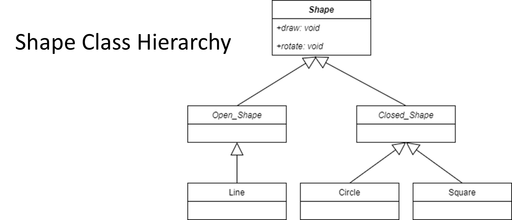
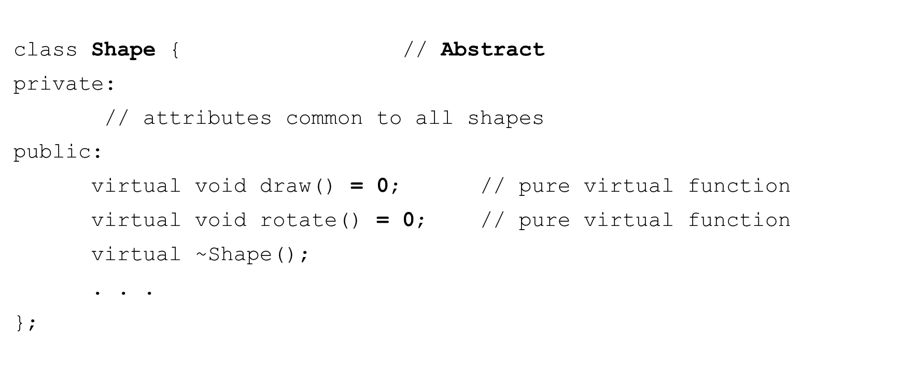
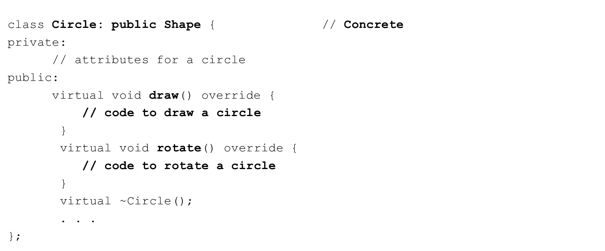

# Cornell Notes

## Topic: Pure Virtual Functions and Abstract Classes

## Date: 08/06/2026

---

### Cue Column (Questions, Keywords, or Prompts)

- [Insert question or keyword]
- [Insert question or keyword]
- [Insert question or keyword]

---

### Notes Section (Main Notes)

#### Pure virtual functions and abstract classes

- Abstract class
  - Cannot instantiate objects
  - These classes are used as base classes in inheritance hierarchies
  - Often referred to as Abstract Base Classes
- Concrete class
  - Used to instantiate objects from
  - All their member functions are defined
    - Checking Account, Savings Account
    - Faculty, Staff
    - Enemy, Level Boss

- Abstract base class
  - Too generic to create objects from
    - Shape, Employee, Account, Player
  - Serves as parent to Derived classes that may have objects
  - Contains at least one pure virtual function
  - Cannot be instantiated
  ```cpp
  Shape shape; // Error
  Shape *ptr = new Shape(); // Error
  ```
  - We can use pointers and references to dynamically refer to concrete classes derived from them
  ```cpp
  Shape *ptr = new Circle();
  ptr->draw();
  ptr->rotate();
  ```

- Pure virtual function
  - Used to make a class abstract
  - Specified with “=0” in its declaration 
  ```
  virtual void function() = 0; // pure virtual function
  ```
  - Typically do not provide implementations
  - Derived classes MUST override the base class
  - If the Derived class does not override then the Derived class is also abstract
  - Used when it doesn't make sense for a base class to have an implementation
    - But concrete classes must implement it
    ```
    virtual void draw() = 0; // Shape
    virtual void defend() = 0; // Player
    ```








---

### Summary Section (Summary of Notes)

[Insert a brief summary of the key ideas and takeaways]