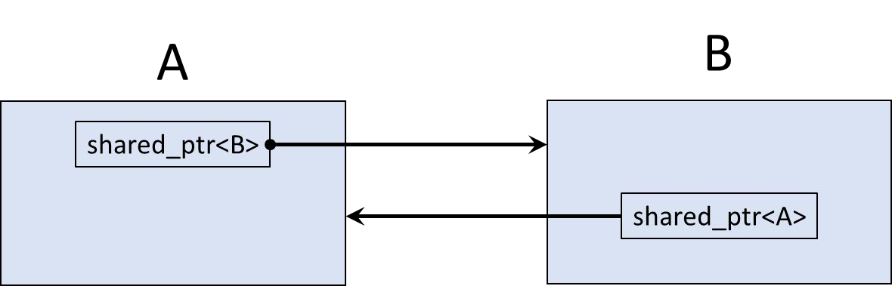
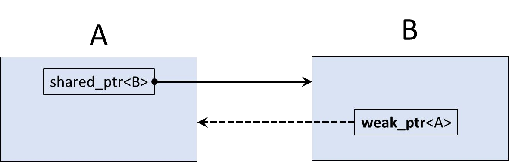

# Cornell Notes

## Topic: Weak pointers

## Date: 09/06/2026

---

### Cue Column (Questions, Keywords, or Prompts)

- [Insert question or keyword]
- [Insert question or keyword]
- [Insert question or keyword]

---

### Notes Section (Main Notes)

#### weak_ptr

- Provides a non-owning “weak” reference

- `weak_ptr<T>`
  - Points to an object of type T on the heap
  - Does not participate in owning relationship
  - Always created from a shared_ptr
  - Does NOT increment or decrement reference use count
  - Used to prevent strong reference cycles which could prevent objects from being deleted

#### `weak_ptr` – circular or cyclic reference

- A refers to B
- B refers to A
- Shared strong ownership prevents heap deallocation

- Solution – make one of the pointers non-owning or ‘weak’
- Now heap storage is deallocated properly

---

### Summary Section (Summary of Notes)

[Insert a brief summary of the key ideas and takeaways]