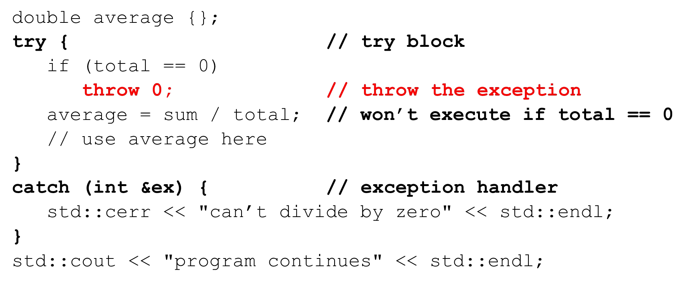

# Cornell Notes

## Topic: Basic Concepts and a Simple Example: Dividing by Zero

## Date: 09/06/2026

---

### Cue Column (Questions, Keywords, or Prompts)

- [Insert question or keyword]
- [Insert question or keyword]
- [Insert question or keyword]

---

### Notes Section (Main Notes)

#### Basic concepts

- Exception handling
  - dealing with extraordinary situations
  - indicates that an extraordinary situation has been detected or has occurred
  - program can deal with the extraordinary situations in a suitable manner
- What causes exceptions?
  - insufficient resources
  - missing resources
  - invalid operations
  - range violations
  - underflows and overflows
  - Illegal data and many others
- Exception safe
  - when your code handles exceptions

#### Terminology

- Exception
  - an object or primitive type that signals that an error has occurred
- Throwing an exception (raising an exception)
  - your code detects that an error has occurred or will occur
  - the place where the error occurred may not know how to handle the error
  - code can throw an exception describing the error to another part of the program that knows how to handle the error
- Catching an exception (handle the exception)
  - code that handles the exception
  - may or may not cause the program to terminate

#### C++ Syntax

- `throw`
  - throws an exception
  - followed by an argument

- `try { code that may throw an exception }`
  - you place code that may throw an exception in a try block
  - if the code throws an exception the try block is exited
  - the thrown exception is handled by a catch handler
  - if no catch handler exists the program terminates

- `catch(Exception ex) { code to handle the exception }`
  - code that handles the exception
  - can have multiple catch handlers
  - may or may not cause the program to terminate

#### Divide by zero example

- What happens if `total` is zero?
  - crash, overflow?
  - it depends

---

### Summary Section (Summary of Notes)

[Insert a brief summary of the key ideas and takeaways]