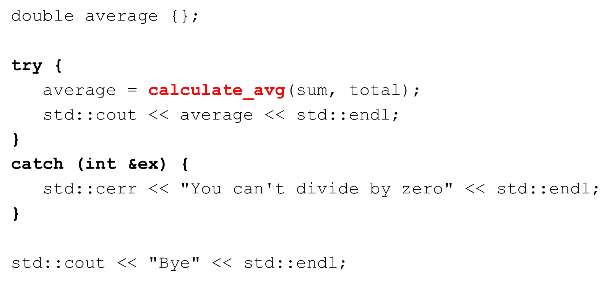

# Cornell Notes

## Topic: Throwing an Exception from a Function

## Date: 09/06/2026

---

### Cue Column (Questions, Keywords, or Prompts)

- What do we return if total is zero?
- How do we handle exceptions in a function?
- What is the syntax for throwing an exception?

---

### Notes Section (Main Notes)

#### What do we return if total is zero?

#### Throw an exception if we can’t complete successfully

#### Catching an exception thrown from a function

---

### Summary Section (Summary of Notes)

- Functions can throw exceptions to indicate errors.
- Use the `throw` keyword to signal an error condition.
- Catch exceptions using `try` and `catch` blocks to handle errors gracefully.