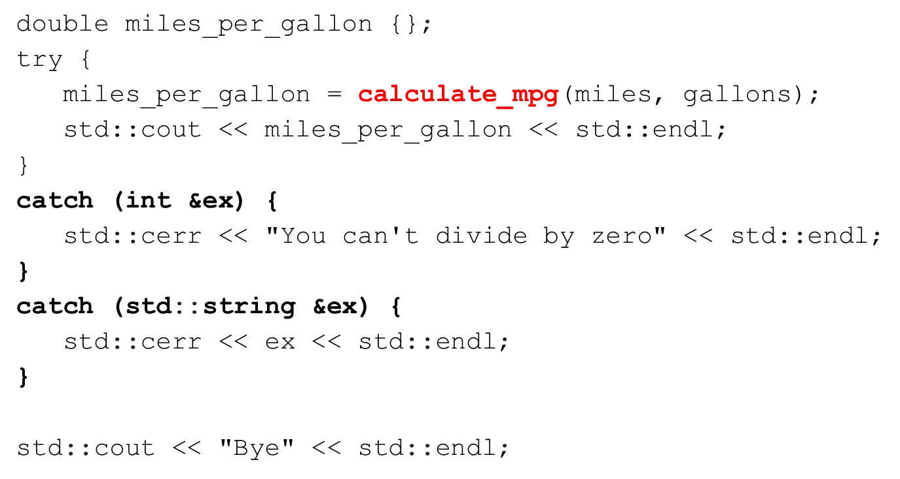

# Cornell Notes

## Topic: Handling Multiple Exceptions

## Date: 09/06/2026

---

### Cue Column (Questions, Keywords, or Prompts)

- [Insert question or keyword]
- [Insert question or keyword]
- [Insert question or keyword]

---

### Notes Section (Main Notes)

#### Throwing multiple exceptions from a function

- What if a function can fail in several ways
  - `gallons` is zero
  - `miles` or `gallons` is negative

#### Throwing an exception from a function

- Throw different type exceptions for each condition

#### Catching an exception thrown from a function

#### Catching any type of exception

---

### Summary Section (Summary of Notes)

- Functions can throw multiple exceptions for different error conditions.
- Use different exception types to indicate different errors.
- Catch exceptions using appropriate catch blocks to handle each type.