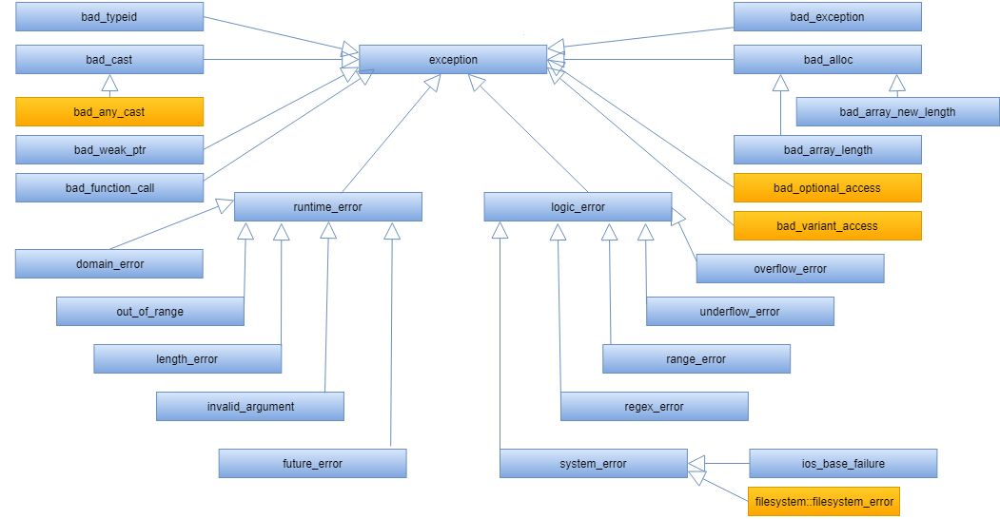

# Cornell Notes

## Topic: The C++ std::exception Class Hierachy

## Date: 11/06/2026

---

### Cue Column (Questions, Keywords, or Prompts)

- What is the C++ std::exception class hierarchy?
- What are the main derived classes of std::exception?
- How do different exception types relate to each other?

---

### Notes Section (Main Notes)

#### The C++ standard library exception class hierarchy

- C++ provides a class hierarchy of exception classes
  - `std::exception` is the base class
  - all subclasses implement the `what()` virtual function
  - we can create our own user-defined exception subclasses

#### Deriving our class from std::exception

#### Our modified Account class constructor

#### Creating an Account object

---

### Summary Section (Summary of Notes)

[Insert a brief summary of the key ideas and takeaways]