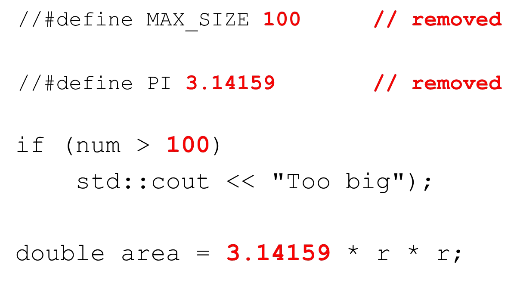

# Cornell Notes

## Topic: Generic Programming with Macros

## Date: 15/06/2026

---

<p align="center"><strong><em>"DO NOT JUST TALK ABOUT IT — SHOW IT"</em></strong></p>

---

### Cue Column (Questions, Keywords, or Prompts)

- [Insert question or keyword]
- [Insert question or keyword]
- [Insert question or keyword]

---

### Notes Section (Main Notes)

#### Generic Programming with Macros

- Generic programming 

> “Writing code that works with a variety of types as arguments, as long as those argument types meet specific syntactic and semantic requirements”, Bjarne Stroustrup

- Macros **beware**
- Function templates
- Class templates

#### Macros `#define`

- C++ preprocessor directives
- No type information
- Simple substitution

```cpp
#define MAX_SIZE 100
#define PI 3.14159

if(num > MAX_SIZE) {
    // do something
}
double area = PI * radius * radius;
```



#### max function

- Suppose we need a function to determine the max of 2 integers


- Now suppose we need to determine the max of 2 doubles, and 2 chars


#### Macros with arguments `#define`

- We can write a generic macro with arguments instead


- We have to be careful with macros


- Solution:


---

### Summary Section (Summary of Notes)

- Macros can be used for generic programming but lack type safety.
- Function templates and class templates provide a safer and more flexible way to achieve generic programming.
- Always be cautious with macros to avoid unexpected behavior.