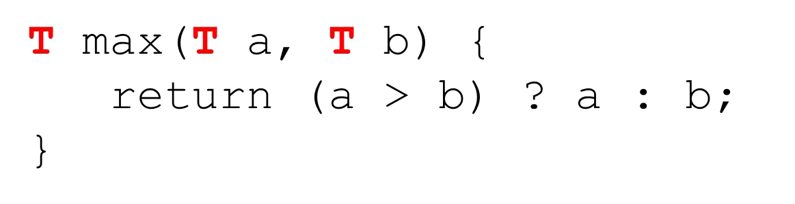
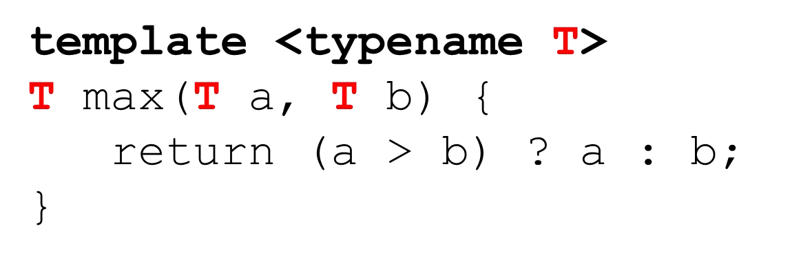
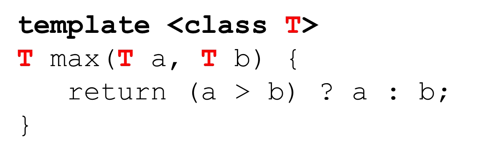
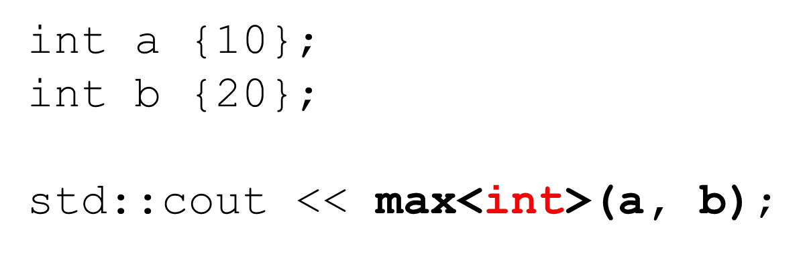

# Cornell Notes

## Topic: Generic Programming with Function Templates

## Date: 15/06/2026

---

<strong><em>"DO NOT JUST TALK ABOUT IT — SHOW IT"</em></strong>

---

### Cue Column (Questions, Keywords, or Prompts)

- [Insert question or keyword]
- [Insert question or keyword]
- [Insert question or keyword]

---

### Notes Section (Main Notes)

#### What is a C++ Template?

- Blueprint
- Function and class templates
- Allow plugging-in any data type
- Compiler generates the appropriate function/class from the blueprint
- Generic programming / meta-programming

- Let’s revisit the max function from the last note

#### max function

- Now suppose we need to determine the max of 2 doubles, and 2 chars

#### max function as a template function

- We can replace type we want to generalize with a name, say `T`
- But now this won’t compile

- We need to tell the compiler this is a template function
- We also need to tell it that T is the template parameter

- We may also use `class` instead of `typename`

- Now the compiler can generate the appropriate function from the template
- Note, this happens at compile-time!

- Many times the compiler can deduce the type and the template parameter is not needed
- Depending on the type of a and b, the compiler will figure it out

- And we can use almost any type we need

- Notice the type MUST support the `>` operator either natively or as an overloaded operator (`operator>`)

- The following will not compile unless `Player` overloads `operator>`

#### multiple types as template parameters

- We can have multiple template parameters
- And their types can be different

- When we use the function we provide the template parameters
- Often the compiler can deduce them

---

### Summary Section (Summary of Notes)

[Insert a brief summary of the key ideas and takeaways]