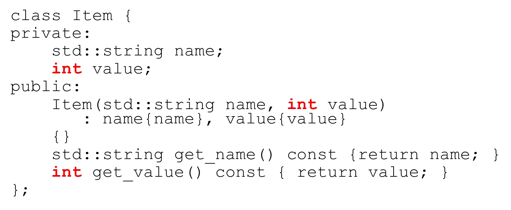
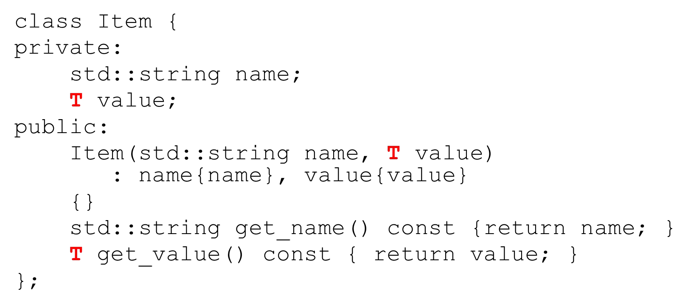
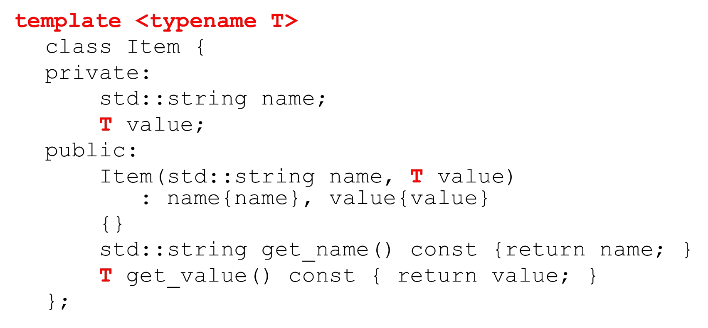
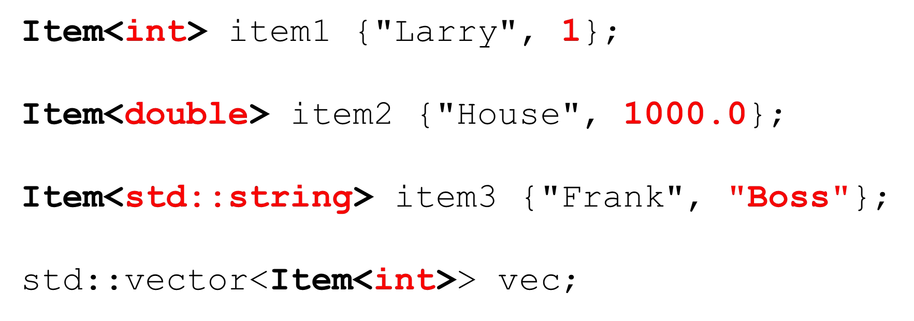
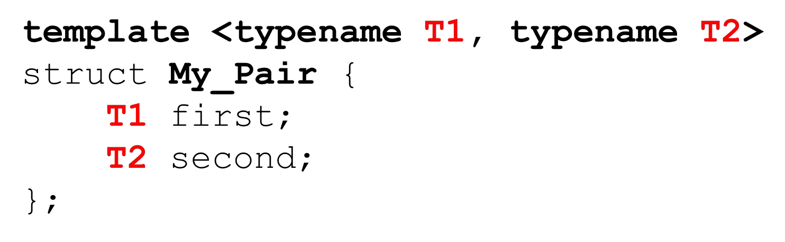

# Cornell Notes

## Topic: Generic Programming with Class Templates

## Date: 15/06/2026

---

<strong><em>"DO NOT JUST TALK ABOUT IT — SHOW IT"</em></strong>

---

### Cue Column (Questions, Keywords, or Prompts)

- [Insert question or keyword]
- [Insert question or keyword]
- [Insert question or keyword]

---

### Notes Section (Main Notes)

#### What is a C++ Class Template?

- Similar to function template, but at the class level
- Allows plugging-in any data type
- Compiler generates the appropriate class from the blueprint

#### Generic Programming with class templates

- Let’s say we want a class to hold Items where the item has a name and an integer

- But we’d like our `Item` class to be able to hold any type of data in addition to the string
- We can’t overload class names
- We don’t want to use dynamic polymorphism

#### Generic Programming with class templates

#### Multiple types as template parameters

- We can have multiple template parameters
- An their types can be different

#### `std::pair`

---

### Summary Section (Summary of Notes)

[Insert a brief summary of the key ideas and takeaways]