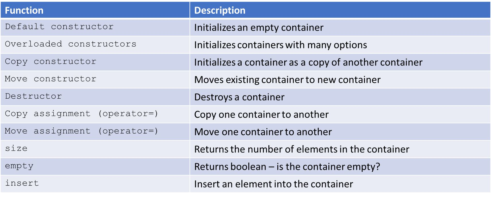
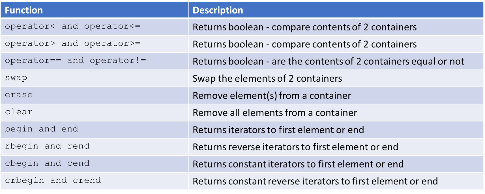

# Cornell Notes

## Topic: Introduction to STL Containers

## Date: 20/06/2026

---

<strong><em>"DO NOT JUST TALK ABOUT IT — SHOW IT"</em></strong>

---

### Cue Column (Questions, Keywords, or Prompts)

- [Insert question or keyword]
- [Insert question or keyword]
- [Insert question or keyword]

---

### Notes Section (Main Notes)

#### Containers

- Data structures that can store object of almost any type
  - Template-based classes
- Each container has member functions
  - Some are specific to the container
  - Others are available to all containers
- Each container has an associated header file
  - `#include <container_type>`

#### Containers – common

#### Container elements

What types of elements can we store in containers?

- A **copy** of the element will be stored in the container
  - All primitives OK
- Element should be
  - Copyable and assignable (copy constructor / copy assignment)
  - Moveable for efficiency (move Constructor / move Assignment)
- Ordered associative containers must be able to compare elements
  - `operator<`, `operator==`

---

### Summary Section (Summary of Notes)

[Insert a brief summary of the key ideas and takeaways]