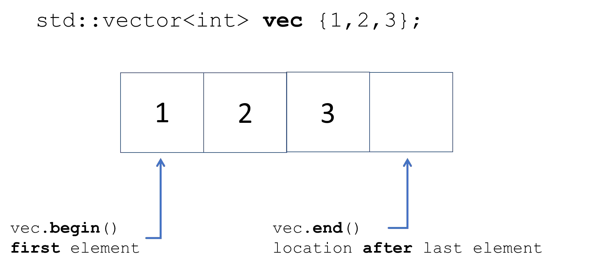
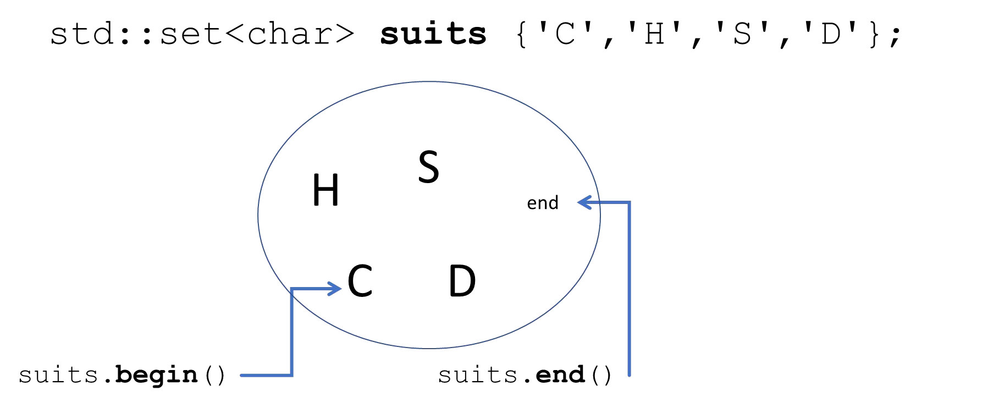
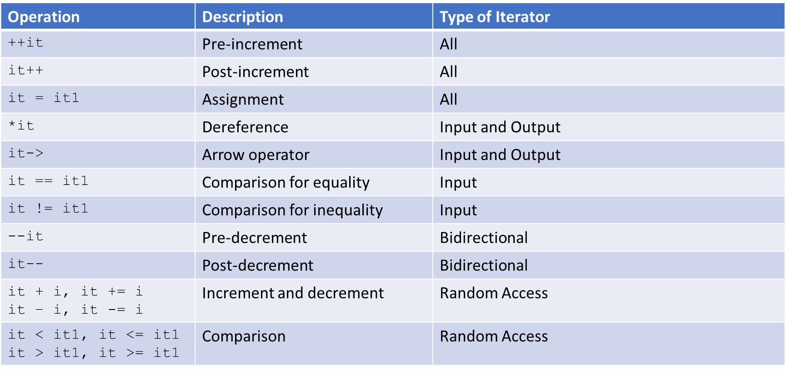
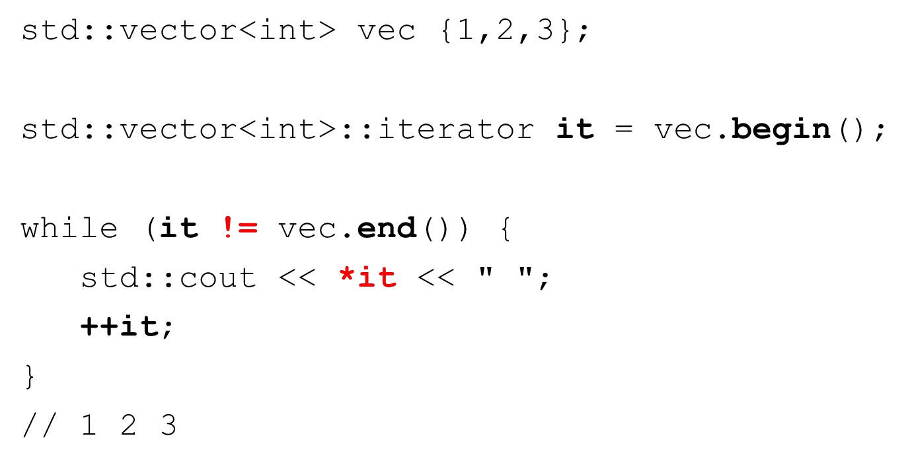
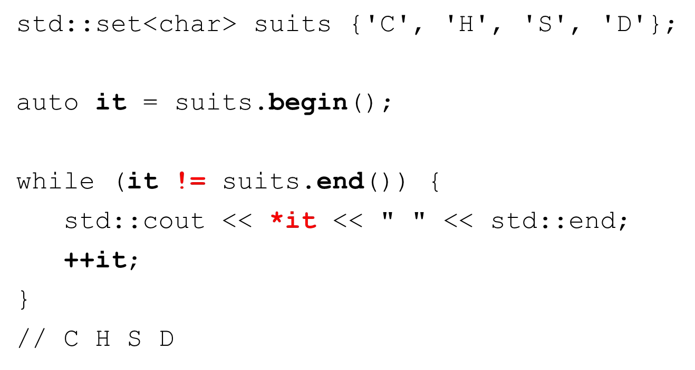
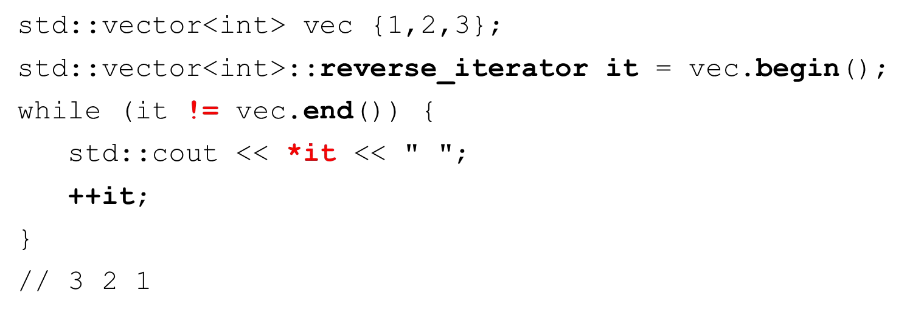

# Cornell Notes

## Topic: Introduction to STL iterators

## Date: 20/06/2026

---

<strong><em>"DO NOT JUST TALK ABOUT IT — SHOW IT"</em></strong>

---

### Cue Column (Questions, Keywords, or Prompts)

- [Insert question or keyword]
- [Insert question or keyword]
- [Insert question or keyword]

---

### Notes Section (Main Notes)

#### Iterators

- Allows abstracting an arbitrary container as a sequence of elements
- They are objects that work like pointers by design
- Most container classes can be traversed with iterators

#### Declaring iterators

- Iterators must be declared based on the container type they will iterate over

#### `iterator` begin and end methods

#### Declaring iterators

#### Initializing iterators

#### Operations with iterators (it)

#### Using iterators – std::vector

- This is how the range-based for loop works

#### Using iterators – std::set

#### Reverse iterators

- Works in reverse
- Last element is the first and first is the last
- `++` moves backward, `--` moves forward

#### Other iterators

---

### Summary Section (Summary of Notes)

[Insert a brief summary of the key ideas and takeaways]