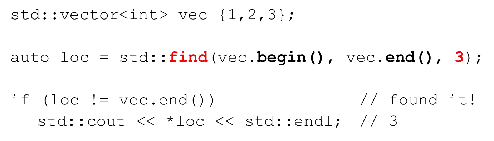
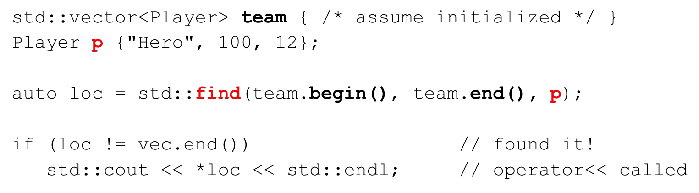
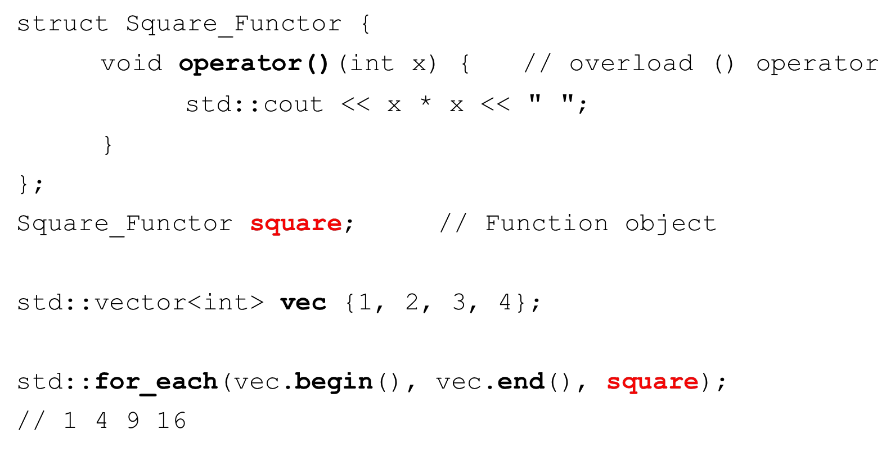
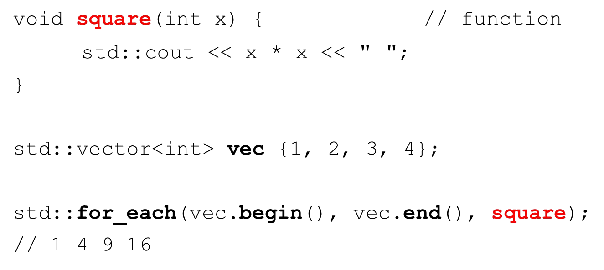

# Cornell Notes

## Topic: Introduction to STL Algorithms

## Date: 25/06/2026

---

<strong><em>"DO NOT JUST TALK ABOUT IT — SHOW IT"</em></strong>

---

### Cue Column (Questions, Keywords, or Prompts)

- [Insert question or keyword]
- [Insert question or keyword]
- [Insert question or keyword]

---

### Notes Section (Main Notes)

#### Algorithms

- STL algorithms work on sequences of container elements provided to them by an iterator
- STL has many common and useful algorithms
- Too many to describe in this section
  - http://en.cppreference.com/w/cpp/algorithm
- Many algorithms require extra information in order to do their work
  - Functors (function objects)
  - Function pointers
  - Lambda expressions (C++11)

#### Algorithms and iterators

- `#include <algorithm>`
- Different containers support different types of iterators
  - Determines the types of algorithms supported
- All STL algorithms expect iterators as arguments
  - Determines the sequence obtained from the container

#### Iterator invalidation

- Iterators point to container elements
- It’s possible iterators become invalid during processing
- Suppose we are iterating over a vector of 10 elements
  - And we `clear()` the vector while iterating? What happens?
  - Undefined behavior – our iterators are pointing to invalid locations

#### Example algorithm – find with primitive types

- The find algorithm tries to locate the first occurrence of an element in a container
- Lots of variations
- Returns an iterator pointing to the located element or `end()`

#### Example algorithm – find with user-defined types

- Find needs to be able to compare object
- `operator==` is used and must be provided by your class

#### Example algorithm – `for_each`

- `for_each` algorithm applies a function to each element in the iterator sequence
  - Function must be provided to the algorithm as:
  - Functor (function object)
  - Function pointer
- Lambda expression (C++11)
- Let’s square each element

#### `for_each` - using a functor

#### `for_each` - using a function pointer

#### `for_each` - using a lambda expression

---

### Summary Section (Summary of Notes)

[Insert a brief summary of the key ideas and takeaways]