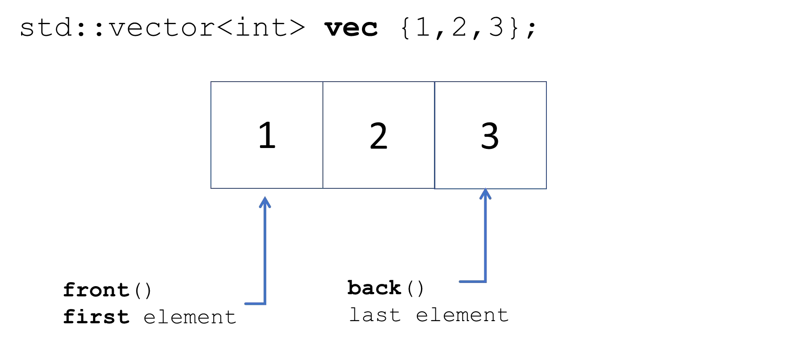
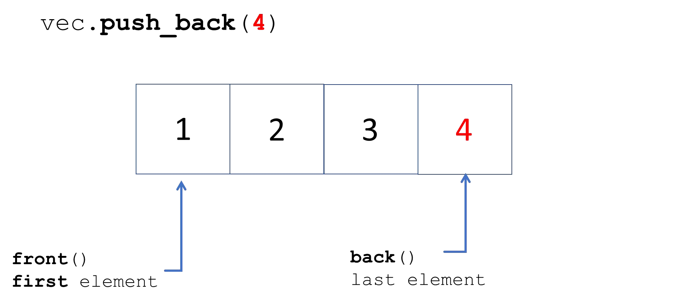

# Cornell Notes

## Topic: Sequence Containers - Vector

## Date: 26/06/2026

---

<strong><em>"DO NOT JUST TALK ABOUT IT — SHOW IT"</em></strong>

---

### Cue Column (Questions, Keywords, or Prompts)

- [Insert question or keyword]
- [Insert question or keyword]
- [Insert question or keyword]

---

### Notes Section (Main Notes)

#### `std::vector`

`#include <vector>`

- Dynamic size
  - Handled automatically
  - Can expand and contract as needed
  - Elements are stored in contiguous memory as an array
- Direct element access (constant time)
- Rapid insertion and deletion at the back (constant time)
- Insertion or removal of elements (linear time)
- All iterators available and may invalidate

#### `std::vector` – initialization and assignment

#### `std::vector` – common methods

---

### Summary Section (Summary of Notes)

[Insert a brief summary of the key ideas and takeaways]