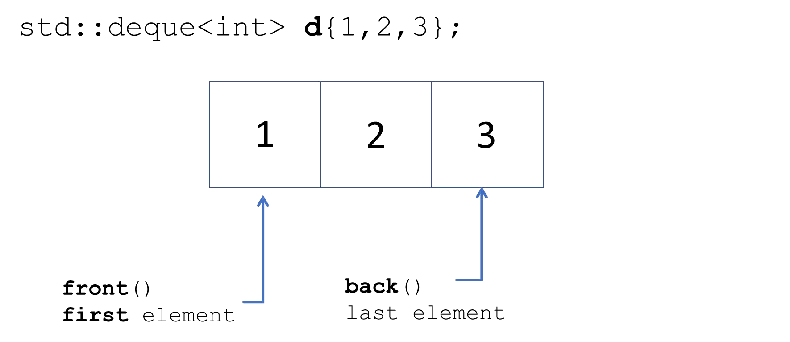
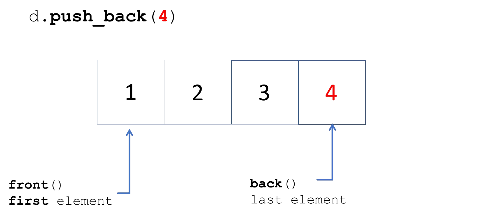
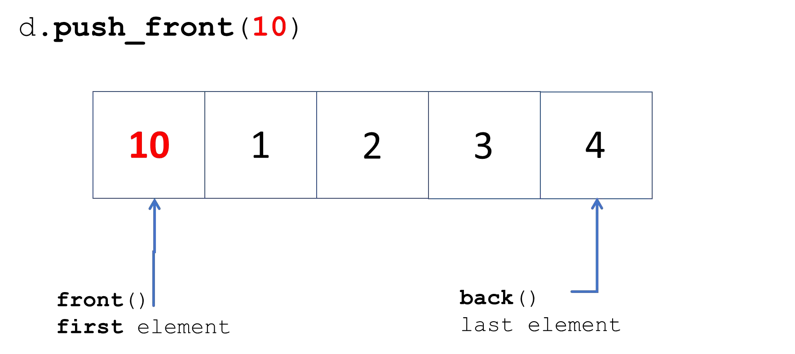

# Cornell Notes

## Topic: Sequence Containers - Deque

## Date: 29/06/2026

---

<p align="center"><strong><em>"DO NOT JUST TALK ABOUT IT — SHOW IT"</em></strong></p>

---

### Cue Column (Questions, Keywords, or Prompts)

- [Insert question or keyword]
- [Insert question or keyword]
- [Insert question or keyword]

---

### Notes Section (Main Notes)

#### `std::deque` (double ended queue)

```c
#include <deque>
```

- Dynamic size
  - Handled automatically
  - Can expand and contract as needed
  - Elements are NOT stored in contiguous memory
- Direct element access (constant time)
- Rapid insertion and deletion at the front and **back** (constant time)
- Insertion or removal of elements (linear time)
- All iterators available and may invalidate

#### `std::deque` – initialization and assignment









#### `std::deque` – common methods


---

### Summary Section (Summary of Notes)

[Insert a brief summary of the key ideas and takeaways]