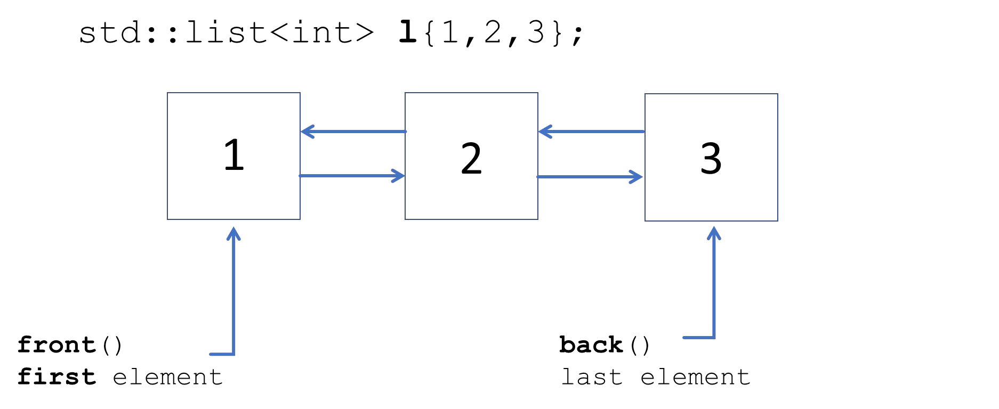
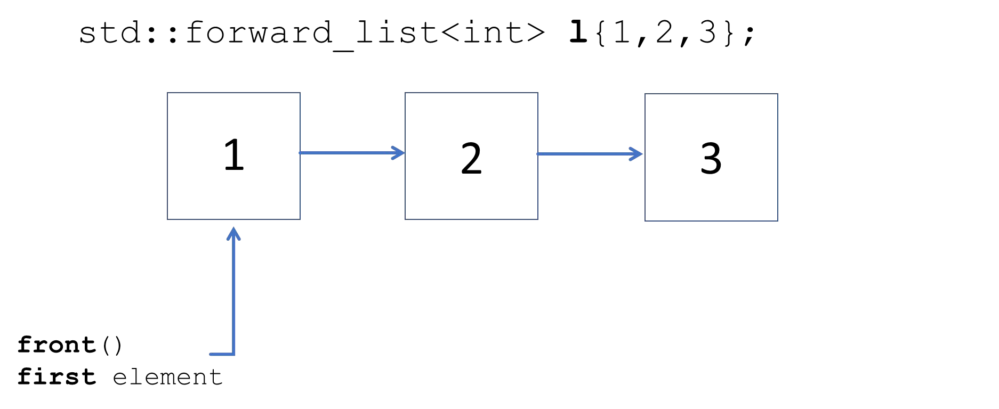

# Cornell Notes

## Topic: Sequence Containers - List and Forward List

## Date: 29/06/2026

---

<strong><em>"DO NOT JUST TALK ABOUT IT — SHOW IT"</em></strong>

---

### Cue Column (Questions, Keywords, or Prompts)

- [Insert question or keyword]
- [Insert question or keyword]
- [Insert question or keyword]

---

### Notes Section (Main Notes)

#### std::list

`#include <list>`

- Dynamic size
  - Lists of elements
  - `list` is bidirectional (doubly-linked)
- Direct element access is NOT provided
- Rapid insertion and deletion of elements anywhere in the container (constant time)
- All iterators available and invalidate when corresponding element is deleted

#### `std::list` – initialization and assignment

#### `std::list` – common methods

#### `std::list` – methods that use iterators

#### std::forward_list

`#include <forward_list>`

- Dynamic size
  - Lists of elements
  - `list` uni-directional (singly-linked)
  - Less overhed than a std::list
- Direct element access is NOT provided
- Rapid insertion and deletion of elements anywhere in the container (constant time)
- Reverse iterators not available. Iterators invalidate when corresponding element is deleted

#### `std::forward_list` – common methods

#### `std::forward_list` – methods that use iterators

---

### Summary Section (Summary of Notes)

[Insert a brief summary of the key ideas and takeaways]