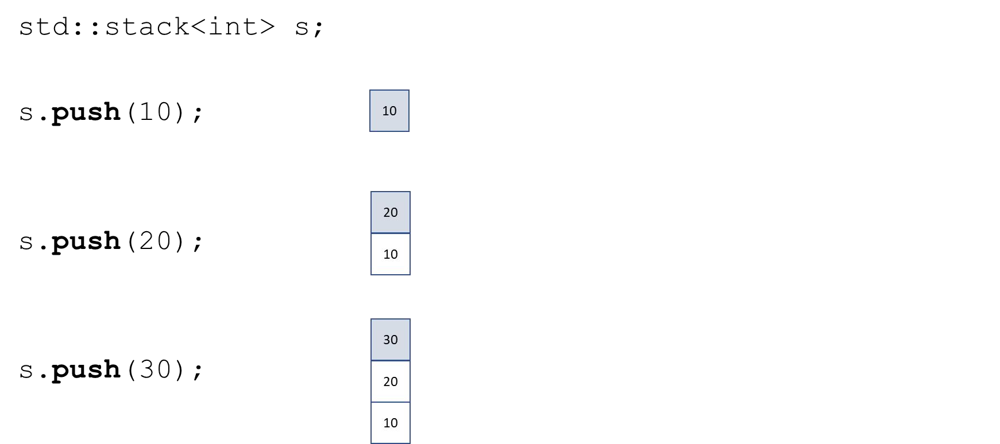

# Cornell Notes

## Topic: Container Adaptors - Stack

## Date: 01/07/2026

---

<strong><em>"DO NOT JUST TALK ABOUT IT — SHOW IT"</em></strong>

---

### Cue Column (Questions, Keywords, or Prompts)

- [Insert question or keyword]
- [Insert question or keyword]
- [Insert question or keyword]

---

### Notes Section (Main Notes)

#### std::stack

- Last-in First-out (LIFO) data structure
- Implemented as an adapter over other STL container Can be implemented as a vector, list, or deque
- All operations occur on one end of the stack (top)
- No iterators are supported

`#include <stack>`

- `push` – insert an element at the top of the stack
- `pop` – remove an element from the top of the stack
- `top` – access the top element of the stack
- `empty` – is the stack empty?
- `size` – number of elements in the stack

#### std::stack – initialization

#### std::stack – common methods

---

### Summary Section (Summary of Notes)

[Insert a brief summary of the key ideas and takeaways]