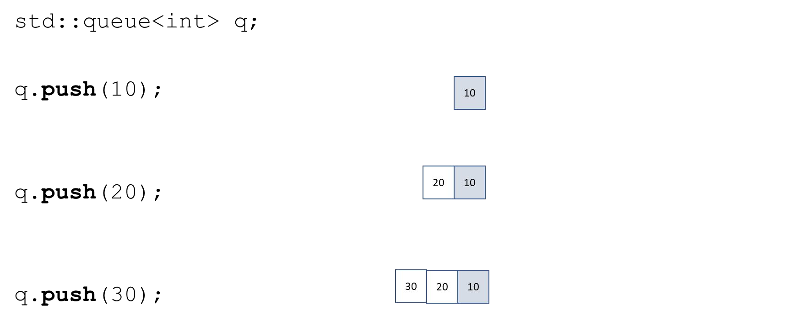
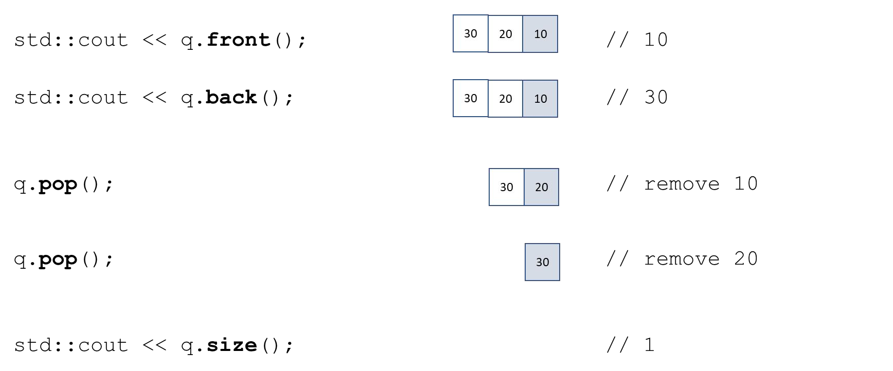

# Cornell Notes

## Topic: Container Adaptors - Queue

## Date: 02/07/2026

---

<strong><em>"DO NOT JUST TALK ABOUT IT — SHOW IT"</em></strong>

---

### Cue Column (Questions, Keywords, or Prompts)

- [Insert question or keyword]
- [Insert question or keyword]
- [Insert question or keyword]

---

### Notes Section (Main Notes)

#### std::queue

- First-in First-out (FIFO) data structure
- Implemented as an adapter over other STL container Can be implemented as a list or deque
- Elements are pushed at the back and popped from the front
- No iterators are supported

`#include <queue>`

- `push` – insert an element at the back of the queue
- `pop` – remove an element from the front of the queue
- `front` – access the element at the front
- `back` – access the element at the back
- `empty` – is the queue empty?
- `size` – number of elements in the queue

#### std::queue – initialization

#### std::queue – common methods

---

### Summary Section (Summary of Notes)

[Insert a brief summary of the key ideas and takeaways]