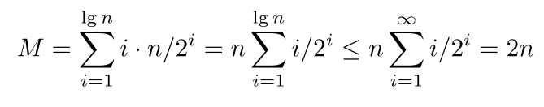
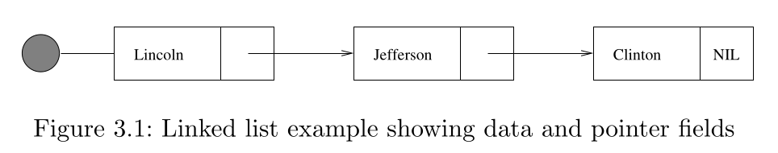

# Cornell Notes

## Topic: Contiguous vs. Linked Data Structures

## Date: 09/07/2026

---

<p align="center"><strong><em>"DO NOT JUST TALK ABOUT IT — SHOW IT"</em></strong></p>

---

### Cue Column (Questions, Keywords, or Prompts)

- [Insert question or keyword]
- [Insert question or keyword]
- [Insert question or keyword]

---

### Notes Section (Main Notes)

Data structures can be neatly classified as either contiguous or linked, depending upon whether they are based on arrays or pointers:

- **Contiguously-allocated structures** are composed of single slabs of memory, and include arrays, matrices, heaps, and hash tables.
- **Linked data structures** are composed of distinct chunks of memory bound together by pointers, and include lists, trees, and graph adjacency lists.

In this section, we review the relative advantages of contiguous and linked data structures. These tradeoffs are more subtle than they appear at first glance, so I encourage readers to stick with me here even if you may be familiar with both types of structures.

#### Arrays

The array is the fundamental contiguously-allocated data structure. Arrays are structures of fixed-size data records such that each element can be efficiently located by its index or (equivalently) address.

A good analogy likens an array to a street full of houses, where each array element is equivalent to a house, and the index is equivalent to the house number. Assuming all the houses are equal size and numbered sequentially from 1 to n, we can compute the exact position of each house immediately from its address.

Advantages of contiguously-allocated arrays include:

- **Constant-time** access given the index – Because the index of each element maps directly to a particular memory address, we can access arbitrary data items instantly provided we know the index.
- **Space efficiency** – Arrays consist purely of data, so no space is wasted with links or other formatting information. Further, end-of-record information is not needed because arrays are built from fixed-size records.
- **Memory locality** – A common programming idiom involves iterating through all the elements of a data structure. Arrays are good for this because they exhibit excellent memory locality. Physical continuity between successive data accesses helps exploit the high-speed cache memory on modern computer architectures.

The downside of arrays is that we cannot adjust their size in the middle of a program’s execution. Our program will fail soon as we try to add the (n + 1)st customer, if we only allocate room for n records. We can compensate by allocating extremely large arrays, but this can waste space, again restricting what our programs can do.

Actually, we can efficiently enlarge arrays as we need them, through the miracle of **dynamic arrays**. Suppose we start with an array of size 1, and double its size from m to 2m each time we run out of space. This doubling process involves allocating a new contiguous array of size 2m, copying the contents of the old array to the lower half of the new one, and returning the space used by the old array to the storage allocation system.

The apparent waste in this procedure involves the recopying of the old contents on each expansion. How many times might an element have to be recopied after a total of n insertions? Well, the first inserted element will have been recopied when the array expands after the first, second, fourth, eighth,... insertions. It will take log2n doublings until the array gets to have n positions. However, most elements do not suffer much upheaval. Indeed, the (n/2 + 1)st through nth elements will move at most once and might never have to move at all.

If half the elements move once, a quarter of the elements twice, and so on, the total number of movements M is given by



Thus, each of the n elements move only two times on average, and the total work of managing the dynamic array is the same O(n) as it would have been if a single array of sufficient size had been allocated in advance!

The primary thing lost using dynamic arrays is the guarantee that each array access takes constant time *in the worst case*. Now all the queries will be fast, except for those relatively few queries triggering array doubling. What we get instead is a promise that the nth array access will be completed quickly enough that the total effort expended so far will still be O(n). Such amortized guarantees arise frequently in the analysis of data structures.

#### Pointers and Linked Structures

Pointers are the connections that hold the pieces of linked structures together. Pointers represent the address of a location in memory. A variable storing a pointer to a given data item can provide more freedom than storing a copy of the item itself. A cellphone number can be thought of as a pointer to its owner as they move about the planet.

Pointer syntax and power differ significantly across programming languages, so we begin with a quick review of pointers in C language. A pointer p is assumed to give the address in memory where a particular chunk of data is located. Pointers in C have types declared at compiler time, denoting the data type of the items they can point to. We use ***p** to denote the item that is pointed to by pointer p, and **&x** to denote the address (i.e. , pointer) of a particular variable **x**. A special **NULL** pointer value is used to denote structure-terminating or unassigned pointers.



All linked data structures share certain properties, as revealed by the following linked list type declaration:

```c
typedef struct list {
    item_type item; /* data item */
    struct list *next; /* point to sucessor */
} list;
```

In particular:

- Each node in our data structure (here **list**) contains one or more data fields (here **item**) that retain the data that we need to store.
- Each node contains a pointer field to at least one other node (here **next**). This means that much of the space used in linked data structures has to be devoted to pointers, not data.
- Finally, we need a pointer to the head of the structure, so we know where to access it.

The list is the simplest linked structure. The three basic operations supported by lists are searching, insertion, and deletion. In **doubly-linked lists**, each node points both to its predecessor and its successor element. This simplifies certain operations at a cost of an extra pointer field per node.

##### Searching a List

Searching for item **x** in a linked list can be done iteratively or recursively. We opt for recursively in the implementation below. If **x** is in the list, it is either the first element or located in the smaller rest of the list. Eventually, we reduce the problem to searching in an empty list, which clearly cannot contain **x**.

```c
list *search_list(list *l, item_type x)
{
    if (l == NULL) return(NULL);
    if (l->item == x)
        return(l);
    else
        return(search_list(l->next, x));
}
```

##### Insertion into a List

Insertion into a singly-linked list is a nice exercise in pointer manipulation, as shown below. Since we have no need to maintain the list in any particular order, we might as well insert each new item in the simplest place. Insertion at the beginning of the list avoids any need to traverse the list, but does require us to update the pointer (denoted **l**) to the head of the data structure.

```c
void insert_list(list **l, item_type x)
{
    list *p; /* temporary pointer */
    p = malloc( sizeof(list) );
    p->item = x;
    p->next = *l;
    *l = p;
}
```

---

### Summary Section (Summary of Notes)

[Insert a brief summary of the key ideas and takeaways]