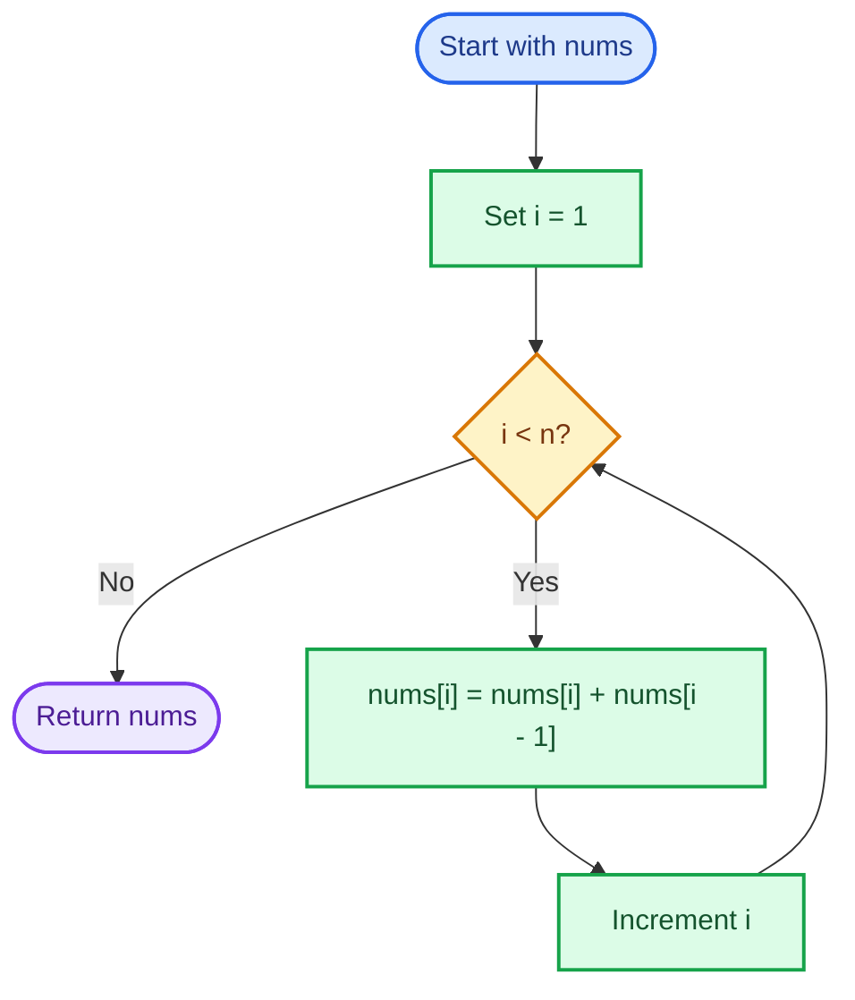
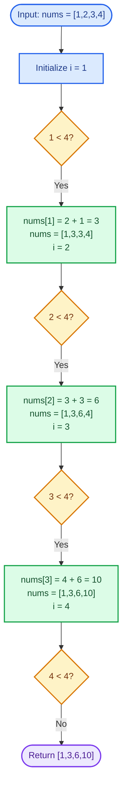
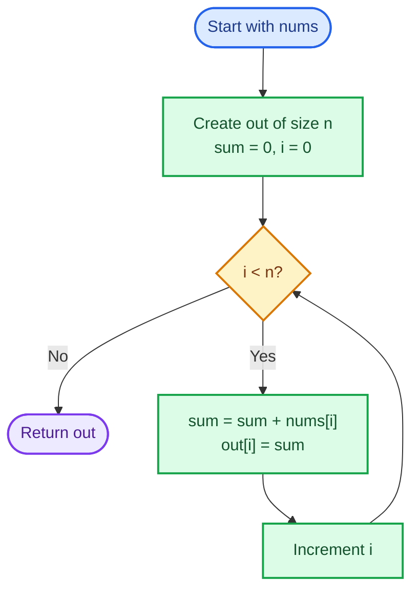
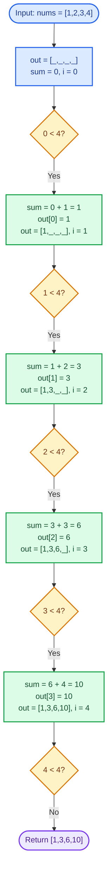
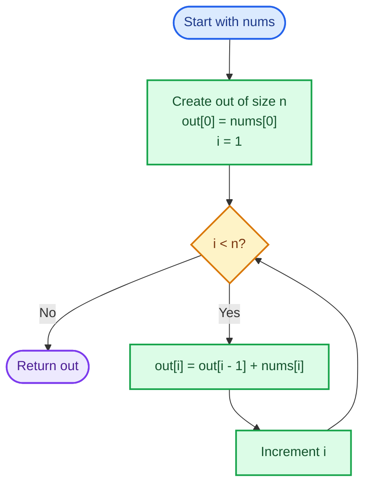
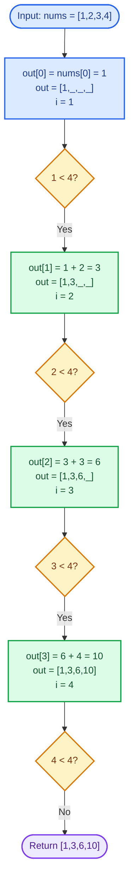

# Cornell Notes

## Topic: Leetcode - 1480 - Running sum of 1d array

## Date: 14/07/2026

---

<p align="center"><strong><em>"DO NOT JUST TALK ABOUT IT — SHOW IT"</em></strong></p>

---

### Problem Description

Given an integer array `nums`, return its running sum. The value at each output index `i` is the sum of every input element from index `0` through index `i`.

Formally:

```text
runningSum[i] = nums[0] + nums[1] + ... + nums[i]
```

#### Example 1

```text
Input:  nums = [1,2,3,4]
Output: [1,3,6,10]
```

The output is formed as `[1, 1+2, 1+2+3, 1+2+3+4]`.

#### Example 2

```text
Input:  nums = [1,1,1,1,1]
Output: [1,2,3,4,5]
```

Each position adds one more `1` to the previous accumulated sum.

#### Example 3

```text
Input:  nums = [3,1,2,10,1]
Output: [3,4,6,16,17]
```

#### Constraints

- `1 <= nums.length <= 1000`
- `-10^6 <= nums[i] <= 10^6`

#### Function Contract

- **Input:** A non-empty integer array.
- **Output:** An equally sized array containing the prefix sum at every index.
- **Mutation:** The result may reuse the input array when in-place modification is allowed.
- **Ordering:** Values must correspond to the original left-to-right input order.

---

### Cue Column (Questions, Keywords, or Prompts)

- What pattern this problem use?
- What invariant guarantees correctness?
- Which strategy most stable in interview?
- Can we do better than O(n)?
- What edge tests catch index/sum bugs?

---

### Notes Section (Main Notes)

## Mindset First (language-agnostic)

- Recognize pattern: prefix accumulation over array.
- Not sliding window, not two pointers, not DP table.
- Lock invariant before coding:
	- `runningSum[i] = runningSum[i-1] + nums[i]`
	- Base case: `runningSum[0] = nums[0]`
- Complexity target fixed early:
	- Time must be `O(n)` (need visit each element)
	- Extra space can be `O(n)` (new output) or `O(1)` extra if in-place allowed.

## Strategy A: In-place Prefix Update (most space-efficient)

- Traverse from index `1` to `n-1`.
- Update current value with previous accumulated value.
- Formula: `nums[i] = nums[i] + nums[i-1]`.
- Why strong:
	- minimal memory
	- shortest logic
- Constraint:
	- mutates input array (only use if allowed).

### Strategy A Flow



## Worked Example A: In-place Prefix Update on `[1,2,3,4]`

This flow replaces each element with its running sum while moving from left to right.

### Strategy A Worked Example Flow



## Strategy B: Build New Output Array (most explicit)

- Keep running variable `sum`.
- Iterate left to right.
- Add current number into `sum`, write `sum` to output position.
- Why useful:
	- preserves input
	- easy to reason/debug
- Complexity:
	- Time `O(n)`, extra space `O(n)`.

### Strategy B Flow



## Worked Example B: Build New Output Array for `[1,2,3,4]`

This flow preserves the input and writes each accumulated value into a separate result array.

### Strategy B Worked Example Flow



## Strategy C: Prefix Array with First-Element Seed

- Set first output equal first input.
- For each next index, use recurrence from previous output.
- Formula: `out[i] = out[i-1] + nums[i]`.
- Why useful:
	- very clear recurrence style
	- good bridge to broader prefix-sum problems.

### Strategy C Flow



## Worked Example C: Seeded Prefix Array for `[1,2,3,4]`

This flow seeds the first output value and builds each later value from the previous prefix.

### Strategy C Worked Example Flow



## In-place vs Out-of-place Decision

- If prompt says "return running sum of nums" and mutation allowed: pick in-place.
- If input must stay unchanged: pick output array strategy.
- Interview default safe choice: ask mutability assumption first, then proceed.

## Common Failure Points (all languages)

- Start loop at wrong index (`0` instead `1`) for in-place recurrence.
- Forget base case for first element.
- Overwrite before read when order wrong.
- Return wrong array (original vs output).
- Skip edge case `n=1`.
- Ignore negative values while mentally checking examples.

---

### Summary Section (Summary of Notes)

Core mindset: this is prefix accumulation with simple recurrence. Lock invariant first, then choose in-place (`O(1)` extra) or new-output (`O(n)` extra) based on mutability requirement. Validate with boundary cases (`n=1`), mixed signs, and normal examples.
