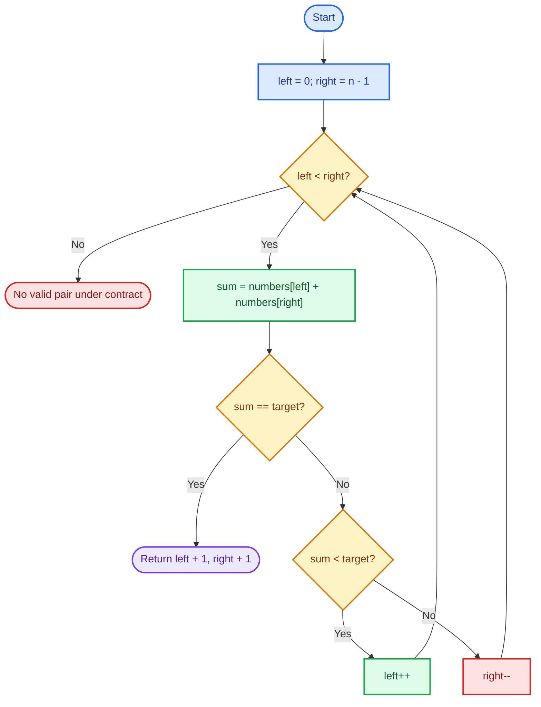
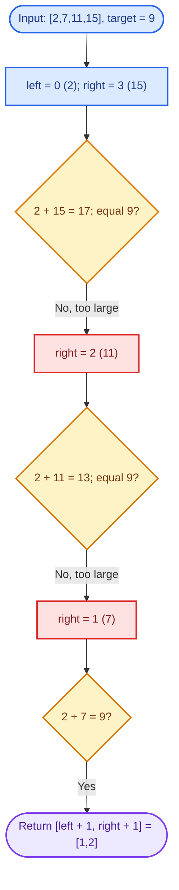
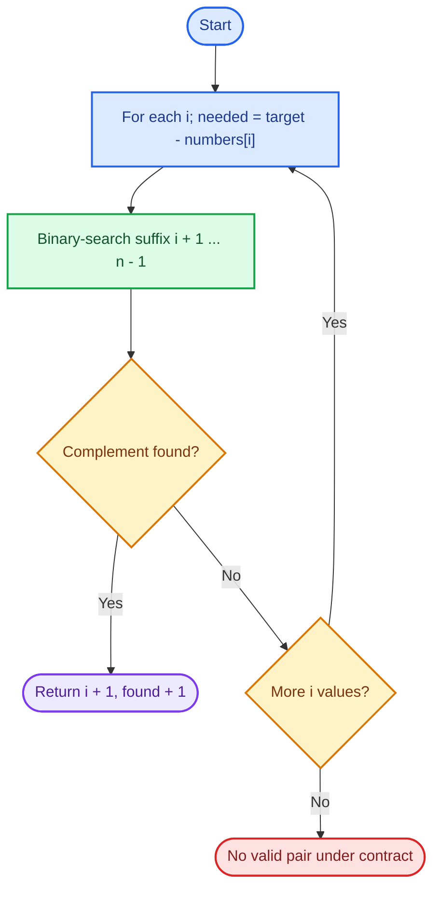
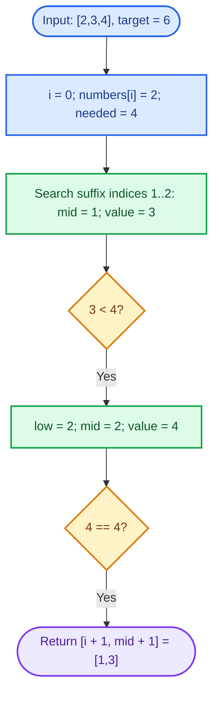

# Cornell Notes

## Topic: Leetcode - 167 - Two Sum II - Input Array Is Sorted

## Date: 30/07/2026

---

<p align="center"><strong><em>"DO NOT JUST TALK ABOUT IT — SHOW IT"</em></strong></p>

---

### Problem Description

Given a non-decreasing sorted, 1-indexed integer array `numbers` and an integer `target`, return the unique pair of indices `[index1, index2]` such that:

- `numbers[index1 - 1] + numbers[index2 - 1] == target`
- `1 <= index1 < index2 <= numbers.length`
- The same element cannot be used twice.

The solution must use constant auxiliary space.

#### Example 1

```text
Input:  numbers = [2,7,11,15], target = 9
Output: [1,2]
```

`2 + 7 == 9`.

#### Example 2

```text
Input:  numbers = [2,3,4], target = 6
Output: [1,3]
```

`2 + 4 == 6`.

#### Example 3

```text
Input:  numbers = [-1,0], target = -1
Output: [1,2]
```

`-1 + 0 == -1`.

#### Constraints

- `2 <= numbers.length <= 3 * 10^4`
- `-1000 <= numbers[i] <= 1000`
- `numbers` is sorted in non-decreasing order.
- `-1000 <= target <= 1000`
- Exactly one solution exists.

#### Function Contract

- **Input:** A sorted integer array, its length, and `target`.
- **Output:** Two 1-based indices in increasing order.
- **Mutation:** Do not modify `numbers`.
- **Ordering:** Returned indices must satisfy `index1 < index2`.
- **Ownership or memory:** C implementation returns a heap-allocated two-element array; caller must call `free()`. C++ returns `vector<int>`.
- **Judge rule:** Exactly one valid pair exists, so a no-solution fallback is unreachable for valid judge input.

---

### Cue Column (Questions, Keywords, or Prompts)

- What pattern does sorted input reveal?
- Why can one pointer move safely after each comparison?
- What invariant does the two-pointer window maintain?
- Why is the answer 1-based instead of 0-based?
- What is the optimal time and auxiliary-space complexity?
- What happens when the pair is at the boundaries?
- What bug occurs if a found result is not returned immediately?

---

### Notes Section (Main Notes)

## Mindset First (language-agnostic)

- Pattern: Sorted array + pair sum → opposite-end two pointers.
- Invariant: Every discarded index cannot belong to any valid pair inside the current search window.
- Target time: `O(n)`.
- Target auxiliary space: `O(1)` excluding returned output.
- Optimality: Each pointer moves only inward, so each array position is examined at most once.

## Strategy A: Opposite-End Two Pointers

- Core idea: Start `left` at the smallest value and `right` at the largest value.
- Algorithm:
	1. Compute `numbers[left] + numbers[right]`.
	2. If sum equals `target`, return `[left + 1, right + 1]`.
	3. If sum is smaller, increment `left`; the smallest value is too small.
	4. If sum is larger, decrement `right`; the largest value is too large.
- Correctness: Because the array is sorted, increasing `left` can only increase the sum, while decreasing `right` can only decrease it. Therefore each movement discards only impossible candidates.
- Complexity: `O(n)` time, `O(1)` auxiliary space.
- Benefits: Optimal, simple, no hash map, preserves input.
- Trade-offs: Requires sorted input. If input is unsorted, sorting changes index relationships or needs extra work.

### Strategy A Flow



## Worked Example A: Opposite-End Two Pointers on `[2,7,11,15]`, target `9`

Start with `left = 0`, `right = 3`; indices returned after finding the sum are converted from 0-based to 1-based.

### Strategy A Worked Example Flow



## Strategy B: Binary Search for Each Complement

- Core idea: For each `numbers[i]`, binary-search the sorted suffix for `target - numbers[i]`.
- Algorithm:
	1. Iterate `i` from `0` to `n - 2`.
	2. Set `needed = target - numbers[i]`.
	3. Binary-search indices `i + 1` through `n - 1` for `needed`.
	4. Return `[i + 1, found + 1]` when found.
- Correctness: The suffix is sorted, so binary search finds the complement if it exists. Starting at `i + 1` prevents reusing the same element.
- Complexity: `O(n log n)` time, `O(1)` auxiliary space.
- Benefits: Uses sortedness and works as a direct complement-search pattern.
- Trade-offs: Slower than two pointers because it repeats logarithmic searches; more boundary logic.

### Strategy B Flow



## Worked Example B: Binary Search for Each Complement on `[2,3,4]`, target `6`

For `i = 0`, the needed complement is `4`; binary search checks the suffix `[3,4]` and finds it at index `2`.

### Strategy B Worked Example Flow



## Common Failure Points (all languages)

- Forgetting the array is 1-indexed in the required output.
- Returning `[right, left]` instead of increasing indices.
- Moving `left` when the sum is too large, or moving `right` when the sum is too small.
- Continuing after finding the pair instead of returning immediately.
- In C, setting `*returnSize = 2` but forgetting `return result`.
- In C, returning a stack array instead of heap memory.
- In C, leaking the allocated result on a successful or abandoned path.
- Using a hash map despite the constant-space requirement.
- Modifying the input array unnecessarily.
- Using `numbersSize` incorrectly when initializing `right`.

## Edge Cases to Test

| Case | Input | Expected | Notes |
|------|-------|----------|-------|
| Minimum positive | `[1,2]`, `3` | `[1,2]` | Smallest valid input. |
| Minimum negative | `[-2,-1]`, `-3` | `[1,2]` | Negative sum. |
| Duplicate pair | `[5,5]`, `10` | `[1,2]` | Same value, different elements. |
| Pair at start | `[2,7,11,15]`, `9` | `[1,2]` | Requires reducing `right`. |
| Pair at end | `[1,2,3,4,9,11]`, `20` | `[5,6]` | Boundary indices. |
| Mixed signs | `[-8,-3,0,4,9]`, `1` | `[2,5]` | Negative plus positive. |
| Zero pair | `[-4,-1,0,0,0,6]`, `0` | `[3,4]` | Repeated zero values. |
| Extreme values | `[-1000,-500,0,500,1000]`, `0` | `[1,5]` | Constraint boundaries. |
| Large input | Sorted array up to `3 * 10^4` values | Valid unique pair | Confirms linear scan and constant auxiliary space. |

## Why Opposite-End Two Pointers is Interview Gold

1. Sorted order converts pair-sum search into a monotonic decision process.
2. Each pointer moves only inward, giving `O(n)` time.
3. No auxiliary table or sorting step is needed.
4. The invariant makes correctness easy to explain.
5. It handles duplicates, negative values, zero, and boundary pairs naturally.

## Implementation Checklist

- [ ] Initialize `left = 0` and `right = numbersSize - 1`.
- [ ] Loop while `left < right`.
- [ ] Compute the current sum.
- [ ] Return immediately when sum equals `target`.
- [ ] Increment `left` when sum is too small.
- [ ] Decrement `right` when sum is too large.
- [ ] Convert indices to 1-based values.
- [ ] In C, allocate exactly two result elements and set `*returnSize = 2`.
- [ ] In C, return allocated memory; caller frees it.
- [ ] Confirm `O(n)` time and `O(1)` auxiliary space.

---

### Summary Section (Summary of Notes)

The sorted-array pair-sum pattern is solved optimally with opposite-end two pointers. The invariant is that each pointer movement discards only impossible pairs: move `left` when the sum is too small and move `right` when it is too large. Return 1-based indices immediately on a match. Complexity is `O(n)` time and `O(1)` auxiliary space, excluding the required two-element output allocation in C. Binary search is valid but slower at `O(n log n)`.
