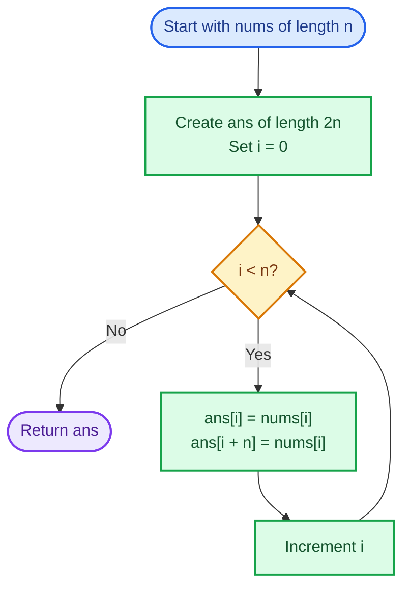
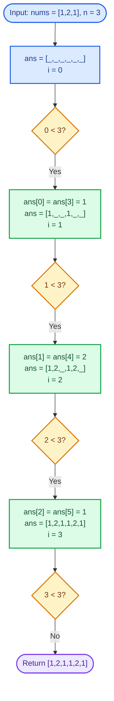
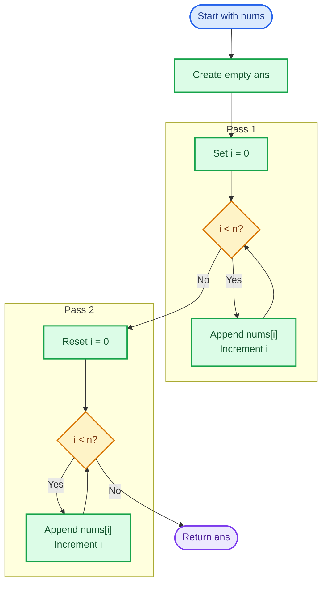
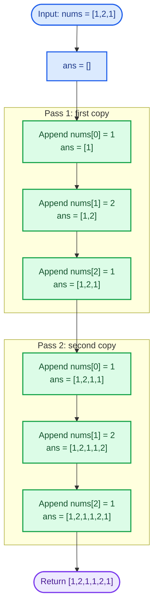
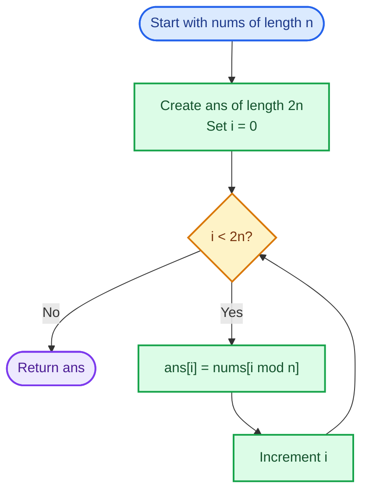
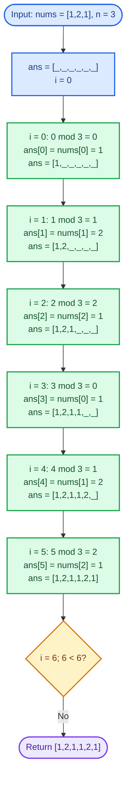

# Cornell Notes

## Topic: Leetcode - 1929 - Concatenation of array

## Date: 14/07/2026

---

<p align="center"><strong><em>"DO NOT JUST TALK ABOUT IT — SHOW IT"</em></strong></p>

---

### Problem Description

Given an integer array `nums` of length `n`, create and return an array `ans` of length `2n` formed by concatenating `nums` with itself.

For every original index `i` in the range `0 <= i < n`, the result must satisfy:

```text
ans[i]     = nums[i]
ans[i + n] = nums[i]
```

#### Example 1

```text
Input:  nums = [1,2,1]
Output: [1,2,1,1,2,1]
```

The result contains the original array twice: `[nums, nums]`.

#### Example 2

```text
Input:  nums = [1,3,2,1]
Output: [1,3,2,1,1,3,2,1]
```

The first four values and the final four values both equal the input array.

#### Constraints

- `n == nums.length`
- `1 <= n <= 1000`
- `1 <= nums[i] <= 1000`

#### Function Contract

- **Input:** A non-empty integer array of length `n`.
- **Output:** A new array of length `2n`.
- **Mapping:** Each input value appears at result positions `i` and `i + n`.
- **Ordering:** Both halves preserve the original input order.

---

### Cue Column (Questions, Keywords, or Prompts)

- What transformation does problem ask?
- What index relation guarantees correctness?
- Which strategy minimizes bugs under pressure?
- What complexity target should I lock first?
- What edge checks prevent silent wrong output?

---

### Notes Section (Main Notes)

## Mindset First (language-agnostic)

- Recognize pattern: this is deterministic index-mapping, not search, not DP, not greedy.
- Lock invariant before coding:
  - For each original index `i` in `[0, n-1]`
  - output must satisfy both `ans[i] = nums[i]` and `ans[i+n] = nums[i]`
- Choose target complexity early: `O(n)` time is mandatory, output size forces `O(n)` extra space.

## Strategy A: Two-Slot Mapping (most robust)

- Build output of size `2n` first.
- Single pass over original array.
- Write each value into two deterministic slots: front half and mirrored slot in second half.
- Why interview-safe:
  - direct translation from requirement to code
  - easiest to reason and debug

### Strategy A Flow



## Worked Example A: Two-Slot Mapping for `[1,2,1]`

This flow writes every input value into its matching position in both output halves.

### Strategy A Worked Example Flow



## Strategy B: Two-Pass Append

- Start empty output.
- Pass 1: append all original values.
- Pass 2: append all original values again.
- Why useful:
  - very readable
  - easy in languages where append is idiomatic
- Caution:
  - pre-size/pre-reserve when possible to avoid repeated reallocations

### Strategy B Flow



## Worked Example B: Two-Pass Append for `[1,2,1]`

This flow completes the first copy before appending the second copy.

### Strategy B Worked Example Flow



## Strategy C: Single Loop Over 2n with Wraparound

- Iterate output index `i` from `0` to `2n-1`.
- Map source index by wraparound: `i mod n`.
- Why useful:
  - compact logic
  - uniform assignment rule
- Caution:
  - modulo each step adds small constant overhead
  - can be less intuitive for beginners

### Strategy C Flow



## Worked Example C: Wraparound Mapping for `[1,2,1]`

This flow maps each output index back to the input with `i mod 3`.

### Strategy C Worked Example Flow



## In-place Thinking

- True in-place is not practical here because required result length doubles.
- Even if language supports dynamic growth, logical output still requires extra capacity.
- Practical mindset: optimize correctness + clarity first, then micro-optimizations.

## Common Failure Points (all languages)

- Off-by-one boundaries (`0..n-1` vs `0..2n-1`).
- Wrong second-half offset (`i+n`).
- Forget to return/output full length `2n`.
- Mixing read index and write index during append approaches.
- Not testing smallest case (`n=1`) and stress case (`n=1000`).


---

### Summary Section (Summary of Notes)

Core mindset: treat problem as fixed index mapping with clear invariant, then pick simplest `O(n)` strategy to implement without bugs. Best default is two-slot mapping; alternatives are two-pass append and wraparound mapping. Validate with boundary-focused tests (`n=1`, normal case, max size).
