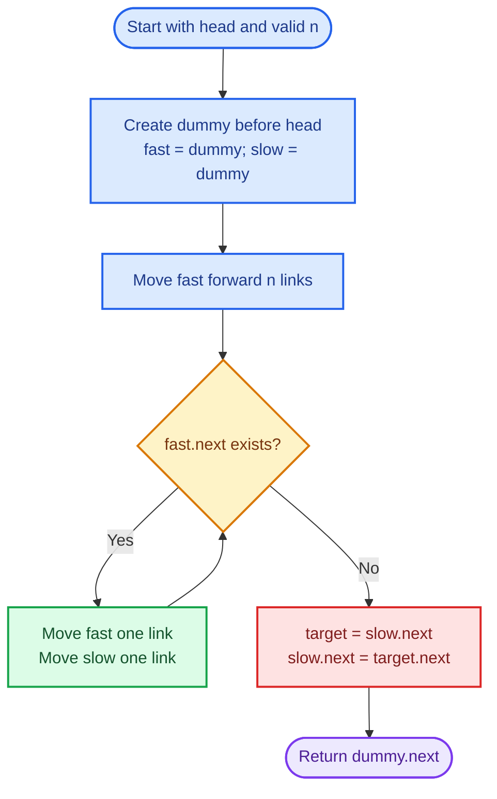
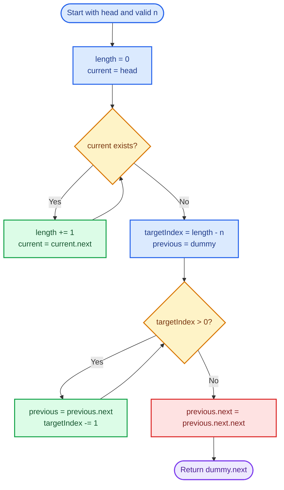

# Cornell Notes

## Topic: Leetcode - 19 - Remove Nth Node From End of List

## Date: 02/09/2026

---

<p align="center"><strong><em>"DO NOT JUST TALK ABOUT IT — SHOW IT"</em></strong></p>

---

### Problem Description

Given the head of a non-empty singly linked list and an integer `n`, remove the node that is `n` positions from the end and return the possibly updated head. Counting from the end starts at `1`: the tail is first, its predecessor is second, and so on.

#### Example 1

```text
Input:  head = [1,2,3,4,5], n = 2
Output: [1,2,3,5]
```

The second node from the end is node `4`.

#### Example 2

```text
Input:  head = [1], n = 1
Output: []
```

The only node is removed.

#### Example 3

```text
Input:  head = [1,2], n = 1
Output: [1]
```

The first node from the end is the tail, node `2`.

#### Constraints

- The list contains `sz` nodes.
- `1 <= sz <= 30`.
- `0 <= Node.val <= 100`.
- `1 <= n <= sz`.

#### Function Contract

- **Input:** `head`, the first node of a valid non-empty singly linked list, and valid one-based distance `n` from the end.
- **Output:** The head after removing exactly the `n`th node from the end; possibly `NULL`/`nullptr`.
- **Mutation:** One link changes to bypass the target node. Node values do not change.
- **Ordering:** All retained nodes preserve their original relative order.
- **Ownership or memory:** The judge contract requires unlinking, not allocating a replacement list. Local C/C++ implementations commonly leave deallocation to the caller or judge unless ownership is explicitly specified.

---

### Cue Column (Questions, Keywords, or Prompts)

- Which two-pointer pattern converts a position from the end into a one-pass deletion?
- Why must `fast` stay exactly `n` nodes ahead of `slow`?
- Why do both pointers begin at a dummy node?
- Where must `slow` stop before unlinking?
- What happens when `n` equals the list length?
- What are the time and auxiliary-space costs?
- Which off-by-one errors move `slow` onto the target instead of its predecessor?

---

### Notes Section (Main Notes)

## Mindset First (language-agnostic)

- Pattern: fixed-gap fast and slow pointers with a dummy head.
- Invariant: after creating an `n`-node gap, each simultaneous move preserves that gap; when `fast` reaches the tail, `slow` is immediately before the target.
- Target time: `O(sz)`.
- Target auxiliary space: `O(1)`.
- Optimality: a singly linked list offers no backward traversal, so finding a position relative to the tail requires reaching the tail; `O(sz)` time is optimal.

## Strategy A: One-Pass Fixed-Gap Two Pointers

- Core idea: use a stack-allocated dummy node, place both pointers there, move `fast` forward `n` links, then move both until `fast` reaches the tail.
- Algorithm:
  1. Set `dummy.next = head`; initialize `fast = dummy` and `slow = dummy`.
  2. Move `fast` exactly `n` links forward.
  3. While `fast.next` exists, move both pointers one link.
  4. Bypass the target with `slow.next = slow.next.next`.
  5. Return `dummy.next`.
- Correctness: after step 2, `fast` is `n` links ahead of `slow`. Simultaneous movement preserves this gap. When `fast` is at the tail, the node after `slow` is exactly `n` positions from the end. Bypassing `slow.next` therefore removes exactly the requested node. Returning `dummy.next` also handles head deletion.
- Complexity: `O(sz)` time, `O(1)` auxiliary space.
- Benefits: one pass, constant space, uniform head/middle/tail deletion.
- Trade-offs: gap size and loop condition are prone to off-by-one mistakes.

### Strategy A Flow



## Worked Example A: Fixed-Gap Two Pointers on `head = [1,2,3,4,5], n = 2`

The dummy node is written as `D`; pointer values identify their current nodes.

### Strategy A Worked Example Flow

```mermaid
flowchart TD
    A(["Input: D → 1 → 2 → 3 → 4 → 5<br/>n = 2"]) --> B["fast = D; slow = D"]
    B --> C1["Gap move 1<br/>fast = 1; slow = D"]
    C1 --> C2["Gap move 2<br/>fast = 2; slow = D"]
    C2 --> D1{"fast.next exists?<br/>2.next = 3"}
    D1 -- Yes --> E1["fast = 3; slow = 1"]
    E1 --> D2{"fast.next exists?<br/>3.next = 4"}
    D2 -- Yes --> E2["fast = 4; slow = 2"]
    E2 --> D3{"fast.next exists?<br/>4.next = 5"}
    D3 -- Yes --> E3["fast = 5; slow = 3"]
    E3 --> D4{"fast.next exists?<br/>5.next = null"}
    D4 -- No --> F["target = slow.next = 4<br/>slow.next = 5<br/>List: 1 → 2 → 3 → 5"]
    F --> G(["Return dummy.next<br/>Output: 1 → 2 → 3 → 5"])

    classDef start fill:#dbeafe,stroke:#2563eb,color:#1e3a8a,stroke-width:2px;
    classDef decision fill:#fef3c7,stroke:#d97706,color:#78350f,stroke-width:2px;
    classDef remove fill:#fee2e2,stroke:#dc2626,color:#7f1d1d,stroke-width:2px;
    classDef keep fill:#dcfce7,stroke:#16a34a,color:#14532d,stroke-width:2px;
    classDef finish fill:#ede9fe,stroke:#7c3aed,color:#4c1d95,stroke-width:2px;

    class A,B,C1,C2 start;
    class D1,D2,D3,D4 decision;
    class E1,E2,E3 keep;
    class F remove;
    class G finish;
```



## Strategy B: Count Length, Then Delete

- Core idea: first count the list length, then locate the predecessor of the zero-based target index `sz - n`.
- Algorithm:
  1. Traverse once to compute `sz`.
  2. Create a dummy node before `head` and set `previous = dummy`.
  3. Move `previous` forward `sz - n` links.
  4. Bypass `previous.next` and return `dummy.next`.
- Correctness: the `n`th node from the end has zero-based index `sz - n` from the start. Starting at the dummy node and moving `sz - n` links places `previous` immediately before that node, so bypassing `previous.next` removes the correct node.
- Complexity: `O(sz)` time over two passes, `O(1)` auxiliary space.
- Benefits: simple conversion from end-relative position to a start-relative index.
- Trade-offs: traverses part or all of the list twice; does not satisfy the one-pass follow-up.

### Strategy B Flow



## Worked Example B: Count Length, Then Delete on `head = [1,2,3,4,5], n = 2`

The first pass computes `length = 5`; the target index from the start is `5 - 2 = 3`.

### Strategy B Worked Example Flow

```mermaid
flowchart TD
    A(["Input: 1 → 2 → 3 → 4 → 5<br/>n = 2"]) --> B["length = 0; current = 1"]
    B --> C1["Visit 1<br/>length = 1; current = 2"]
    C1 --> C2["Visit 2<br/>length = 2; current = 3"]
    C2 --> C3["Visit 3<br/>length = 3; current = 4"]
    C3 --> C4["Visit 4<br/>length = 4; current = 5"]
    C4 --> C5["Visit 5<br/>length = 5; current = null"]
    C5 --> D["targetIndex = 5 - 2 = 3<br/>previous = D"]
    D --> E1{"targetIndex > 0?<br/>3 > 0"}
    E1 -- Yes --> F1["previous = 1<br/>targetIndex = 2"]
    F1 --> E2{"targetIndex > 0?<br/>2 > 0"}
    E2 -- Yes --> F2["previous = 2<br/>targetIndex = 1"]
    F2 --> E3{"targetIndex > 0?<br/>1 > 0"}
    E3 -- Yes --> F3["previous = 3<br/>targetIndex = 0"]
    F3 --> E4{"targetIndex > 0?<br/>0 > 0"}
    E4 -- No --> G["target = previous.next = 4<br/>previous.next = 5"]
    G --> H(["Return dummy.next<br/>Output: 1 → 2 → 3 → 5"])

    classDef start fill:#dbeafe,stroke:#2563eb,color:#1e3a8a,stroke-width:2px;
    classDef decision fill:#fef3c7,stroke:#d97706,color:#78350f,stroke-width:2px;
    classDef remove fill:#fee2e2,stroke:#dc2626,color:#7f1d1d,stroke-width:2px;
    classDef keep fill:#dcfce7,stroke:#16a34a,color:#14532d,stroke-width:2px;
    classDef finish fill:#ede9fe,stroke:#7c3aed,color:#4c1d95,stroke-width:2px;

    class A,B,D start;
    class E1,E2,E3,E4 decision;
    class C1,C2,C3,C4,C5,F1,F2,F3 keep;
    class G remove;
    class H finish;
```



## Fixed-Gap Invariant

Let the distance from `slow` to `fast` be measured in links. After advancing `fast` by `n` links:

- `fast` is exactly `n` links ahead of `slow`.
- Every simultaneous move preserves this distance.
- When `fast` reaches the tail, `slow.next` is the `n`th node from the end.
- Links change during removal; nodes do not move.

## Common Failure Points (all languages)

- Treating `n` as a node value instead of a one-based position from the end.
- Moving `fast` `n + 1` links while also using the `fast.next` stopping condition.
- Stopping when `fast` becomes null with the wrong initial gap.
- Moving `slow` onto the target; deletion needs the target's predecessor.
- Starting from `head` without separately handling removal of the head.
- Returning the original `head` instead of `dummy.next` after head removal.
- Changing node values rather than relinking nodes.
- Freeing/deleting the removed node when the surrounding ownership contract is unknown.

## Edge Cases to Test

| Case | Input | Expected | Notes |
|------|-------|----------|-------|
| Only node | `head = [1], n = 1` | `[]` | Returned head becomes null. |
| Remove tail | `head = [1,2], n = 1` | `[1]` | `slow` stops before the tail. |
| Remove head | `head = [1,2], n = 2` | `[2]` | Dummy node avoids a special branch. |
| Remove middle | `head = [1,2,3,4,5], n = 3` | `[1,2,4,5]` | Typical interior relink. |
| Duplicate values | `head = [7,7,7,7], n = 2` | `[7,7,7]` | Position and node identity matter, not value uniqueness. |
| Value boundaries | `head = [0,100], n = 1` | `[0]` | Values do not affect pointer movement. |
| Maximum length | `30` nodes, valid `n` | `29` retained nodes | Confirms constraint boundary. |

## Why Fixed-Gap Two Pointers is Interview Gold

1. It meets the one-pass follow-up with `O(1)` auxiliary space.
2. The fixed-distance invariant gives a concise correctness proof.
3. The dummy node removes head-deletion branching.
4. The pattern generalizes to finding nodes relative to the tail and maintaining sliding linked-list windows.

## Implementation Checklist

- [ ] Create a stack-allocated dummy node whose `next` is `head`.
- [ ] Start both pointers at the dummy node.
- [ ] Advance `fast` exactly `n` links.
- [ ] Move both while `fast.next` exists.
- [ ] Confirm `slow.next` is the target.
- [ ] Bypass exactly one node without changing values.
- [ ] Return `dummy.next`, not always the original `head`.
- [ ] Verify only-node, head, middle, and tail removal.
- [ ] Confirm `O(sz)` time and `O(1)` auxiliary space.

---

### Summary Section (Summary of Notes)

Use a dummy head plus fixed-gap fast and slow pointers. Move `fast` `n` links ahead, then move both pointers until `fast` reaches the tail. The gap invariant places `slow` immediately before the `n`th node from the end, allowing one link update to remove it. Returning `dummy.next` handles head deletion uniformly. The method preserves retained-node order, runs in `O(sz)` time, and uses `O(1)` auxiliary space.
