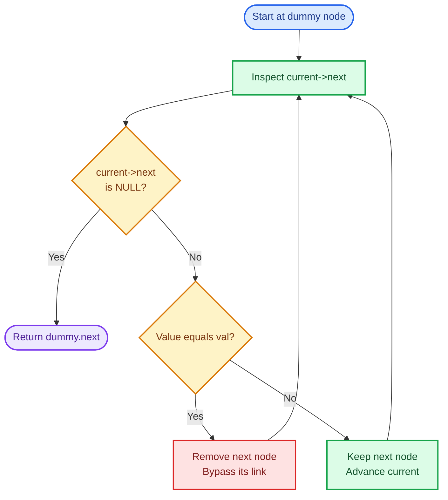
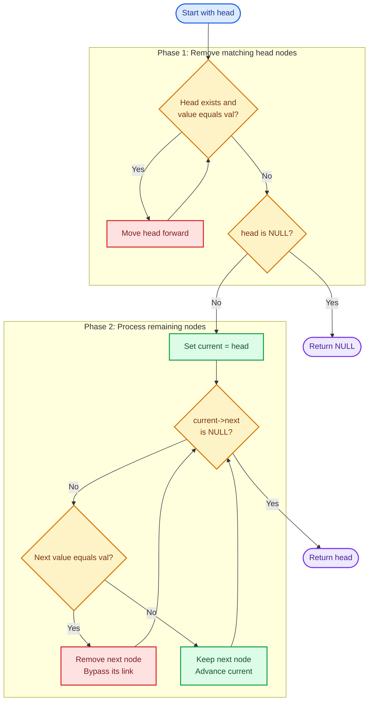
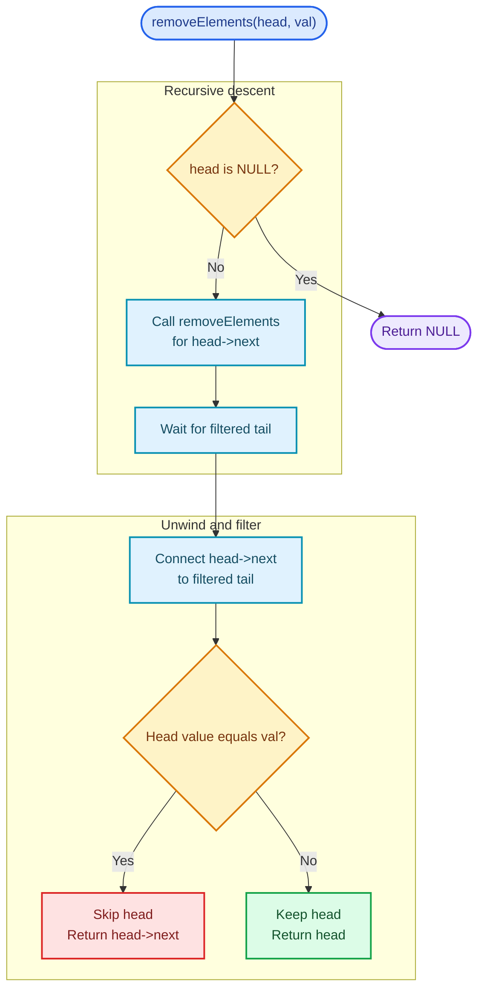

# Cornell Notes

## Topic: Leetcode - 203 - Remove Linked List Elements

## Date: 24/07/2026

---

<p align="center"><strong><em>"DO NOT JUST TALK ABOUT IT — SHOW IT"</em></strong></p>

---

### Problem Description

Given the `head` of a singly linked list and an integer `val`, remove every node whose value equals `val` and return the new head of the resulting list.

The relative order of all retained nodes must remain unchanged. Because one or more nodes at the beginning of the list may be removed, the returned head can differ from the original head. If every node is removed, return a null pointer.

#### Example 1

```text
Input:  head = [1,2,6,3,4,5,6], val = 6
Output: [1,2,3,4,5]
```

The two nodes containing `6` are removed while the remaining nodes keep their original order.

#### Example 2

```text
Input:  head = [], val = 1
Output: []
```

The input list is empty, so the result is also empty.

#### Example 3

```text
Input:  head = [7,7,7,7], val = 7
Output: []
```

Every node contains the target value, so every node is removed.

#### Constraints

- The number of nodes is in the range `[0, 10^4]`.
- `1 <= Node.val <= 50`
- `0 <= val <= 50`

#### Function Contract

- **Input:** A pointer to the first node and the value to remove.
- **Output:** A pointer to the first retained node, or null when no nodes remain.
- **Mutation:** The existing list may be modified by reconnecting its `next` pointers.
- **Ordering:** Retained nodes must stay in their original relative order.

---

### Cue Column (Questions, Keywords, or Prompts)

- Why is removing the head different from removing other nodes?
- How does a dummy node remove special-case logic?
- Which pointer should advance after a node is removed?
- What invariant must always hold?
- Is one pass sufficient or do we need multiple?
- What edge cases expose broken pointer updates?

---

### Notes Section (Main Notes)

## Mindset First (language-agnostic)

- Recognize pattern: conditionally unlink nodes from a singly linked list.
- NOT an array-shifting problem; removal changes links, not stored positions.
- The main difficulty is that the original head may need to be removed.
- A dummy node placed before `head` gives every real node a predecessor.
- Lock invariant before coding:
	- `current->next` is the node currently being inspected.
	- Nodes before `current` have already been processed.
	- The list from the dummy node to `current` contains no node equal to `val`.
	- If `current->next` is removed, keep `current` in place.
	- If `current->next` is kept, advance `current`.
- Complexity targets fixed early:
	- Time must be `O(n)` (inspect each node once).
	- Extra space must be `O(1)` (only a dummy node and pointers).

## Strategy A: Dummy Node (Most Robust - Optimal)

- Create a dummy node whose `next` points to the original head.
- Maintain a pointer named `current`, initially pointing to the dummy node.
- Inspect `current->next` instead of `current`.
- Algorithm:
	1. Set `dummy.next = head`.
	2. Set `current = &dummy`.
	3. While `current->next` is not null:
		- If `current->next->val == val`, bypass that node.
		- Otherwise, keep that next node and move `current` forward to it.
	4. Return `dummy.next`.
- Why strong:
	- `O(n)` time and `O(1)` extra space (truly optimal).
	- Handles an empty list naturally.
	- Handles one or many matching head nodes without separate loops.
	- Uses the same removal logic for every node position.
- Invariant maintained:
	- Every node before `current->next` has already been processed.
	- `current` always points to a retained node or the dummy node.

### Strategy A Flow



## Strategy B: Update Head First, Then Traverse

- Remove matching nodes from the beginning before processing the rest.
- Algorithm:
	1. While `head` exists and `head->val == val`, move `head` forward.
	2. Set `current = head`.
	3. Inspect and possibly unlink `current->next`.
	4. Return the updated `head`.
- Why useful:
	- Uses no dummy node.
	- Makes head-removal behavior explicit.
- Trade-off:
	- Requires separate logic for the head and the remaining nodes.
	- Easier to miss consecutive matching nodes at the beginning.
	- More branches usually mean more opportunities for pointer mistakes.

### Strategy B Flow



## Strategy C: Recursive Filtering

- Solve the smaller list first, then decide whether to keep the current node.
- Concept:
	1. Recursively filter `head->next`.
	2. Assign the filtered result back to `head->next`.
	3. Return `head->next` when `head->val == val`; otherwise return `head`.
- Why useful:
	- Very compact.
	- Naturally expresses "filter the rest, then filter this node."
- Trade-off:
	- Uses `O(n)` call-stack space.
	- A list with 10,000 nodes may risk stack overflow.
	- Iterative dummy-node traversal is safer and more space-efficient.

### Strategy C Flow



## Common Failure Points (all languages)

- Dereferencing `head` or `current->next` before checking for null.
- Returning the original `head` instead of `dummy.next`.
- Advancing `current` immediately after removing a node.
- Skipping consecutive matching nodes because of an incorrect pointer advance.
- Updating only a local pointer without reconnecting the previous node.
- Losing the rest of the list before saving or using the next link.
- Allocating a dummy node on the heap when a stack node is sufficient.
- Forgetting that all nodes, including the original head, may be removed.
- Accessing a removed node after it has been freed.

## Edge Cases to Test

| Case | Input | `val` | Expected | Notes |
|------|-------|-------|----------|-------|
| Empty list | `[]` | 1 | `[]` | Head is already null |
| Single matching node | `[1]` | 1 | `[]` | New head becomes null |
| Single non-matching node | `[1]` | 2 | `[1]` | Original head remains |
| All nodes match | `[7,7,7,7]` | 7 | `[]` | Every node is removed |
| No nodes match | `[1,2,3]` | 4 | `[1,2,3]` | List remains unchanged |
| Match at head | `[6,1,2,3]` | 6 | `[1,2,3]` | Head must change |
| Consecutive heads | `[6,6,6,1]` | 6 | `[1]` | Repeated head removal |
| Match in middle | `[1,2,6,3]` | 6 | `[1,2,3]` | Reconnect predecessor |
| Consecutive middle | `[1,6,6,2]` | 6 | `[1,2]` | Do not advance after removal |
| Match at tail | `[1,2,3,6]` | 6 | `[1,2,3]` | New tail points to null |
| Alternating matches | `[6,1,6,2,6]` | 6 | `[1,2]` | Repeated keep/remove pattern |

## Why the Dummy-Node Approach is Interview Gold

1. **Uniform logic**: Head, middle, and tail removals use the same operation.
2. **Optimal space**: True `O(1)` with one stack node and one pointer.
3. **Optimal time**: Every node is inspected exactly once.
4. **Simple invariant**: Always decide what to do with `current->next`.
5. **Fewer branches**: No separate head-removal phase is required.
6. **Generalizable**: Useful for list deletion, partitioning, merging, and reversal problems.

## Pointer Movement Rule

| Condition | Link update | Move `current`? | Reason |
|-----------|-------------|-----------------|--------|
| `current->next->val == val` | Bypass `current->next` | No | The new `current->next` has not been checked |
| `current->next->val != val` | Keep the link | Yes | That node is confirmed valid |

## Implementation Checklist

- [ ] Create a stack-allocated dummy node.
- [ ] Point `dummy.next` to `head`.
- [ ] Initialize `current` to the dummy node.
- [ ] Loop while `current->next` is not null.
- [ ] Bypass matching nodes through `current->next`.
- [ ] Do not advance `current` after a removal.
- [ ] Advance `current` only when keeping a node.
- [ ] Return `dummy.next`, not the original `head`.
- [ ] Test empty, all-match, no-match, and consecutive-match cases.
- [ ] Confirm time `O(n)` and extra space `O(1)`.

---

### Summary Section (Summary of Notes)

Core mindset: remove linked-list nodes by changing links, not by shifting values. A stack-allocated dummy node makes the operation uniform because even the original head has a predecessor. Inspect `current->next`: bypass it when its value equals `val`, otherwise advance `current`. Never advance immediately after removal because the replacement `current->next` has not yet been checked. This produces an optimal single-pass solution with `O(n)` time and `O(1)` extra space while naturally handling empty lists, repeated matching heads, consecutive matches, and complete removal.
