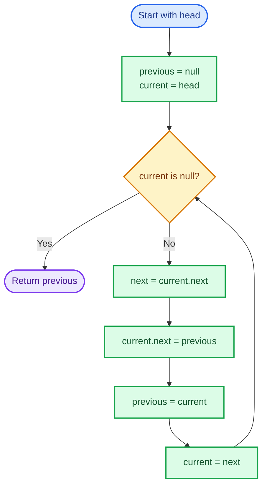
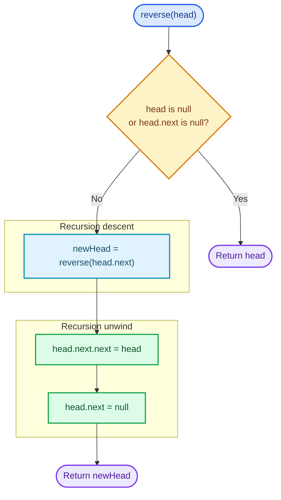

# Cornell Notes

## Topic: Leetcode - 206 - Reverse Linked List

## Date: 24/07/2026

---

<p align="center"><strong><em>"DO NOT JUST TALK ABOUT IT — SHOW IT"</em></strong></p>

---

### Problem Description

Given the `head` of a singly linked list, reverse the direction of every link and return the new head. The same nodes must appear in the opposite order; links change, but nodes do not move.

#### Example 1

```text
Input:  head = [1,2,3,4,5]
Output: [5,4,3,2,1]
```

The original tail becomes the new head, and each node points to its former predecessor.

#### Example 2

```text
Input:  head = [1,2]
Output: [2,1]
```

#### Example 3

```text
Input:  head = []
Output: []
```

An empty list remains empty.

#### Constraints

- The number of nodes is in the range `[0, 5000]`.
- `-5000 <= Node.val <= 5000`.

#### Function Contract

- **Input:** `head`, a pointer or reference to the first node of a singly linked list, or null for an empty list.
- **Output:** A pointer or reference to the first node of the reversed list; null when the input is empty.
- **Mutation:** Rewire each existing node's `next` link in place. Do not require new list nodes.
- **Ordering:** If the input values are `[a, b, c]`, the returned list must be `[c, b, a]`.
- **Ownership or memory:** Node ownership does not change. The function neither allocates nor frees list nodes.

---

### Cue Column (Questions, Keywords, or Prompts)

- What pattern converts a one-way chain without losing access to its remaining nodes?
- Which three pointers describe the processed prefix, current node, and unprocessed suffix?
- What invariant holds before and after every iterative pointer update?
- Why must `current->next` be saved before changing it?
- What are the base cases for the recursive solution?
- Why is iteration `O(1)` auxiliary space while recursion is `O(n)`?
- How should null, one-node, two-node, duplicate-value, and maximum-size lists behave?
- Which mistakes create a lost suffix, cycle, or incorrect returned head?

---

### Notes Section (Main Notes)

## Mindset First (language-agnostic)

- Pattern: In-place linked-list pointer reversal.
- Invariant: Before each iteration, `previous` is the head of a correctly reversed processed prefix, while `current` is the head of the untouched suffix.
- Target time: `O(n)`.
- Target auxiliary space: `O(1)`.
- Optimality: Every node's link must be examined or changed, so `O(n)` time is asymptotically optimal. Three pointers are sufficient, so no size-dependent auxiliary storage is needed.

## Strategy A: Iterative Three-Pointer Reversal

- Core idea: Walk forward through the original list while reversing one `next` link at a time.
- Algorithm:
  1. Initialize `previous` to null and `current` to `head`.
  2. While `current` is not null, save `current->next` as `next`.
  3. Redirect `current->next` to `previous`.
  4. Advance `previous` to `current` and `current` to `next`.
  5. Return `previous`, which is the original tail and new head.
- Correctness:
  - Initially, the processed prefix is empty, so `previous = null` correctly represents its reversed form.
  - Each iteration preserves the unprocessed suffix through `next`, reverses exactly one link, and extends the correctly reversed prefix by one node.
  - When `current` becomes null, no nodes remain unprocessed. Therefore, `previous` heads the complete reversed list.
- Complexity: `O(n)` time and `O(1)` auxiliary space.
- Benefits: Optimal space, no allocation, no recursion-depth risk, and stable behavior at the `5000`-node limit.
- Trade-offs: Pointer-update order is critical; overwriting `current->next` before saving it loses the remaining suffix.

### Strategy A Flow



## Strategy B: Recursive Suffix Reversal

- Core idea: Recursively reverse the suffix beginning at `head->next`, then attach `head` after that reversed suffix.
- Algorithm:
  1. If `head` is null or `head->next` is null, return `head`.
  2. Recursively reverse the list starting at `head->next`; store its head as `newHead`.
  3. Set `head->next->next = head` so the former successor points back to `head`.
  4. Set `head->next = null` so the old forward link cannot form a cycle.
  5. Return `newHead` unchanged through every stack frame.
- Correctness:
  - The base case is already reversed because it contains zero or one node.
  - Assume recursion correctly reverses the suffix. Redirecting the former successor's `next` link to `head` appends `head` to that reversed suffix.
  - Clearing `head->next` makes `head` the suffix tail and prevents a cycle. Thus the whole list is reversed.
- Complexity: `O(n)` time and `O(n)` auxiliary space for the recursive call stack.
- Benefits: Compact expression of the inductive structure and useful for explaining recursive linked-list reasoning.
- Trade-offs: Uses linear stack space and risks stack overflow on larger constraints or environments with small stacks.

### Strategy B Flow



## Pointer-State Transition

For a local chain `previous <- current -> next`, one iteration performs:

1. Save `next` before breaking the forward link.
2. Change the link to `previous <- current`.
3. Move both traversal pointers one position forward in the original order.

| State | `previous` | `current` | `next` |
|-------|------------|-----------|--------|
| Before update | Reversed prefix head | Node being processed | Not yet saved |
| After saving | Reversed prefix head | Node being processed | Original successor |
| After rewiring | New reversed prefix tailward link | Node being processed | Preserved suffix head |
| After advancing | New reversed prefix head | Preserved suffix head | Recomputed next iteration |

## Common Failure Points (all languages)

- Reassigning `current->next` before saving the original successor, which loses the unprocessed suffix.
- Returning `current` after the loop; it is null. Return `previous`.
- Forgetting to initialize `previous` to null, so the new tail may point to invalid data.
- Advancing pointers in the wrong order and skipping nodes.
- Allocating replacement nodes when only link rewiring is required.
- In recursion, omitting `head->next = null`, which creates a cycle.
- Claiming recursive auxiliary space is `O(1)` while ignoring the `O(n)` call stack.
- Treating node values as unique; reversal depends on links, not values.

## Edge Cases to Test

| Case | Input | Expected | Notes |
|------|-------|----------|-------|
| Empty list | `[]` | `[]` | Return null without dereferencing it. |
| Single node | `[1]` | `[1]` | Node becomes both head and tail. |
| Two nodes | `[1,2]` | `[2,1]` | Smallest case that changes a link. |
| Odd length | `[1,2,3,4,5]` | `[5,4,3,2,1]` | Standard example. |
| Even length | `[1,2,3,4]` | `[4,3,2,1]` | Confirms no midpoint assumption. |
| Duplicate values | `[7,7,7,7]` | `[7,7,7,7]` | Verify node identity and links, not values alone. |
| Value boundaries | `[-5000,0,5000]` | `[5000,0,-5000]` | Values do not affect pointer logic. |
| Maximum size | `5000` nodes | Same nodes in reverse order | Confirms linear traversal and safe iterative space. |

## Why Iterative Three-Pointer Reversal is Interview Gold

1. It reaches the optimal `O(n)` time and `O(1)` auxiliary-space bounds.
2. Its invariant is precise and easy to prove.
3. It demonstrates safe mutation under pointer dependencies.
4. It handles empty, singleton, and maximum-size lists without special-case code inside the loop.
5. It avoids recursive stack growth while preserving every original node.

## Implementation Checklist

- [ ] Initialize `previous` to null and `current` to `head`.
- [ ] Save the original successor before changing `current->next`.
- [ ] Reverse exactly one link per iteration.
- [ ] Advance `previous` and `current` using the saved successor.
- [ ] Return `previous`, not null `current`.
- [ ] Confirm the original head becomes the new tail with a null `next`.
- [ ] Reuse all original nodes without allocation or deallocation.
- [ ] Test empty, one-node, two-node, duplicate-value, boundary-value, and maximum-size lists.
- [ ] Verify `O(n)` time and `O(1)` iterative auxiliary space.
- [ ] Count recursive call-stack usage as `O(n)` when discussing Strategy B.

---

### Summary Section (Summary of Notes)

Reverse Linked List is an in-place pointer-reversal problem. The key invariant is that `previous` always heads a correctly reversed processed prefix while `current` heads the untouched suffix. The optimal iterative strategy saves the next node, reverses the current link, and advances both pointers, producing `O(n)` time and `O(1)` auxiliary space. Null and singleton inputs work naturally, the original head becomes a null-terminated tail, and the same nodes are returned in reverse order. Recursion is correct and expressive but uses `O(n)` auxiliary stack space.
