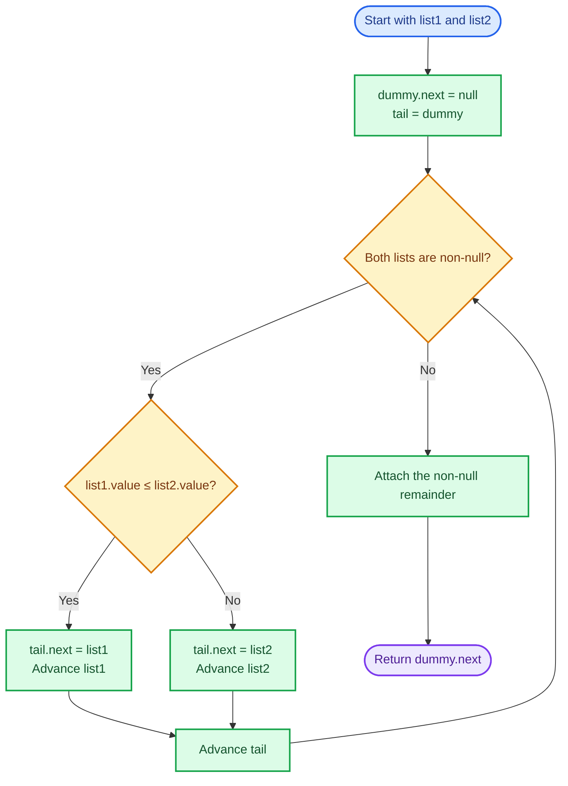
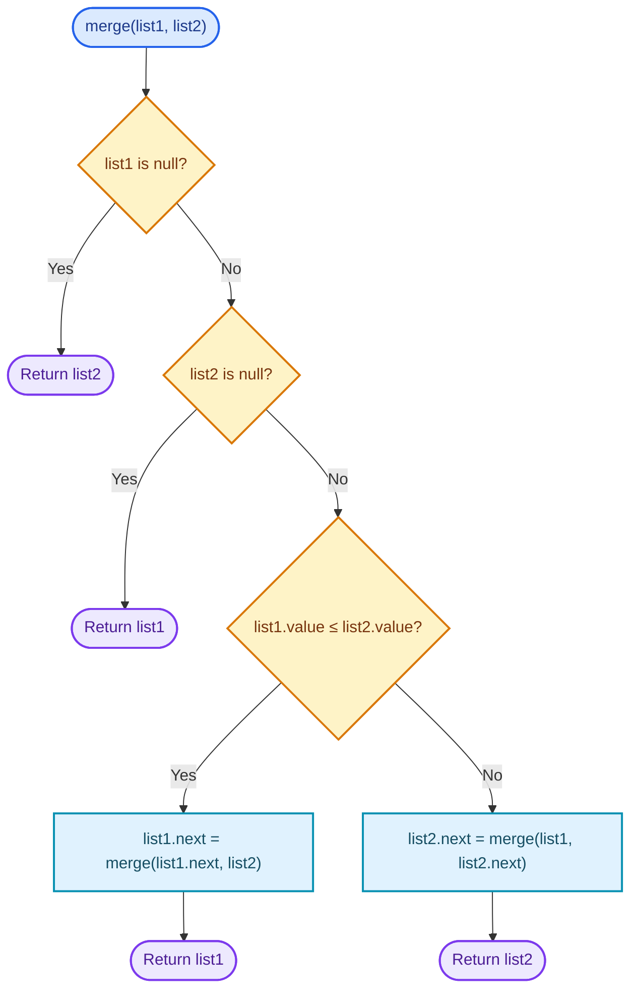
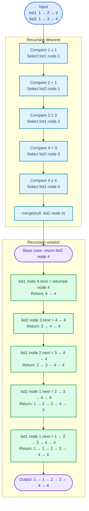

# Cornell Notes

## Topic: Leetcode - 21 - Merge Two Sorted Lists

## Date: 25/07/2026

---

<p align="center"><strong><em>"DO NOT JUST TALK ABOUT IT — SHOW IT"</em></strong></p>

---

### Problem Description

Given the heads of two linked lists sorted in non-decreasing order, merge them into one sorted linked list and return its head.

Build the result by splicing together the existing nodes. Links change, but nodes do not move or need to be copied.

#### Example 1

```text
Input:  list1 = [1,2,4], list2 = [1,3,4]
Output: [1,1,2,3,4,4]
```

At each step, take the smaller current node. When the values are equal, either equal-valued node may be selected first without changing the required value sequence.

#### Example 2

```text
Input:  list1 = [], list2 = []
Output: []
```

Both inputs are empty, so the merged head is null.

#### Example 3

```text
Input:  list1 = [], list2 = [0]
Output: [0]
```

When one input is empty, the other list is already the complete merged result.

#### Constraints

- The number of nodes in both lists is in the range `[0, 50]`.
- `-100 <= Node.val <= 100`
- Both `list1` and `list2` are sorted in non-decreasing order.

#### Function Contract

- **Input:** Two pointers or references to the heads of sorted singly linked lists; either may be null.
- **Output:** The head of one non-decreasing list containing every input node exactly once.
- **Mutation:** Reconnect the existing nodes through their `next` links.
- **Ordering:** Preserve non-decreasing value order and the relative order of nodes taken from the same input list.
- **Ownership or memory:** Reuse all original nodes. Do not free them or require replacement nodes; a stack-allocated dummy node is allowed because it is not returned.

---

### Cue Column (Questions, Keywords, or Prompts)

- Which familiar algorithm uses the same two-sequence merge pattern?
- What invariant describes the merged prefix and the two unprocessed suffixes?
- Why is comparing only the two current heads sufficient?
- When should `tail`, `list1`, and `list2` advance?
- Why can the remaining suffix be attached without further comparisons?
- What are the recursive base cases?
- Why is iterative auxiliary space `O(1)` but recursive space `O(m+n)`?
- Which mistakes lose nodes, create cycles, or return the dummy node?

---

### Notes Section (Main Notes)

## Mindset First (language-agnostic)

- Pattern: Merge two sorted sequences by repeatedly selecting the smaller front element.
- Linked-list advantage: Selecting a node only changes links; no array shifting is required.
- Invariant: Before each comparison, the chain from `dummy.next` through `tail` is sorted and contains exactly the nodes already selected. `list1` and `list2` point to the smallest unmerged nodes in their respective lists.
- Target time: `O(m+n)`, where `m` and `n` are the two list lengths.
- Target iterative auxiliary space: `O(1)`.
- Optimality: Every input node must appear in the result, so any correct algorithm requires `O(m+n)` time.

## Strategy A: Iterative Dummy Node and Tail Pointer

- Core idea: Build a sorted result prefix behind a stack-allocated dummy node while `tail` tracks its final node.
- Algorithm:
  1. Create `dummy` and set `tail = &dummy`.
  2. While both lists are non-null, compare their current node values.
  3. Attach the smaller node to `tail->next`, advance that input pointer, and then advance `tail`.
  4. When one list becomes null, attach the other list's entire remaining suffix.
  5. Return `dummy.next`.
- Correctness:
  - Initially, the merged prefix is empty and therefore sorted.
  - Because each input is sorted, its head is its smallest remaining value. Selecting the smaller head therefore selects the smallest value not yet merged.
  - Attaching that node preserves the sorted-prefix invariant and removes exactly one node from the unprocessed inputs.
  - Once one list is empty, the other suffix is already sorted and every one of its values is at least as large as the merged tail. Attaching it completes the result.
- Complexity: `O(m+n)` time and `O(1)` auxiliary space.
- Benefits: Optimal time and space, no recursion-depth risk, uniform head handling, and direct reuse of original nodes.
- Trade-offs: Pointer-update order matters; advancing `tail` or an input pointer incorrectly can lose nodes or create a malformed chain.

### Strategy A Flow



## Worked Example A: Iterative Merge on `[1,2,4] + [1,3,4]`

This flow uses `<=` for ties, so the node from `list1` is selected first when both current values are equal.

### Strategy A Worked Example Flow

```mermaid
flowchart TD
    A(["Input<br/>list1: 1 → 2 → 4<br/>list2: 1 → 3 → 4"])
    A --> B["Merged: empty<br/>tail = dummy"]
    B --> C1{"list1 1 ≤ list2 1?"}
    C1 -- Yes --> D1["Attach list1 node 1<br/>Merged: 1<br/>list1: 2 → 4"]
    D1 --> C2{"list1 2 ≤ list2 1?"}
    C2 -- No --> D2["Attach list2 node 1<br/>Merged: 1 → 1<br/>list2: 3 → 4"]
    D2 --> C3{"list1 2 ≤ list2 3?"}
    C3 -- Yes --> D3["Attach list1 node 2<br/>Merged: 1 → 1 → 2<br/>list1: 4"]
    D3 --> C4{"list1 4 ≤ list2 3?"}
    C4 -- No --> D4["Attach list2 node 3<br/>Merged: 1 → 1 → 2 → 3<br/>list2: 4"]
    D4 --> C5{"list1 4 ≤ list2 4?"}
    C5 -- Yes --> D5["Attach list1 node 4<br/>Merged: 1 → 1 → 2 → 3 → 4<br/>list1: null"]
    D5 --> C6{"Both lists are non-null?"}
    C6 -- No --> D6["Attach remaining list2 node 4<br/>Merged: 1 → 1 → 2 → 3 → 4 → 4"]
    D6 --> F(["Return 1 → 1 → 2 → 3 → 4 → 4"])

    classDef start fill:#dbeafe,stroke:#2563eb,color:#1e3a8a,stroke-width:2px;
    classDef decision fill:#fef3c7,stroke:#d97706,color:#78350f,stroke-width:2px;
    classDef keep fill:#dcfce7,stroke:#16a34a,color:#14532d,stroke-width:2px;
    classDef finish fill:#ede9fe,stroke:#7c3aed,color:#4c1d95,stroke-width:2px;

    class A,B start;
    class C1,C2,C3,C4,C5,C6 decision;
    class D1,D2,D3,D4,D5,D6 keep;
    class F finish;
```



## Strategy B: Recursive Head Selection

- Core idea: Select the smaller current head, recursively merge the remaining suffixes, and connect the selected node to that recursive result.
- Algorithm:
  1. If `list1` is null, return `list2`.
  2. If `list2` is null, return `list1`.
  3. If `list1->val <= list2->val`, set `list1->next` to the merge of `list1->next` and `list2`, then return `list1`.
  4. Otherwise, set `list2->next` to the merge of `list1` and `list2->next`, then return `list2`.
- Correctness:
  - The base cases are correct because merging any sorted list with an empty list returns the non-empty list unchanged.
  - For non-empty inputs, the smaller head is the smallest remaining node overall.
  - Assuming the recursive call correctly merges the remaining suffixes, linking the selected head before that result produces a sorted list containing every remaining node exactly once.
- Complexity: `O(m+n)` time and `O(m+n)` auxiliary stack space in the worst case.
- Benefits: Compact and closely matches the inductive definition of merging two sorted lists.
- Trade-offs: Linear call-stack growth, recursion-depth risk, and less explicit pointer state than the iterative approach.

### Strategy B Flow



## Worked Example B: Recursive Merge on `[1,2,4] + [1,3,4]`

This flow shows every recursive selection during descent and every `next` connection during unwind.

### Strategy B Worked Example Flow



## Pointer Roles and Movement

| Pointer | Meaning | When it moves |
|---------|---------|---------------|
| `dummy` | Stable node before the merged head | Never |
| `tail` | Final node of the correctly merged prefix | After attaching one selected node |
| `list1` | First unmerged node from the first list | When its node is selected |
| `list2` | First unmerged node from the second list | When its node is selected |

When both lists are non-null, move exactly one input pointer per comparison. When either list becomes null, link the whole remaining suffix in one operation.

## Common Failure Points (all languages)

- Returning the dummy node instead of `dummy.next`.
- Forgetting to initialize `dummy.next` when the language does not do so automatically.
- Advancing `tail` before attaching the selected node.
- Advancing both input pointers after one comparison and losing a node.
- Forgetting to attach the non-empty remainder after the comparison loop.
- Allocating replacement nodes instead of splicing the originals.
- Comparing a node value before checking that its pointer is non-null.
- Creating a cycle by linking `tail` to an already processed node.
- Claiming the recursive solution uses `O(1)` auxiliary space while ignoring its call stack.
- Assuming values are unique; duplicates must be retained.

## Edge Cases to Test

| Case | `list1` | `list2` | Expected | Purpose |
|------|---------|---------|----------|---------|
| Both empty | `[]` | `[]` | `[]` | Return null |
| First empty | `[]` | `[0]` | `[0]` | Return second head |
| Second empty | `[0]` | `[]` | `[0]` | Return first head |
| Single nodes, first smaller | `[1]` | `[2]` | `[1,2]` | Smallest changing merge |
| Single nodes, second smaller | `[2]` | `[1]` | `[1,2]` | Select second list first |
| Duplicate values | `[1,1,1]` | `[1,1]` | `[1,1,1,1,1]` | Retain every node |
| Alternating values | `[1,3,5,7]` | `[2,4,6,8]` | `[1,2,3,4,5,6,7,8]` | Repeated pointer switching |
| First list entirely smaller | `[1,2,3]` | `[4,5,6]` | `[1,2,3,4,5,6]` | Attach second remainder |
| Second list entirely smaller | `[4,5,6]` | `[1,2,3]` | `[1,2,3,4,5,6]` | Attach first remainder |
| Value boundaries | `[-100,0,100]` | `[-100,50,100]` | `[-100,-100,0,50,100,100]` | Minimum, maximum, and ties |
| Maximum combined size | `25` nodes | `25` nodes | `50` sorted nodes | Constraint-scale structure |

## Why Iterative Dummy-Tail Merge is Interview Gold

1. It directly applies the merge step used by merge sort.
2. It achieves optimal `O(m+n)` time with `O(1)` auxiliary space.
3. The dummy node removes special handling for the result head.
4. Its invariant is concise: the prefix behind `dummy` is complete and sorted.
5. It naturally handles empty inputs, duplicates, and an exhausted list.
6. It reuses every original node without allocation or deallocation.

## Implementation Checklist

- [ ] Use a stack-allocated dummy node.
- [ ] Initialize `tail` to the dummy node.
- [ ] Compare values only while both input pointers are non-null.
- [ ] Attach exactly one node per comparison.
- [ ] Advance only the input pointer whose node was selected.
- [ ] Advance `tail` after attaching the selected node.
- [ ] Attach the complete non-null remainder after the loop.
- [ ] Return `dummy.next`.
- [ ] Preserve every input node exactly once and terminate with null.
- [ ] Test empty lists, duplicates, value boundaries, alternating values, and maximum size.
- [ ] State iterative `O(1)` and recursive `O(m+n)` auxiliary space accurately.

---

### Summary Section (Summary of Notes)

Merge Two Sorted Lists is the linked-list form of merging two sorted sequences. The key invariant is that the chain ending at `tail` is sorted and complete for all processed nodes, while `list1` and `list2` point to the smallest remaining candidates. The optimal iterative strategy uses a stack dummy and tail pointer to splice one node at a time, then attaches the remaining suffix, giving `O(m+n)` time and `O(1)` auxiliary space. Empty inputs return the other list naturally, duplicate values are preserved, and links change while nodes do not move. Recursive head selection is also correct and runs in `O(m+n)` time, but its call stack requires `O(m+n)` auxiliary space.
