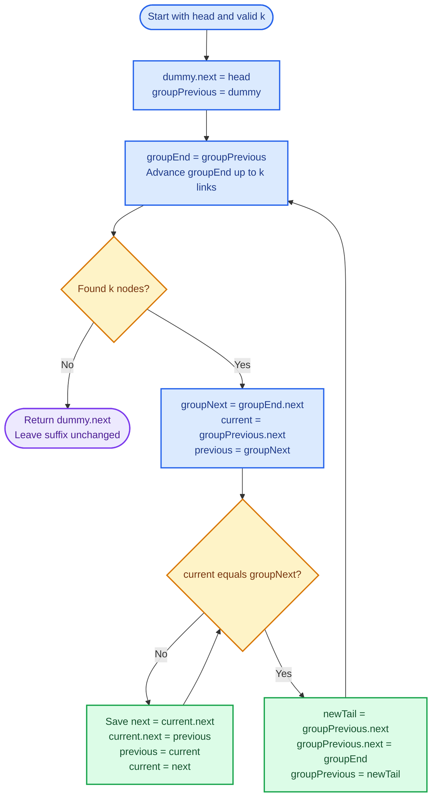
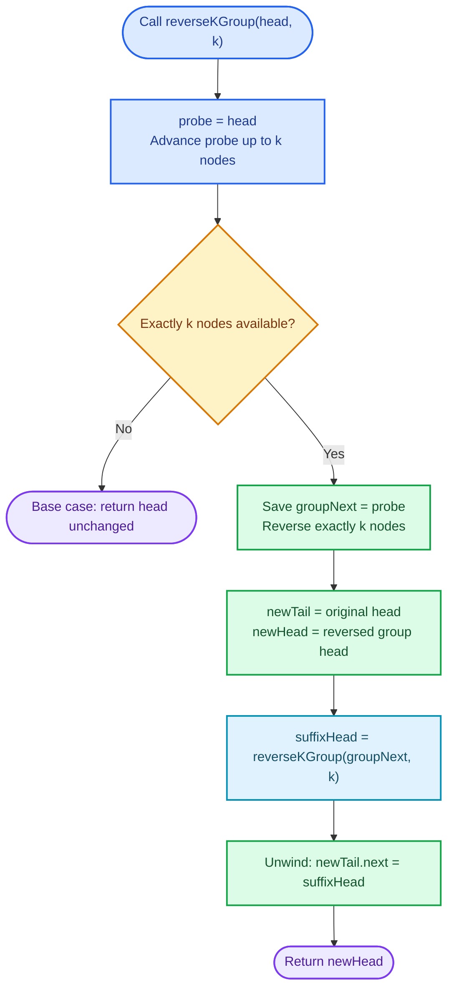
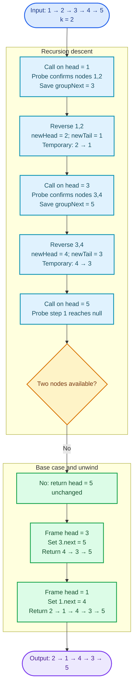

# Cornell Notes

## Topic: Leetcode - 25 - Reverse Nodes in k-Group

## Date: 02/09/2026

---

<p align="center"><strong><em>"DO NOT JUST TALK ABOUT IT — SHOW IT"</em></strong></p>

---

### Problem Description

Given the head of a singly linked list and a positive integer `k`, reverse the list's nodes in consecutive groups of exactly `k`. Leave a final group containing fewer than `k` nodes unchanged. Return the modified list head.

Only links may change. Node values must remain unchanged.

#### Example 1

```text
Input:  head = [1,2,3,4,5], k = 2
Output: [2,1,4,3,5]
```

The first two complete groups are reversed. The final node remains unchanged.

#### Example 2

```text
Input:  head = [1,2,3,4,5], k = 3
Output: [3,2,1,4,5]
```

Only the first three nodes form a complete group. The final two nodes retain their order.

#### Constraints

- The list contains `n` nodes.
- `1 <= k <= n <= 5000`.
- `0 <= Node.val <= 1000`.

#### Function Contract

- **Input:** `head`, the first node of a valid non-empty singly linked list, and a valid group size `k`.
- **Output:** The head of the list after every complete `k`-node group is reversed.
- **Mutation:** Existing `next` links change in place. Node values do not change.
- **Ordering:** Nodes inside complete groups appear in reverse order. A final incomplete group preserves its original order.
- **Ownership or memory:** Reuse every original node. Do not allocate replacement list nodes or destroy nodes.

---

### Cue Column (Questions, Keywords, or Prompts)

- How can a dummy head simplify reconnecting the first reversed group?
- How is a complete group confirmed before any destructive link update?
- Which three boundaries identify the previous group, current group, and following group?
- Why must reversal begin with `previous = groupNext`?
- After reversal, which original node becomes the next `groupPrevious`?
- What invariant keeps processed groups connected to the untouched suffix?
- Why is iterative in-place reversal `O(1)` auxiliary space?
- What failure corrupts an incomplete final group?

---

### Notes Section (Main Notes)

## Mindset First (language-agnostic)

- Pattern: dummy head, fixed-size group detection, in-place sublist reversal, boundary reconnection.
- Invariant: before each iteration, `groupPrevious.next` is the first unprocessed node; all earlier complete groups are correctly reversed and connected; the remaining suffix is intact.
- Target time: `O(n)`.
- Target auxiliary space: `O(1)`.
- Optimality: every node must be inspected to determine complete groups, giving an `O(n)` lower bound. Relinking existing nodes permits constant auxiliary space.

## Strategy A: Iterative In-Place Group Reversal

- Core idea: use a dummy node before `head`. For each candidate group, first locate its `k`th node. Reverse only after confirming the complete group, then reconnect both boundaries.
- Algorithm:
  1. Set `dummy.next = head` and `groupPrevious = dummy`.
  2. Walk `k` links from `groupPrevious` to find `groupEnd`.
  3. If `groupEnd` is null, return `dummy.next`; the remaining nodes form an incomplete group.
  4. Save `groupNext = groupEnd.next`.
  5. Reverse links from `groupPrevious.next` through `groupEnd`, initializing `previous = groupNext`.
  6. Save the original group head, now the group tail; connect `groupPrevious.next` to `groupEnd`.
  7. Move `groupPrevious` to the new group tail and repeat.
- Correctness: group detection prevents changing an incomplete suffix. During reversal, `previous` always heads the already-reversed part connected to `groupNext`, while `current` heads the unreversed part. On completion, `groupEnd` is the new group head and the original group head is the new tail. Reconnecting those boundaries preserves one valid list and restores the loop invariant.
- Complexity: `O(n)` time, `O(1)` auxiliary space.
- Benefits: optimal complexity, no recursion depth, no replacement nodes, uniform first-group handling.
- Trade-offs: boundary names and update order require care; losing `groupNext` or the original group head breaks reconnection.

### Strategy A Flow



## Worked Example A: Iterative In-Place Group Reversal on `head = [1,2,3,4,5], k = 2`

`D` denotes the dummy node. Each update shows the reachable list after relinking.

### Strategy A Worked Example Flow

```mermaid
flowchart TD
    A(["Input: D → 1 → 2 → 3 → 4 → 5<br/>k = 2"]) --> B["groupPrevious = D"]
    B --> C1["Advance 2 links<br/>groupEnd = 2"]
    C1 --> D1{"Complete group?"}
    D1 -- Yes --> E1["Save groupNext = 3<br/>current = 1; previous = 3"]
    E1 --> F1["Save next = 2<br/>Set 1.next = 3<br/>previous = 1; current = 2"]
    F1 --> G1["Save next = 3<br/>Set 2.next = 1<br/>previous = 2; current = 3"]
    G1 --> H1["Connect D.next = 2<br/>groupPrevious = 1<br/>List: D → 2 → 1 → 3 → 4 → 5"]
    H1 --> C2["Advance 2 links from 1<br/>groupEnd = 4"]
    C2 --> D2{"Complete group?"}
    D2 -- Yes --> E2["Save groupNext = 5<br/>current = 3; previous = 5"]
    E2 --> F2["Save next = 4<br/>Set 3.next = 5<br/>previous = 3; current = 4"]
    F2 --> G2["Save next = 5<br/>Set 4.next = 3<br/>previous = 4; current = 5"]
    G2 --> H2["Connect 1.next = 4<br/>groupPrevious = 3<br/>List: D → 2 → 1 → 4 → 3 → 5"]
    H2 --> C3["Advance from 3<br/>Step 1 reaches 5<br/>Step 2 reaches null"]
    C3 --> D3{"Complete group?"}
    D3 -- No --> R(["Return D.next<br/>Output: 2 → 1 → 4 → 3 → 5"])

    classDef start fill:#dbeafe,stroke:#2563eb,color:#1e3a8a,stroke-width:2px;
    classDef decision fill:#fef3c7,stroke:#d97706,color:#78350f,stroke-width:2px;
    classDef keep fill:#dcfce7,stroke:#16a34a,color:#14532d,stroke-width:2px;
    classDef finish fill:#ede9fe,stroke:#7c3aed,color:#4c1d95,stroke-width:2px;

    class A,B,C1,E1,C2,E2,C3 start;
    class D1,D2,D3 decision;
    class F1,G1,H1,F2,G2,H2 keep;
    class R finish;
```



## Strategy B: Recursive Group Reversal

- Core idea: confirm that `k` nodes exist, reverse that group, recursively process the suffix, then connect the current group's new tail to the returned suffix head.
- Algorithm:
  1. Advance a probe `k` nodes from `head`.
  2. If the probe cannot complete `k` moves, return `head` unchanged.
  3. Reverse exactly the first `k` nodes.
  4. Recursively call the strategy on the node after that group.
  5. Connect the original `head`, now the group tail, to the recursively returned head.
  6. Return the current group's new head.
- Correctness: the base case leaves every incomplete suffix unchanged. For a complete group, local reversal correctly reverses its `k` nodes. Assuming recursion correctly transforms the suffix, connecting the new tail to that result creates the required list. Induction over the number of complete groups proves correctness.
- Complexity: `O(n)` time, `O(n / k)` auxiliary call-stack space.
- Benefits: direct decomposition into one group plus the remaining list; concise conceptual proof.
- Trade-offs: does not meet the `O(1)` auxiliary-space follow-up and can grow the call stack to `O(n)` when `k = 1`.

### Strategy B Flow



## Worked Example B: Recursive Group Reversal on `head = [1,2,3,4,5], k = 2`

The flow shows recursion descent, the incomplete-group base case, then every unwind reconnection.

### Strategy B Worked Example Flow



## Group-Boundary Invariant

For the iterative strategy, before each group-detection phase:

- `groupPrevious` is immediately before the first unprocessed node.
- Every earlier complete group is reversed and connected correctly.
- The suffix beginning at `groupPrevious.next` remains in its original order.
- No link in a candidate group changes until `k` nodes are confirmed.
- After reversal, the original group head becomes the new tail and the original `groupEnd` becomes the new head.
- Links change; nodes do not move and values do not change.

## Common Failure Points (all languages)

- Reversing while counting, then discovering fewer than `k` nodes and leaving the suffix corrupted.
- Advancing only `k - 1` links from `groupPrevious`, selecting the wrong `groupEnd`.
- Initializing `previous` to null instead of `groupNext`, disconnecting the reversed group from the suffix.
- Overwriting `current.next` before saving its old value.
- Forgetting that the original group head becomes the new tail.
- Connecting `groupPrevious.next` to the wrong node after reversal.
- Advancing `groupPrevious` to `groupEnd` instead of the new tail.
- Reversing the final incomplete group.
- Swapping values instead of changing links.
- Calling a recursive implementation `O(1)` space while ignoring its call stack.

## Edge Cases to Test

| Case | Input | Expected | Notes |
|------|-------|----------|-------|
| Single node | `head = [1], k = 1` | `[1]` | Minimum `n` and `k`. |
| Identity operation | `head = [1,2,3], k = 1` | `[1,2,3]` | Every one-node group remains unchanged. |
| Entire list | `head = [1,2,3,4], k = 4` | `[4,3,2,1]` | One complete group, no suffix. |
| Exact multiple | `head = [1,2,3,4,5,6], k = 3` | `[3,2,1,6,5,4]` | Every node belongs to a complete group. |
| One-node remainder | `head = [1,2,3,4,5], k = 2` | `[2,1,4,3,5]` | Final node must remain untouched. |
| Remainder of `k - 1` | `head = [1,2,3,4,5], k = 3` | `[3,2,1,4,5]` | Largest possible incomplete suffix. |
| Duplicate values | `head = [7,7,7,7], k = 2` | `[7,7,7,7]` | Validate node identity, not values alone. |
| Value boundaries | `head = [0,1000,5], k = 2` | `[1000,0,5]` | Values do not affect link behavior. |
| Maximum length | `5000` nodes, valid `k` | Grouped reversal | Confirms linear traversal and bounded stack avoidance. |

## Why Iterative In-Place Group Reversal is Interview Gold

1. It reaches optimal `O(n)` time and `O(1)` auxiliary space.
2. The dummy head removes special handling for the first group.
3. Group detection before mutation protects the incomplete suffix.
4. Explicit boundary pointers make the correctness invariant explainable.
5. The technique generalizes to reversing or replacing bounded linked-list segments.

## Implementation Checklist

- [ ] Create a stack-allocated dummy node before `head`.
- [ ] Start `groupPrevious` at the dummy node.
- [ ] Confirm all `k` nodes before reversing any link.
- [ ] Save `groupNext` before changing links.
- [ ] Save `current.next` before overwriting it.
- [ ] Initialize `previous = groupNext` to preserve suffix connectivity.
- [ ] Connect the prior section to `groupEnd`, the new group head.
- [ ] Advance `groupPrevious` to the original group head, now the tail.
- [ ] Leave an incomplete final group unchanged.
- [ ] Never alter node values or allocate replacement nodes.
- [ ] Verify exact node identity, null termination, and absence of cycles.
- [ ] Confirm `O(n)` time and `O(1)` auxiliary space.

---

### Summary Section (Summary of Notes)

Use a dummy head to process complete `k`-node groups uniformly. Before changing links, locate the group's `k`th node; if it does not exist, return with the incomplete suffix untouched. Save the following node, reverse the confirmed group in place, reconnect its new head and tail, then continue. The boundary invariant keeps processed groups connected and the untouched suffix valid. The iterative strategy runs in optimal `O(n)` time with `O(1)` auxiliary space; recursion also runs in `O(n)` time but consumes `O(n / k)` call-stack space.
