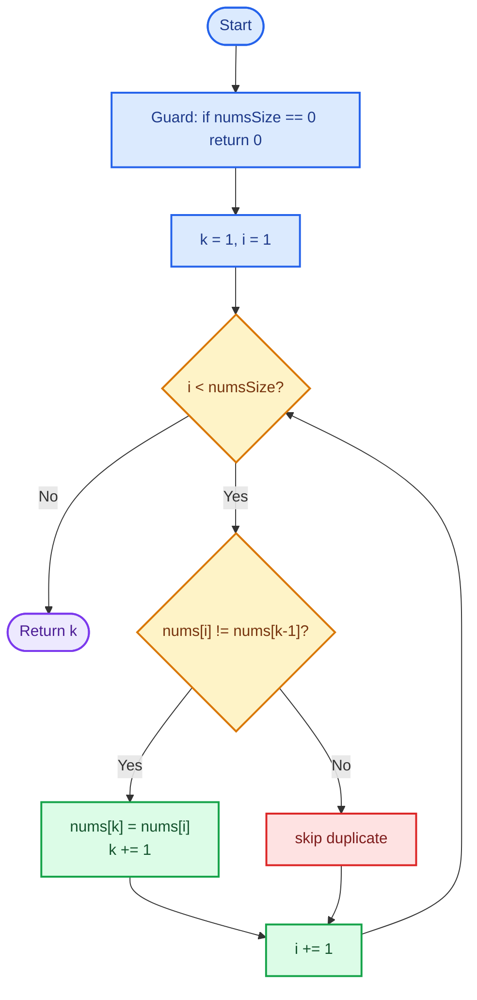
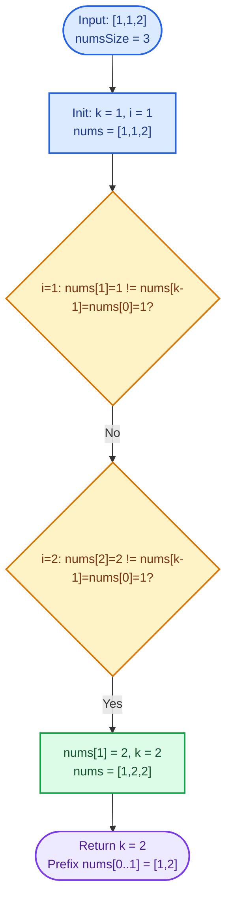

# Cornell Notes

## Topic: Leetcode - 26 - Remove Duplicates from Sorted Array

## Date: 27/07/2026

---

<p align="center"><strong><em>"DO NOT JUST TALK ABOUT IT — SHOW IT"</em></strong></p>

---

### Problem Description

Given an integer array `nums` sorted in non-decreasing order, remove the duplicates **in-place** so that each unique element appears only once. The relative order of the remaining elements must be preserved.

Return `k`, the count of unique elements. After the call, the first `k` slots of `nums` must hold the unique values in their original sorted order. Slots at index `>= k` are ignored by the judge.

#### Example 1

```text
Input:  nums = [1,1,2]
Output: 2, nums = [1,2,_]
```

Return `k = 2`; first two slots are `1, 2`. Slot `[2]` is ignored.

#### Example 2

```text
Input:  nums = [0,0,1,1,1,2,2,3,3,4]
Output: 5, nums = [0,1,2,3,4,_,_,_,_,_]
```

Return `k = 5`; first five slots are `0, 1, 2, 3, 4`. Remaining five slots are ignored.

#### Constraints

- `1 <= nums.length <= 3 * 10^4`
- `-100 <= nums[i] <= 100`
- `nums` is sorted in non-decreasing order.

#### Function Contract

- **Input:** Non-empty sorted integer array `nums` with size `numsSize`.
- **Output:** Integer `k` = number of unique values.
- **Mutation:** Rewrite `nums[0..k-1]` in place to hold unique values in original order.
- **Ordering:** Preserve non-decreasing order of the retained values.
- **Ownership:** No allocation; caller owns the buffer. Slots `nums[k..numsSize-1]` are judge-ignored.

---

### Cue Column (Questions, Keywords, or Prompts)

- Which pattern applies when duplicates sit adjacent in a sorted array?
- What invariant does the write pointer maintain?
- Why does comparing `nums[i]` to `nums[i-1]` suffice instead of scanning `nums[0..k-1]`?
- What target complexity is mandatory given `n <= 3 * 10^4` and in-place requirement?
- Which boundary cases break naive `k = 0` initialization?

---

### Notes Section (Main Notes)

## Mindset First (language-agnostic)

- Pattern: **two-pointer / slow-fast** on a sorted array (write pointer + read pointer).
- Invariant: `nums[0..k-1]` always holds the unique prefix in original order; `k` is the next write slot.
- Sortedness collapses "have I seen this?" into "does it differ from the previous kept value?" — an `O(1)` check.
- Target time: `O(n)` single pass.
- Target auxiliary space: `O(1)` (in-place, no extra buffers).

## Strategy A: Two-Pointer Write / Read (optimal)

- Core idea: `k` is the write pointer marking the next slot for a new unique value. Read pointer `i` scans forward; whenever `nums[i] != nums[i-1]`, copy to `nums[k]` and advance `k`.
- Algorithm:
    1. If `numsSize == 0`, return `0`. (Guard even though constraints promise `n >= 1`.)
    2. Initialize `k = 1` — the first element is always unique.
    3. For `i` from `1` to `numsSize - 1`:
        - If `nums[i] != nums[i - 1]`, assign `nums[k] = nums[i]` and increment `k`.
    4. Return `k`.
- Correctness: input is sorted, so any duplicate of `nums[i]` must equal `nums[i-1]`. Comparing against `nums[i-1]` (the original prior value in the input) is safe because writes to `nums[k]` never cross the read cursor (`k <= i` throughout). When `k == i`, the write is a no-op copy.
- Complexity: `O(n)` time, `O(1)` auxiliary space.
- Benefits: single pass, no allocation, minimal branching, judge-compatible.
- Trade-offs: relies on sortedness — breaks if input is unsorted.

### Strategy A Flow


## Worked Example A: Two-Pointer Write / Read on `[0,0,1,1,1,2,2,3,3,4]`

Trace every meaningful step. `k` = write index; `i` = read index. Only steps where the comparison outcome changes state are shown as separate frames.

### Strategy A Worked Example Flow

```mermaid
flowchart TD
    A(["Input: [0,0,1,1,1,2,2,3,3,4]<br/>numsSize = 10"]) --> B["Init: k = 1, i = 1<br/>nums = [0,0,1,1,1,2,2,3,3,4]"]
    B --> C1{"i=1: nums[1]=0 != nums[0]=0?"}
    C1 -- No --> C2{"i=2: nums[2]=1 != nums[1]=0?"}
    C2 -- Yes --> U2["nums[1] = 1, k = 2<br/>nums = [0,1,1,1,1,2,2,3,3,4]"]
    U2 --> C3{"i=3: nums[3]=1 != nums[2]=1?"}
    C3 -- No --> C4{"i=4: nums[4]=1 != nums[3]=1?"}
    C4 -- No --> C5{"i=5: nums[5]=2 != nums[4]=1?"}
    C5 -- Yes --> U5["nums[2] = 2, k = 3<br/>nums = [0,1,2,1,1,2,2,3,3,4]"]
    U5 --> C6{"i=6: nums[6]=2 != nums[5]=2?"}
    C6 -- No --> C7{"i=7: nums[7]=3 != nums[6]=2?"}
    C7 -- Yes --> U7["nums[3] = 3, k = 4<br/>nums = [0,1,2,3,1,2,2,3,3,4]"]
    U7 --> C8{"i=8: nums[8]=3 != nums[7]=3?"}
    C8 -- No --> C9{"i=9: nums[9]=4 != nums[8]=3?"}
    C9 -- Yes --> U9["nums[4] = 4, k = 5<br/>nums = [0,1,2,3,4,2,2,3,3,4]"]
    U9 --> R(["Return k = 5<br/>Prefix nums[0..4] = [0,1,2,3,4]"])

    classDef start fill:#dbeafe,stroke:#2563eb,color:#1e3a8a,stroke-width:2px;
    classDef decision fill:#fef3c7,stroke:#d97706,color:#78350f,stroke-width:2px;
    classDef keep fill:#dcfce7,stroke:#16a34a,color:#14532d,stroke-width:2px;
    classDef finish fill:#ede9fe,stroke:#7c3aed,color:#4c1d95,stroke-width:2px;

    class A,B start;
    class C1,C2,C3,C4,C5,C6,C7,C8,C9 decision;
    class U2,U5,U7,U9 keep;
    class R finish;
```



## Strategy B: Compare-to-Last-Written (equivalent, marginally different comparison target)

- Core idea: track the last written value via `nums[k - 1]` instead of `nums[i - 1]`. Advance and write when `nums[i] != nums[k - 1]`.
- Algorithm:
    1. If `numsSize == 0`, return `0`.
    2. Initialize `k = 1`.
    3. For `i` from `1` to `numsSize - 1`:
        - If `nums[i] != nums[k - 1]`, assign `nums[k] = nums[i]` and increment `k`.
    4. Return `k`.
- Correctness: `nums[k - 1]` always holds the most recent unique value written. Sortedness guarantees any new distinct value is strictly greater, so a single inequality check is enough.
- Complexity: `O(n)` time, `O(1)` auxiliary space.
- Benefits: same asymptotics as Strategy A; works even if the read cursor was somehow perturbed to reread an earlier slot (more robust to code-review edits).
- Trade-offs: reads a value that may have been mutated this pass; requires reasoning about "we only overwrite with an equal or later value" to see safety. Slightly less obvious than Strategy A.

### Strategy B Flow



## Worked Example B: Compare-to-Last-Written on `[1,1,2]`

### Strategy B Worked Example Flow



## Common Failure Points (all languages)

- Initializing `k = 0` and starting the loop at `i = 0`; the first comparison `nums[0] != nums[-1]` is undefined. Correct init: `k = 1`, `i = 1`.
- Comparing `nums[i]` to `nums[i]` (self-check) instead of to the previous element.
- Attempting to physically delete elements from the array — the contract only requires the prefix to be correct.
- Returning `numsSize` unchanged, or returning the number of duplicates instead of the number of uniques.
- Allocating a helper set or auxiliary array — violates the `O(1)` auxiliary-space expectation.
- Assuming duplicates are non-adjacent — the sortedness guarantee is precisely what makes them adjacent.

## Edge Cases to Test

| Case | Input | Expected `k`, prefix | Notes |
|------|-------|----------------------|-------|
| Minimum size | `[1]` | `1`, `[1]` | Single element is always unique. |
| All duplicates | `[5,5,5,5]` | `1`, `[5]` | Loop body never advances `k` after init. |
| No duplicates | `[1,2,3,4,5]` | `5`, `[1,2,3,4,5]` | Every iteration writes `nums[k] = nums[i]` (often a no-op copy). |
| Duplicates at ends | `[1,1,2,3,3]` | `3`, `[1,2,3]` | Verifies both leading and trailing duplicate runs. |
| Negative + zero + positive | `[-3,-3,-1,0,0,2,2]` | `4`, `[-3,-1,0,2]` | Sign transitions still monotonic. |
| Constraint boundaries | `[-100,-100,0,100,100]` | `3`, `[-100,0,100]` | Uses min and max allowed values. |
| Two same | `[1,1]` | `1`, `[1]` | Smallest input that triggers the skip branch. |
| Two different | `[1,2]` | `2`, `[1,2]` | Smallest input that triggers the write branch. |

## Why Two-Pointer Write / Read is Interview Gold

1. Textbook slow-fast pointer template — reusable across "in-place filter" problems (LC 27, 80, 283).
2. Single pass, no allocation — meets both time and space optimality with a five-line loop.
3. Invariant (`nums[0..k-1]` is the unique prefix) is easy to state and defend under interviewer questioning.
4. Handles all edge cases with a single guard and correct initialization; no special-case branches.
5. Directly demonstrates leveraging the sortedness precondition — a common interview follow-up ("what if the array is unsorted?" naturally leads to a hash-set alternative discussion).

## Implementation Checklist

- [ ] Initialize `k = 1` and iterate `i` from `1`, not `0`.
- [ ] Compare against `nums[i - 1]` (or `nums[k - 1]`), never `nums[i]`.
- [ ] Perform the write `nums[k] = nums[i]` before incrementing `k`.
- [ ] Return `k`, not `numsSize` and not `numsSize - k`.
- [ ] Do not allocate auxiliary storage.
- [ ] Verify prefix contents `nums[0..k-1]` in tests, ignore slots `>= k`.
- [ ] Confirm `O(n)` time and `O(1)` auxiliary space on final code review.

---

### Summary Section (Summary of Notes)

Pattern is **two-pointer in-place filter on a sorted array**. Invariant: `nums[0..k-1]` holds the unique prefix in original order; `k` is the next write slot. Because the array is sorted, duplicates are adjacent, so a single comparison `nums[i] != nums[i-1]` (Strategy A) or `nums[i] != nums[k-1]` (Strategy B) decides whether to keep and advance. Optimal complexity is `O(n)` time and `O(1)` auxiliary space. Critical edge behavior: initialize `k = 1` and start at `i = 1` — the first element is always unique — and return `k`, leaving slots `>= k` untouched but judge-ignored.
