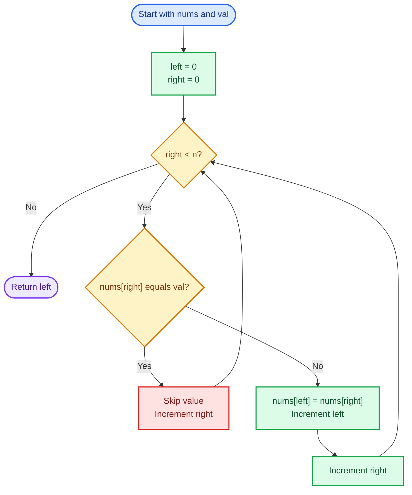
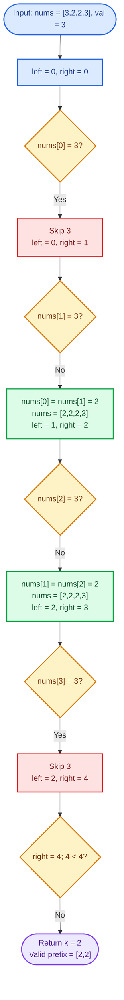
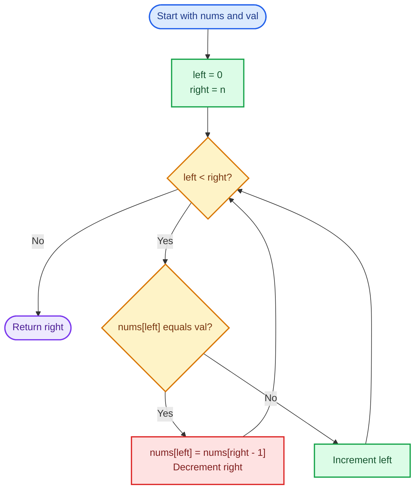

# Cornell Notes

## Topic: Leetcode - 27 - Remove Element

## Date: 16/07/2026

---

<p align="center"><strong><em>"DO NOT JUST TALK ABOUT IT — SHOW IT"</em></strong></p>

---

### Problem Description

Given an integer array `nums` and an integer `val`, remove every occurrence of `val` from `nums` in-place and return the number of elements that remain.

Let `k` be the number of elements not equal to `val`. After the operation, the first `k` positions of `nums` must contain those retained elements. Their order may change, and values stored after index `k - 1` do not matter.

#### Example 1

```text
Input:  nums = [3,2,2,3], val = 3
Output: k = 2, nums = [2,2,_,_]
```

The first two positions contain the two retained values. The remaining positions are ignored.

#### Example 2

```text
Input:  nums = [0,1,2,2,3,0,4,2], val = 2
Output: k = 5, nums = [0,1,4,0,3,_,_,_]
```

The first five positions contain `0`, `0`, `1`, `3`, and `4` in any order.

#### Constraints

- `0 <= nums.length <= 100`
- `0 <= nums[i] <= 50`
- `0 <= val <= 100`

#### Function Contract

- **Input:** A mutable integer array and the value to remove.
- **Output:** The count `k` of retained elements.
- **Mutation:** Store all retained elements within the first `k` positions.
- **Ordering:** The relative order of retained elements does not need to be preserved.
- **Ignored region:** Elements at positions `k` and beyond are irrelevant.

---

### Cue Column (Questions, Keywords, or Prompts)

- What pattern does this problem use?
- Why is two pointers better than brute force?
- What is the invariant that guarantees correctness?
- Can we modify the array in-place without extra space?
- What edge cases reveal common pointer mistakes?
- Why must we only care about first k elements?

---

### Notes Section (Main Notes)

## Mindset First (language-agnostic)

- Recognize pattern: in-place removal/partition with two pointers.
- NOT sliding window, NOT dynamic programming.
- Lock invariant before coding:
	- All elements ≠ `val` must be in first `k` positions.
	- Order of remaining elements doesn't matter.
	- Elements beyond position `k` are irrelevant.
- Complexity targets fixed early:
	- Time must be `O(n)` (single pass required).
	- Extra space must be `O(1)` (in-place modification only).

## Strategy A: Two Pointers (Optimal - Most Stable)

- `left` pointer: position where next non-`val` element goes.
- `right` pointer: scans through entire array.
- Algorithm:
	1. Start both at appropriate positions.
	2. When `right` finds element ≠ `val`, copy to `left` and advance both.
	3. When `right` finds element = `val`, only advance `right`.
	4. Return `left` as count of elements kept.
- Why strong:
	- `O(n)` time, `O(1)` space (truly in-place).
	- Single pass, no sorting overhead.
	- Works with any value range.
- Invariant maintained:
	- Positions `[0, left)` always contain only non-`val` elements.
	- Position `left` is where next valid element goes.

### Strategy A Flow



## Worked Example A: Two Pointers on `[3,2,2,3]` with `val = 3`

This flow scans every value and compacts retained values into the valid prefix.

### Strategy A Worked Example Flow



## Strategy B: Swap and Shrink (Backtrack approach)

- Use `left` for the current position and `right` as the exclusive end of the active range.
- If `nums[left] == val`, replace it with `nums[right - 1]` and decrement `right`.
- Recheck the replacement at `left`; otherwise advance `left`.
- Why useful:
	- Avoids copying every retained element when removals are rare.
	- Can finish without scanning positions removed from the active suffix.
- Trade-off:
	- Slightly more complex logic.
	- Does not preserve relative order.
	- A replacement value must be checked again before advancing.
- Complexity: `O(n)` time and `O(1)` auxiliary space.

### Strategy B Flow



## Worked Example B: Swap and Shrink on `[0,1,2,2,3,0,4,2]`

This flow uses `val = 2` and rechecks a position whenever a suffix value replaces a target.

### Strategy B Worked Example Flow

```mermaid
flowchart TD
    A(["Input: nums = [0,1,2,2,3,0,4,2], val = 2"]) --> B["left = 0, right = 8"]
    B --> K0["nums[0] = 0: keep<br/>left = 1, right = 8"]
    K0 --> K1["nums[1] = 1: keep<br/>left = 2, right = 8"]
    K1 --> C2{"nums[2] = 2?"}
    C2 -- Yes --> R1["Replace with nums[7] = 2<br/>right = 7<br/>Recheck left = 2"]
    R1 --> C3{"nums[2] = 2?"}
    C3 -- Yes --> R2["Replace with nums[6] = 4<br/>nums = [0,1,4,2,3,0,4,2]<br/>right = 6"]
    R2 --> K2["nums[2] = 4: keep<br/>left = 3, right = 6"]
    K2 --> C4{"nums[3] = 2?"}
    C4 -- Yes --> R3["Replace with nums[5] = 0<br/>nums = [0,1,4,0,3,0,4,2]<br/>right = 5"]
    R3 --> K3["nums[3] = 0: keep<br/>left = 4, right = 5"]
    K3 --> K4["nums[4] = 3: keep<br/>left = 5, right = 5"]
    K4 --> C5{"left < right?"}
    C5 -- No --> F(["Return k = 5<br/>Valid prefix = [0,1,4,0,3]"])

    classDef start fill:#dbeafe,stroke:#2563eb,color:#1e3a8a,stroke-width:2px;
    classDef decision fill:#fef3c7,stroke:#d97706,color:#78350f,stroke-width:2px;
    classDef remove fill:#fee2e2,stroke:#dc2626,color:#7f1d1d,stroke-width:2px;
    classDef keep fill:#dcfce7,stroke:#16a34a,color:#14532d,stroke-width:2px;
    classDef finish fill:#ede9fe,stroke:#7c3aed,color:#4c1d95,stroke-width:2px;

    class A,B start;
    class C2,C3,C4,C5 decision;
    class R1,R2,R3 remove;
    class K0,K1,K2,K3,K4 keep;
    class F finish;
```



## Common Failure Points (all languages)

- Forgetting to advance pointers correctly.
- Overwriting before reading (pointer synchronization).
- Returning wrong count (array size instead of `k`).
- Forgetting that order of remaining elements doesn't matter.
- Missing edge cases: empty array, all elements equal `val`, no elements equal `val`.
- Off-by-one errors in initialization or loop bounds.
- Comparing with wrong value type (int vs char).

## Edge Cases to Test

| Case | Input | val | Expected k | Notes |
|------|-------|-----|-----------|-------|
| Empty | [] | any | 0 | Should return 0 |
| Single match | [1] | 1 | 0 | All elements removed |
| Single no-match | [1] | 2 | 1 | No elements removed |
| All match | [1,1,1] | 1 | 0 | Entire array is target |
| All no-match | [1,2,3] | 0 | 3 | No removals needed |
| Mixed | [0,1,2,2,3,0,4,2] | 2 | 5 | Scattered removals |
| Boundaries | [50,50,50] | 50 | 0 | Max constraint value |

## Why Two Pointers is Interview Gold

1. **Space-efficient**: True O(1) extra space (not just O(1) + recursion stack).
2. **Time-optimal**: Can't beat O(n) since we must examine each element.
3. **Conceptually clean**: Clear invariant that's easy to explain.
4. **Generalizable**: Same technique works for many in-place partition problems.
5. **No dependencies**: Works regardless of value distribution or input order.

---

### Summary Section (Summary of Notes)

Core mindset: this is an in-place partition problem where we must move all non-`val` elements to the front and return the count. The two-pointer technique is optimal: `left` tracks the write position for valid elements, `right` scans for candidates. Single `O(n)` pass, `O(1)` extra space. Lock the invariant early (first `k` positions contain only non-`val` elements), test all boundary cases (empty, all-match, all-no-match, mixed), and validate pointer synchronization carefully to avoid off-by-one errors.
