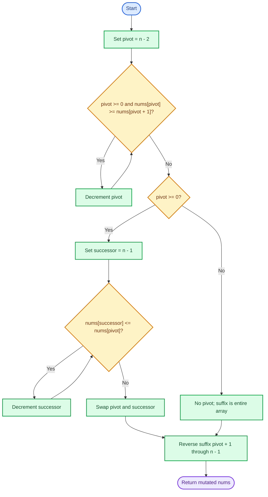
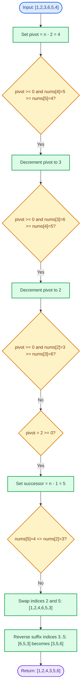
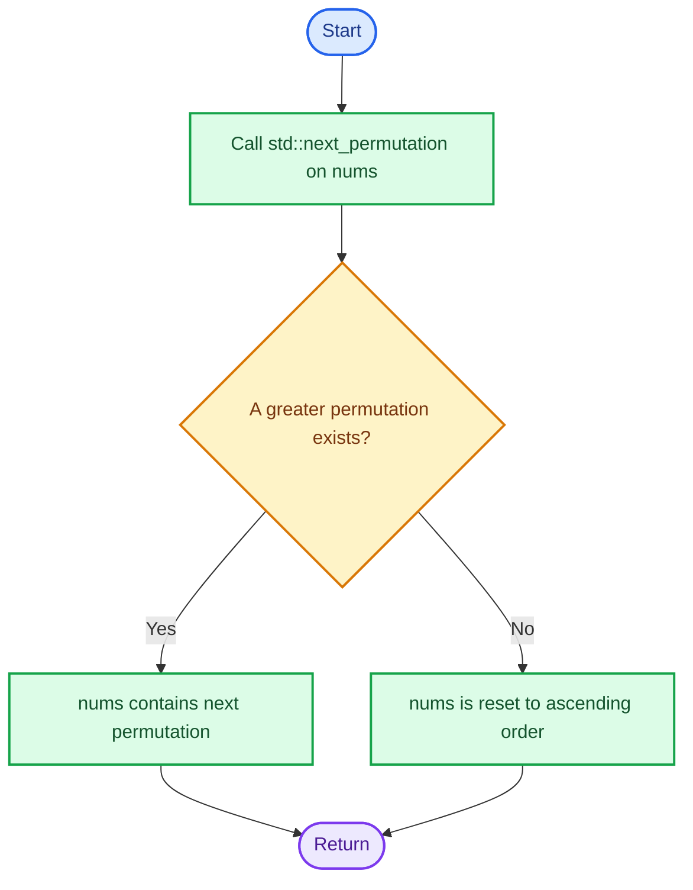
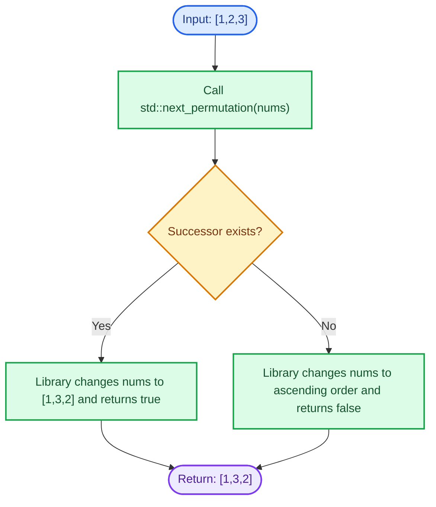

# Cornell Notes

## Topic: Leetcode - 31 - Next Permutation

## Date: 02/08/2026

---

<p align="center"><strong><em>"DO NOT JUST TALK ABOUT IT — SHOW IT"</em></strong></p>

---

### Problem Description

Given an integer array `nums`, rearrange it into its next lexicographically greater permutation. If no greater permutation exists, rearrange it into the lowest lexicographical order, which is ascending order.

The replacement must happen in place and use only constant extra memory.

#### Example 1

```text
Input: nums = [1,2,3]
Output: [1,3,2]
```

The next arrangement after `[1,2,3]` is `[1,3,2]`.

#### Example 2

```text
Input: nums = [3,2,1]
Output: [1,2,3]
```

`[3,2,1]` is already the greatest permutation, so reset to ascending order.

#### Example 3

```text
Input: nums = [1,1,5]
Output: [1,5,1]
```

The rightmost possible increase swaps the final `1` and `5`.

#### Constraints

- `1 <= nums.length <= 100`
- `0 <= nums[i] <= 100`

#### Function Contract

- **Input:** Mutable integer array `nums`.
- **Output:** No return value; `nums` becomes its next permutation.
- **Mutation:** Modify `nums` in place.
- **Ordering:** Return the smallest permutation strictly greater than the input; if none exists, return ascending order.
- **Memory:** Use `O(1)` auxiliary space.

---

### Cue Column (Questions, Keywords, or Prompts)

- What suffix property reveals where the next increase must occur?
- Why is the pivot the rightmost index satisfying `nums[i] < nums[i + 1]`?
- Why can the successor be found from the right side?
- Why does reversing the suffix produce the smallest valid result?
- What happens when no pivot exists?
- Can the operation remain in place with `O(1)` auxiliary space?

---

### Notes Section (Main Notes)

## Mindset First (language-agnostic)

- Pattern: Lexicographical successor using a pivot and monotonic suffix.
- Invariant: The suffix right of the pivot is non-increasing before the swap; after the pivot swap, reversing it makes it the smallest possible suffix.
- Target time: `O(n)`.
- Target auxiliary space: `O(1)`.

## Strategy A: Pivot, Successor, Reverse (Optimal)

- Core idea: Find the longest non-increasing suffix. Increase the element immediately before it by swapping with the smallest larger suffix element, then reverse the suffix.
- Algorithm:
  1. Scan from right to left until finding `pivot` where `nums[pivot] < nums[pivot + 1]`.
  2. If `pivot` exists, scan from the end to find `successor` where `nums[successor] > nums[pivot]`, then swap them.
  3. Reverse `nums[pivot + 1 ... n - 1]`. If no pivot exists, `pivot = -1`, so the entire array is reversed into ascending order.
- Correctness: The rightmost pivot changes the latest possible position, preserving the longest prefix. The suffix is non-increasing, so the rightmost element greater than the pivot is the smallest valid successor. Reversing the suffix gives its minimum ordering.
- Complexity: `O(n)` time, `O(1)` auxiliary space.
- Benefits: Optimal, in-place, language-agnostic, and directly exposes the lexicographical invariant.
- Trade-offs: Requires careful boundary handling for `pivot = -1` and duplicate values.

### Strategy A Flow



## Worked Example A: Pivot, Successor, Reverse on `[1,2,3,6,5,4]`

### Strategy A Worked Example Flow



## Strategy B: Standard Library Successor

- Core idea: Use the language library implementation: C++ `std::next_permutation` performs the same pivot, successor, and suffix reversal operation.
- Algorithm:
  1. Call `std::next_permutation(nums.begin(), nums.end())`.
  2. The function mutates the range in place.
  3. If the input is the greatest permutation, it rearranges the range into ascending order and returns `false`.
- Correctness: The standard library function is specified to produce the next lexicographical permutation, or the first permutation when no successor exists.
- Complexity: `O(n)` time, `O(1)` auxiliary space for the normal random-access range implementation.
- Benefits: Short, standard, well-tested C++ code.
- Trade-offs: C++-only, hides the algorithmic reasoning, and has no direct equivalent in standard C.

### Strategy B Flow



## Worked Example B: Standard Library Successor on `[1,2,3]`

`std::next_permutation` finds the successor of `[1,2,3]` directly.

### Strategy B Worked Example Flow



## Common Failure Points (all languages)

- Scanning left to right for the pivot; the required pivot is the rightmost valid one.
- Using `<=` instead of `<` for the pivot, which mishandles duplicates.
- Choosing the first larger successor rather than the smallest valid successor.
- Sorting the suffix instead of reversing it, which adds unnecessary work but still may pass.
- Forgetting to reverse the full array when no pivot exists.
- Allocating a second array and violating the `O(1)` auxiliary-space requirement.
- Reversing the suffix before swapping the pivot, which can select the wrong successor.

## Edge Cases to Test

| Case | Input | Expected | Notes |
|------|-------|----------|-------|
| Minimum size | `[7]` | `[7]` | No adjacent pair exists. |
| Example | `[1,2,3]` | `[1,3,2]` | Normal successor. |
| Maximum permutation | `[3,2,1]` | `[1,2,3]` | No pivot; reverse all. |
| Duplicate values | `[1,1,5]` | `[1,5,1]` | Equality must not become pivot. |
| All equal | `[4,4,4]` | `[4,4,4]` | No visible change. |
| Pivot near front | `[1,3,2]` | `[2,1,3]` | Changes earliest possible suffix boundary. |
| Descending suffix | `[1,2,3,6,5,4]` | `[1,2,4,3,5,6]` | Swap then reverse suffix. |
| Boundary values | `[0,0,100]` | `[0,100,0]` | Includes input limits. |
| Alternating duplicates | `[0,1,0,1]` | `[0,1,1,0]` | Checks repeated values and suffix handling. |
| Maximum length | `[0,1,2,...,99]` | `[0,1,2,...,98,99]` successor behavior | Must remain linear and in place. |

## Why Pivot, Successor, Reverse is Interview Gold

1. It derives directly from lexicographical ordering instead of enumerating permutations.
2. It changes the latest possible position, preserving the longest prefix.
3. It uses the suffix's monotonic structure to find the successor in one scan.
4. It reaches the required `O(n)` time and `O(1)` auxiliary space.
5. The same reasoning works in C, C++, and other languages.

## Implementation Checklist

- [ ] Scan from right to left for the rightmost `pivot` with `nums[pivot] < nums[pivot + 1]`.
- [ ] Find a `successor` strictly greater than the pivot value.
- [ ] Swap pivot and successor only when a pivot exists.
- [ ] Reverse the suffix starting at `pivot + 1`.
- [ ] Reverse the whole array when no pivot exists.
- [ ] Mutate the original array without allocating another array.
- [ ] Confirm `O(n)` time and `O(1)` auxiliary space.

---

### Summary Section (Summary of Notes)

Next Permutation uses the pivot-successor-reverse pattern. Find the rightmost index where the sequence increases, swap that pivot with the smallest larger value in the descending suffix, then reverse the suffix to obtain the smallest greater permutation. If no pivot exists, reverse the entire array to obtain ascending order. The optimal solution runs in `O(n)` time, uses `O(1)` auxiliary space, and mutates the input in place.
