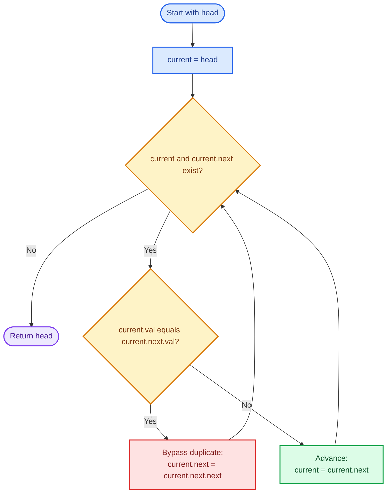
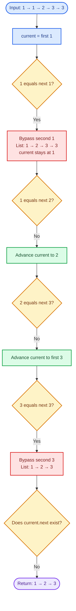
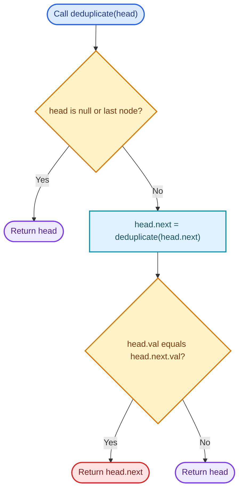
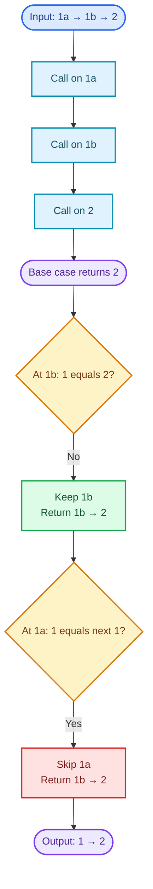

# Cornell Notes

## Topic: Leetcode - 83 - Remove Duplicates from Sorted List

## Date: 25/07/2026

---

<p align="center"><strong><em>"DO NOT JUST TALK ABOUT IT — SHOW IT"</em></strong></p>

---

### Problem Description

Given `head` of a sorted singly linked list, remove duplicate occurrences so
each value appears once. Return the still-sorted list.

#### Example 1

```text
Input:  head = [1,1,2]
Output: [1,2]
```

#### Example 2

```text
Input:  head = [1,1,2,3,3]
Output: [1,2,3]
```

#### Constraints

- Node count is in `[0, 300]`.
- `-100 <= Node.val <= 100`.
- Input list is sorted in ascending order.

#### Function Contract

- **Input:** Head pointer of a sorted singly linked list; `NULL` is valid.
- **Output:** Head pointer of same list after duplicate links are bypassed.
- **Mutation:** Links change in place; nodes do not move.
- **Ordering:** Remaining values preserve ascending order.
- **Ownership or memory:** Reuse original nodes. Judge owns node allocation;
  solution need not allocate replacement nodes.

---

### Cue Column (Questions, Keywords, or Prompts)

- Why does sorting make one forward scan sufficient?
- What invariant holds before `current` advances?
- Why must `current` stay still after removing a duplicate?
- When is `current->next` safe to read?
- What are iterative and recursive complexity costs?
- Which bug leaves three or more equal values partially duplicated?

---

### Notes Section (Main Notes)

## Mindset First (language-agnostic)

- Pattern: Adjacent duplicate removal in a sorted linked list.
- Invariant: Everything before `current` is deduplicated; `current` is first
  retained node for its value.
- Target time: `O(n)`.
- Target auxiliary space: `O(1)`.
- Optimality: Every retained value must be inspected, so `O(n)` time is
  asymptotically optimal.

## Strategy A: Iterative In-Place Link Bypass

- Core idea: Sorted order places equal values next to each other. Compare
  `current` with `current->next`.
- Algorithm:
  1. Set `current = head`.
  2. While both `current` and `current->next` exist, compare their values.
  3. If equal, bypass next node with
     `current->next = current->next->next`; keep `current` in place.
  4. Otherwise advance `current`.
  5. Return original `head`.
- Correctness: Equal adjacent nodes are bypassed until next value differs.
  Then advancing seals one unique value behind `current`. By induction, all
  processed values occur once. Original order remains because links only skip
  nodes.
- Complexity: `O(n)` time, `O(1)` auxiliary space.
- Benefits: One pass, no allocation, constant auxiliary space.
- Trade-off: Mutates input links.

### Strategy A Flow



## Worked Example A: Iterative In-Place Link Bypass on `[1,1,2,3,3]`

Start with `current` at first `1`.

### Strategy A Worked Example Flow



## Strategy B: Recursive Suffix Deduplication

- Core idea: Deduplicate suffix first, then compare `head` with returned suffix
  head. If values match, return suffix; otherwise link `head` to suffix.
- Algorithm:
  1. Return `head` when it is `NULL` or last node.
  2. Recursively deduplicate `head->next`.
  3. If `head->val == head->next->val`, return `head->next`.
  4. Otherwise return `head`.
- Correctness: Recursive call returns a unique sorted suffix. Comparing `head`
  with first suffix value is sufficient because list is sorted. Returning one
  of them removes exactly one duplicate occurrence per frame.
- Complexity: `O(n)` time, `O(n)` auxiliary call-stack space.
- Benefits: Compact expression of suffix reasoning.
- Trade-off: Call stack is worse than iterative `O(1)` space.

### Strategy B Flow



## Worked Example B: Recursive Suffix Deduplication on `[1,1,2]`

Recursion reaches tail, then resolves duplicates while unwinding.

### Strategy B Worked Example Flow



## Pointer-Movement Invariant

- Duplicate found: change link, do not advance `current`. Another equal node may
  still follow.
- Different value found: advance `current`; its value group is complete.
- Nodes do not move. Only `next` links change.

## Common Failure Points (all languages)

- Advancing after bypassing a duplicate, leaving triples partly duplicated.
- Reading `current->next` without checking `current` and `current->next`.
- Comparing non-adjacent nodes despite sorted input.
- Allocating a new list unnecessarily.
- Claiming recursive method uses `O(1)` auxiliary space.
- Solving LeetCode 82 instead: that problem removes every value that repeats;
  this problem keeps one copy.

## Edge Cases to Test

| Case | Input | Expected | Notes |
|------|-------|----------|-------|
| Empty | `[]` | `[]` | Return `NULL` |
| One node | `[1]` | `[1]` | No comparison |
| Smallest duplicate | `[1,1]` | `[1]` | One bypass |
| No duplicates | `[1,2,3]` | `[1,2,3]` | Links unchanged |
| All equal | `[5,5,5,5]` | `[5]` | `current` must stay |
| Head duplicates | `[1,1,2]` | `[1,2]` | Keep first head |
| Tail duplicates | `[1,2,2]` | `[1,2]` | New tail ends at `NULL` |
| Value bounds | `[-100,-100,100,100]` | `[-100,100]` | Both limits |
| Maximum size | 300 sorted nodes | Unique sequence | Linear traversal |

## Why Iterative In-Place Link Bypass is Interview Gold

1. Exploits sorted adjacency directly.
2. Meets optimal `O(n)` time and `O(1)` auxiliary space.
3. Uses one pointer and one clear invariant.
4. Handles duplicate runs without special head or tail branches.

## Implementation Checklist

- [ ] Return `NULL` safely for empty input.
- [ ] Require both `current` and `current->next` before comparison.
- [ ] Bypass equal next node without advancing.
- [ ] Advance only when adjacent values differ.
- [ ] Preserve original head and sorted order.
- [ ] Reuse original nodes; allocate no replacement list.
- [ ] Verify `O(n)` time and `O(1)` iterative auxiliary space.

---

### Summary Section (Summary of Notes)

Sorted order makes duplicates adjacent. Keep invariant that list before
`current` is already unique. When adjacent values match, bypass next node and
hold `current`; otherwise advance. This iterative method changes links, not node
positions, preserves order, and runs in `O(n)` time with `O(1)` auxiliary
space. Empty, singleton, all-equal, and long duplicate runs need no special
branch beyond safe loop guards.
