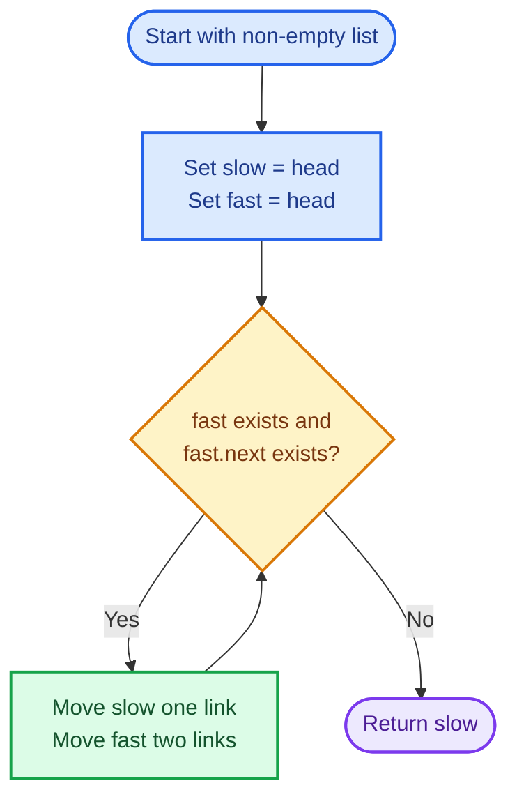
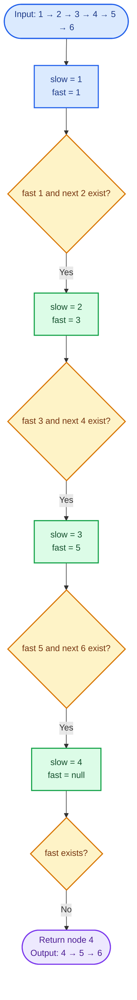
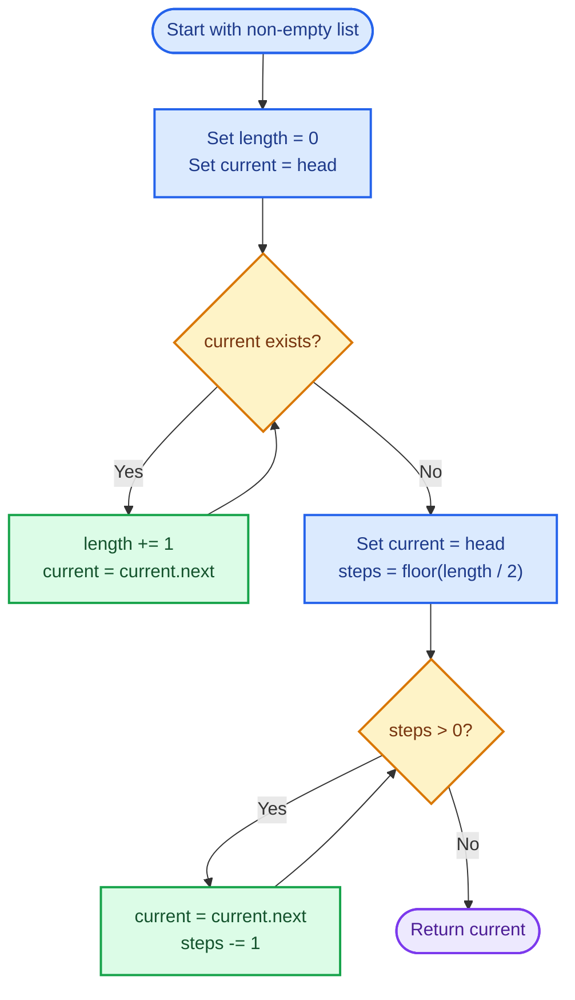
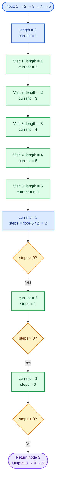

# Cornell Notes

## Topic: Leetcode - 876 - Middle of the Linked List

## Date: 06/08/2026

---

<p align="center"><strong><em>"DO NOT JUST TALK ABOUT IT — SHOW IT"</em></strong></p>

---

### Problem Description

Given the head of a non-empty singly linked list, return its middle node. If the list has two middle nodes, return the second one. The returned node represents the suffix beginning at that middle.

#### Example 1

```text
Input:  head = [1,2,3,4,5]
Output: [3,4,5]
```

Node `3` is the unique middle.

#### Example 2

```text
Input:  head = [1,2,3,4,5,6]
Output: [4,5,6]
```

Nodes `3` and `4` are the two middle nodes, so the second middle, node `4`, is returned.

#### Constraints

- The list contains between `1` and `100` nodes.
- `1 <= Node.val <= 100`.

#### Function Contract

- **Input:** `head`, a pointer to the first node of a valid non-empty singly linked list.
- **Output:** A pointer to the middle node; for even length, the second middle node.
- **Mutation:** No node values or links are changed.
- **Ordering:** The original node order remains unchanged.
- **Ownership or memory:** The returned pointer aliases an existing node. No allocation or deallocation is required.

---

### Cue Column (Questions, Keywords, or Prompts)

- Which pointer pattern finds a midpoint in one pass?
- Why does moving one pointer twice as fast locate the middle?
- Which loop condition selects the second middle for even lengths?
- What remains true after every iteration?
- What are the time and auxiliary-space costs?
- What happens for one-node and two-node lists?
- Why is checking only `fast` unsafe before reading `fast->next`?

---

### Notes Section (Main Notes)

## Mindset First (language-agnostic)

- Pattern: fast and slow pointers.
- Invariant: after `k` iterations, `slow` has moved `k` links while `fast` has moved `2k` links.
- Target time: `O(n)`.
- Target auxiliary space: `O(1)`.
- Optimality: locating the middle may require observing the list length, so `O(n)` time is asymptotically optimal; two pointers avoid storing nodes or making a second pass.

## Strategy A: Fast and Slow Pointers

- Core idea: advance `slow` one node and `fast` two nodes per iteration.
- Algorithm:
  1. Initialize both pointers at `head`.
  2. While `fast` and `fast->next` exist, move `slow` once and `fast` twice.
  3. Return `slow` when `fast` reaches or passes the end.
- Correctness: when the loop stops, `fast` has covered twice the distance covered by `slow`. Therefore, `slow` is at index `floor(n / 2)`, which is the unique middle for odd `n` and the second middle for even `n`.
- Complexity: `O(n)` time, `O(1)` auxiliary space.
- Benefits: one pass, constant space, no mutation.
- Trade-offs: pointer conditions must be ordered safely to avoid dereferencing null.

### Strategy A Flow



## Worked Example A: Fast and Slow Pointers on `[1,2,3,4,5,6]`

Both pointers begin at node `1`; each iteration shows their new node values.

### Strategy A Worked Example Flow



## Strategy B: Count, Then Advance

- Core idea: count all nodes first, then advance from `head` by `floor(n / 2)` links.
- Algorithm:
  1. Traverse the list to compute length `n`.
  2. Reset a pointer to `head`.
  3. Advance it `floor(n / 2)` times and return it.
- Correctness: zero-based index `floor(n / 2)` is the unique middle for odd `n` and the second middle for even `n`.
- Complexity: `O(n)` time over two passes, `O(1)` auxiliary space.
- Benefits: simple index-based reasoning.
- Trade-offs: performs two passes instead of one.

### Strategy B Flow



## Worked Example B: Count, Then Advance on `[1,2,3,4,5]`

The first pass counts five nodes; the second advances by `floor(5 / 2) = 2` links.

### Strategy B Worked Example Flow



## Pointer Movement Invariant

After `k` completed iterations of Strategy A:

- `slow` is `k` links from `head`.
- `fast` is `2k` links from `head`, unless it has passed the tail.
- No links or values have changed.

For `n = 2m`, the loop runs `m` times and `slow` reaches index `m`, the second middle. For `n = 2m + 1`, the loop runs `m` times and `slow` reaches index `m`, the unique middle.

## Common Failure Points (all languages)

- Using `while (fast->next)` without first proving `fast` is non-null.
- Using a loop condition that stops too early and returns the first middle for even lengths.
- Returning `fast` instead of `slow`.
- Returning the middle value rather than the middle node pointer.
- Allocating a copy instead of returning an existing node.
- Modifying links even though the task requires only locating a node.

## Edge Cases to Test

| Case | Input | Expected | Notes |
|------|-------|----------|-------|
| Minimum length | `[42]` | `[42]` | Loop never runs; return `head`. |
| Smallest even length | `[1,2]` | `[2]` | Must select the second middle. |
| Odd length | `[1,2,3,4,5]` | `[3,4,5]` | Unique middle. |
| Even length | `[1,2,3,4,5,6]` | `[4,5,6]` | Second of two middles. |
| Repeated values | `[7,7,7,7,7]` | suffix at node index `2` | Node identity matters, not value uniqueness. |
| Boundary values | `[1,100,1,100]` | `[1,100]` | Values do not affect pointer movement. |
| Maximum length | `100` nodes | suffix starting at index `50` | Confirms even-size boundary behavior. |

## Why Fast and Slow Pointers is Interview Gold

1. It solves the task in one pass with constant auxiliary space.
2. Its movement invariant gives a short correctness proof.
3. The pattern transfers directly to cycle detection, cycle entry, and linked-list partition problems.

## Implementation Checklist

- [ ] Initialize `slow` and `fast` to `head`.
- [ ] Check `fast` before `fast->next`.
- [ ] Move `slow` one link and `fast` two links per iteration.
- [ ] Return the existing node pointer stored in `slow`.
- [ ] Do not alter node values or links.
- [ ] Verify one-node and two-node lists.
- [ ] Verify odd and even lengths.
- [ ] Confirm `O(n)` time and `O(1)` auxiliary space.

---

### Summary Section (Summary of Notes)

Use fast and slow pointers. Maintain the invariant that `fast` travels twice as far as `slow`. When `fast` reaches or passes the tail, `slow` is at index `floor(n / 2)`, giving the unique middle for odd lengths and the second middle for even lengths. This one-pass method runs in `O(n)` time, uses `O(1)` auxiliary space, preserves the list, and returns an existing node pointer.
