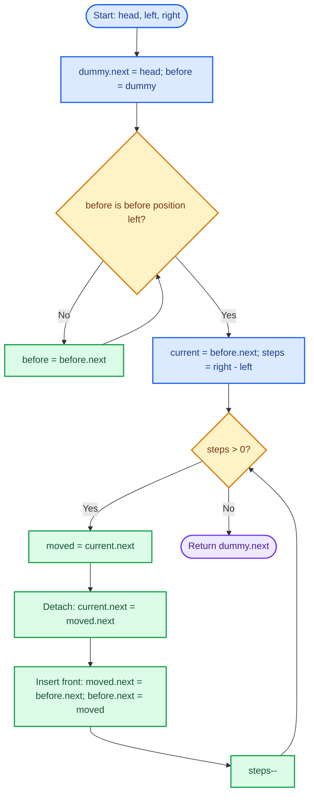
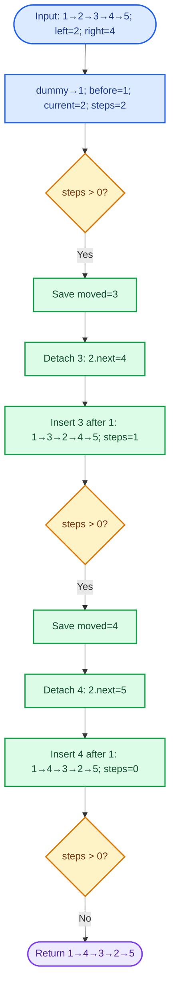
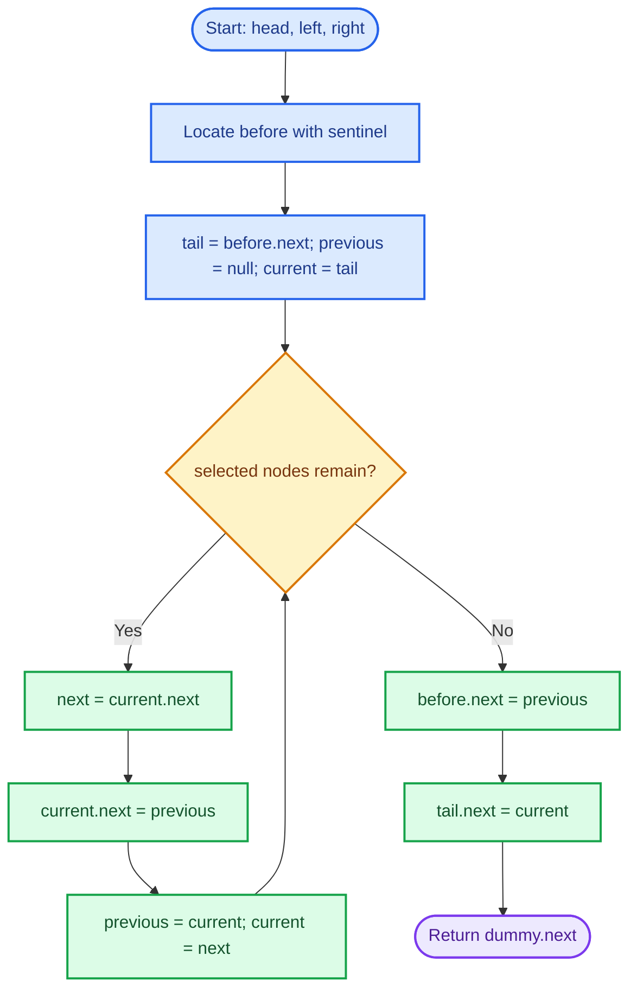
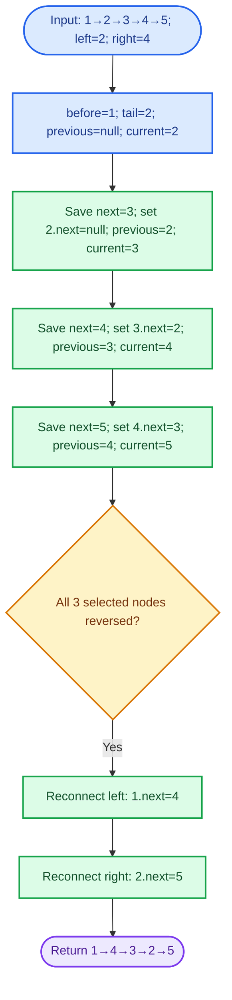

# Cornell Notes

## Topic: Leetcode - 92 - Reverse Linked List II

## Date: 17/08/2026

---

<p align="center"><strong><em>"DO NOT JUST TALK ABOUT IT — SHOW IT"</em></strong></p>

---

### Problem Description

Given the head of a singly linked list and positions `left` and `right`, reverse the links among nodes in the inclusive range `[left, right]`. Return the possibly changed head. Positions are 1-based.

#### Example 1

```text
Input:  head = [1,2,3,4,5], left = 2, right = 4
Output: [1,4,3,2,5]
```

#### Example 2

```text
Input:  head = [5], left = 1, right = 1
Output: [5]
```

#### Constraints

- The list contains `n` nodes.
- `1 <= n <= 500`
- `-500 <= Node.val <= 500`
- `1 <= left <= right <= n`

#### Function Contract

- **Input:** A valid singly linked list head plus valid 1-based positions `left` and `right`.
- **Output:** The head after reversing exactly the selected sublist.
- **Mutation:** Existing node links change in place; nodes and values do not move or get copied.
- **Ordering:** Nodes outside `[left, right]` retain relative order. Nodes inside it appear in reverse order.
- **Ownership or memory:** No nodes are allocated or freed by the solution. A stack sentinel is temporary.

---

### Cue Column (Questions, Keywords, or Prompts)

- Why does a sentinel simplify `left == 1`?
- Which pointers delimit the reversed region?
- What invariant makes repeated front insertion correct?
- How are the prefix, reversed range, and suffix reconnected?
- Why is the solution `O(n)` time and `O(1)` auxiliary space?
- Which pointer assignment order avoids losing the remaining list?

---

### Notes Section (Main Notes)

## Mindset First (language-agnostic)

- Pattern: sentinel node plus in-place linked-list pointer rewiring.
- Invariant: after each insertion, `before->next` starts the correctly reversed processed prefix; `current` remains the tail of that reversed prefix and points to the unprocessed suffix.
- Target time: `O(n)`.
- Target auxiliary space: `O(1)`.
- Optimality: locating the range requires traversal, while link changes need no storage proportional to `n`.

## Strategy A: Head Insertion Within the Sublist

- Core idea: keep the first selected node fixed as `current`; repeatedly detach its next node and insert that node immediately after `before`.
- Algorithm:
  1. Create a stack sentinel whose `next` is `head`.
  2. Move `before` to the node immediately preceding position `left`.
  3. Set `current = before->next`.
  4. Repeat `right - left` times: save `moved = current->next`, detach it, then insert it after `before`.
  5. Return `dummy.next`.
- Correctness: each iteration moves the next unprocessed node to the front of the selected range. The processed range is therefore reversed, while `current->next` preserves access to every unprocessed node and the suffix.
- Benefits: one forward traversal, constant auxiliary space, uniform handling when `left == 1`.
- Trade-off: assignment order is easy to corrupt; `moved` must be saved before detachment.
- Complexity: `O(n)` time, `O(1)` auxiliary space.

### Strategy A Flow



## Worked Example A: Head insertion on `head = [1,2,3,4,5], left = 2, right = 4`

The sentinel precedes node `1`; two nodes are moved to the front of the selected range.

### Strategy A Worked Example Flow



## Strategy B: Standard Sublist Reversal Then Reconnect

- Core idea: save the node before the range and its original first node, reverse selected links with the usual `previous/current/next` loop, then reconnect both boundaries.
- Algorithm:
  1. Use a sentinel and locate `before`.
  2. Save `tail = before->next`; initialize `previous = null` and `current = tail`.
  3. Reverse exactly `right - left + 1` links.
  4. Set `before->next = previous` and `tail->next = current`.
  5. Return `dummy.next`.
- Correctness: the standard loop reverses every selected edge exactly once. `previous` becomes the selected range's new head, `tail` its new tail, and `current` the untouched suffix head.
- Benefits: directly reuses the standard whole-list reversal pattern.
- Trade-off: requires a separate reconnection phase and tracks more boundary pointers than Strategy A.
- Complexity: `O(n)` time, `O(1)` auxiliary space.

### Strategy B Flow



## Worked Example B: Standard reversal on `head = [1,2,3,4,5], left = 2, right = 4`

The selected nodes are reversed first, then joined back to node `1` and node `5`.

### Strategy B Worked Example Flow



## Common Failure Points (all languages)

- Forgetting the sentinel, then needing a fragile special case for `left == 1`.
- Advancing `current` during Strategy A; it must remain the reversed range's tail.
- Overwriting `current->next` before saving `moved` or `next`.
- Running the reversal loop one too many or too few times.
- Returning the original `head` instead of `dummy.next`.
- Changing values instead of links; the contract requires node identity to remain intact.

## Edge Cases to Test

| Case | Input | Expected | Notes |
|------|-------|----------|-------|
| Single node | `[5], 1, 1` | `[5]` | No rewiring |
| One-position range | `[-500,0,500], 2, 2` | `[-500,0,500]` | Loop runs zero times |
| Entire list | `[1,2,3,4], 1, 4` | `[4,3,2,1]` | Head changes |
| Prefix | `[1,2,3,4,5], 1, 3` | `[3,2,1,4,5]` | Sentinel boundary |
| Suffix | `[1,2,3,4,5], 3, 5` | `[1,2,5,4,3]` | New tail ends at null |
| Duplicate values | `[0,7,7,0,7], 1, 5` | `[7,0,7,7,0]` | Compare node identity, not only values |
| Maximum size | `500 nodes, 1, 500` | Full reversal | Confirms linear traversal |

## Why Head Insertion is Interview Gold

1. It satisfies the one-pass follow-up with `O(1)` auxiliary space.
2. The sentinel removes the head-boundary special case.
3. Its invariant cleanly separates the reversed prefix from the unprocessed suffix.

## Implementation Checklist

- [ ] Point sentinel `next` to `head`.
- [ ] Stop `before` exactly one node before `left`.
- [ ] Execute exactly `right - left` head insertions.
- [ ] Save `moved` before changing any link to it.
- [ ] Keep `current` fixed as the selected range's tail.
- [ ] Return `dummy.next`.
- [ ] Confirm `O(n)` time and `O(1)` auxiliary space.

---

### Summary Section (Summary of Notes)

Use a stack sentinel plus repeated head insertion. `before->next` always starts the reversed processed range; `current` remains its tail and keeps access to the unprocessed suffix. Existing nodes stay allocated and only links change. The method handles `left == 1` without branching, runs in `O(n)` time, and uses `O(1)` auxiliary space. A one-position range naturally performs zero rewiring operations.
