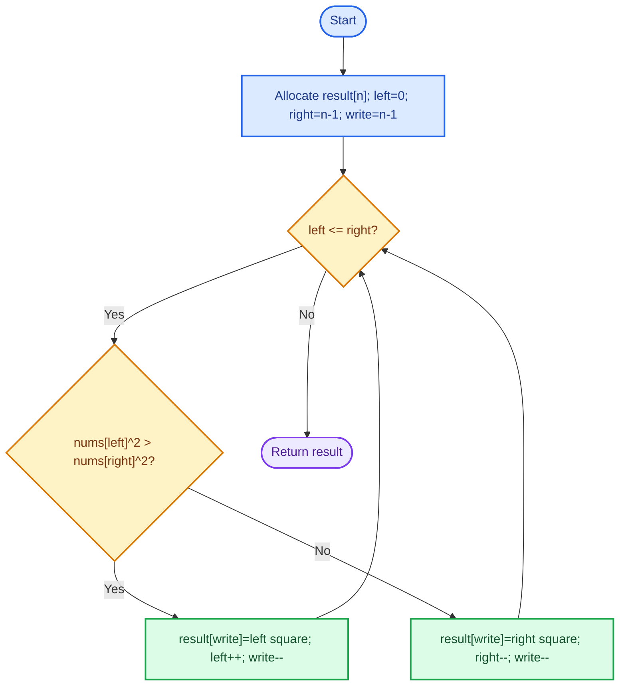
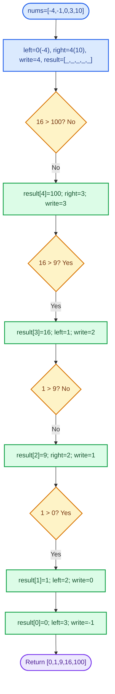
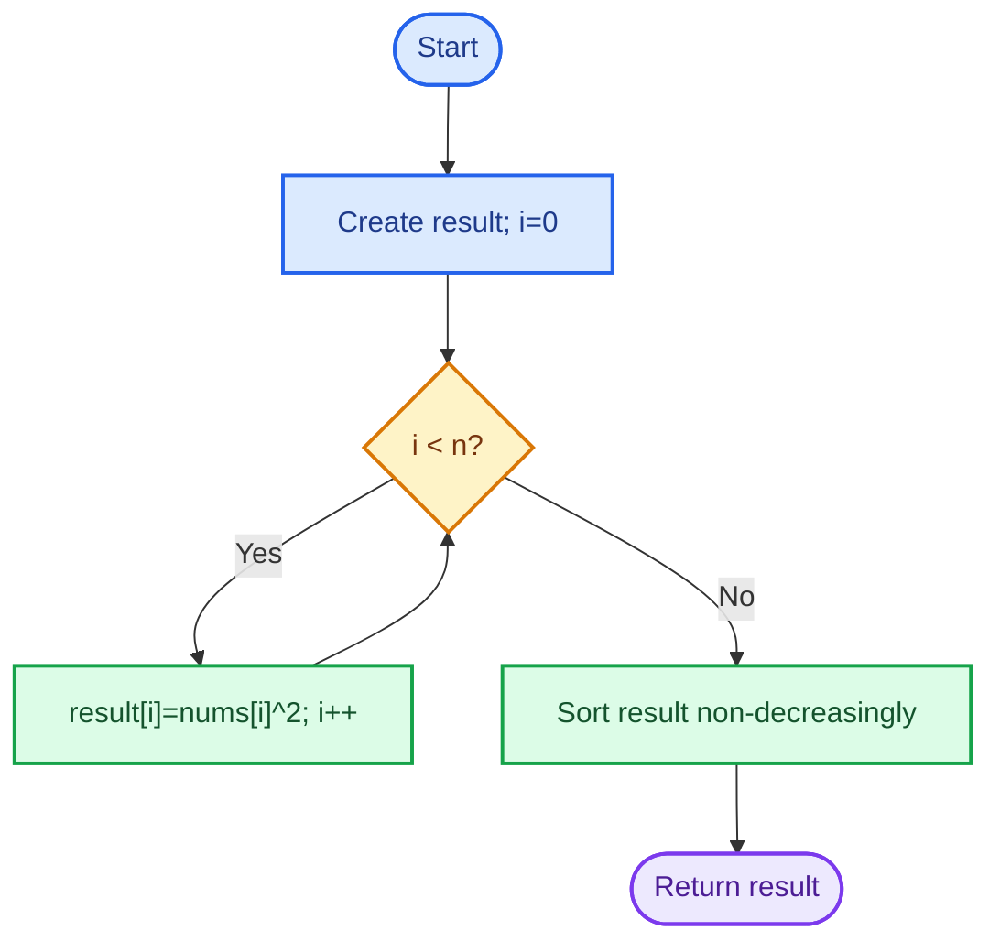
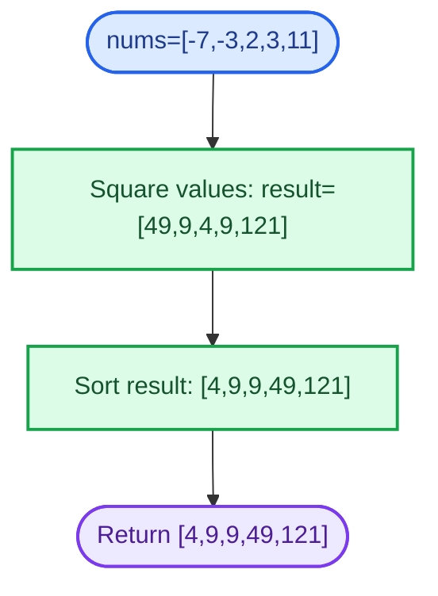

# Cornell Notes

## Topic: Leetcode - 977 - Squares of a Sorted Array

## Date: 29/07/2026

---

<p align="center"><strong><em>"DO NOT JUST TALK ABOUT IT — SHOW IT"</em></strong></p>

---

### Problem Description

Given `nums`, sorted in non-decreasing order, return a new array containing every squared value, also sorted in non-decreasing order. Negative values can produce larger squares than values near zero.

#### Example 1

```text
Input:  nums = [-4,-1,0,3,10]
Output: [0,1,9,16,100]
```

Squaring gives `[16,1,0,9,100]`; sorting produces output.

#### Example 2

```text
Input:  nums = [-7,-3,2,3,11]
Output: [4,9,9,49,121]
```

#### Constraints

- `1 <= nums.length <= 10^4`
- `-10^4 <= nums[i] <= 10^4`
- `nums` is sorted in non-decreasing order.

#### Function Contract

- **Input:** sorted integer array `nums`.
- **Output:** array of every `nums[i] * nums[i]`, sorted non-decreasingly.
- **Mutation:** input must remain unchanged.
- **Ordering:** output must be non-decreasing.
- **Ownership or memory:** C caller frees returned `malloc` array; C++ returns `vector<int>` by value.

---

### Cue Column (Questions, Keywords, or Prompts)

- Why can largest remaining square only come from either end?
- What invariant makes right-to-left output filling correct?
- Why must output write index move from end to start?
- How does squaring break source order across negative and positive values?
- What happens for all-negative, all-positive, zero, and equal-magnitude inputs?
- Why is square-then-sort slower than two pointers?

---

### Notes Section (Main Notes)

## Mindset First (language-agnostic)

- Pattern: two pointers over sorted input.
- Invariant: before each iteration, `result[write + 1..n - 1]` contains largest squares in final sorted order; largest unplaced square is `max(nums[left]^2, nums[right]^2)`.
- Target time: `O(n)`.
- Target auxiliary space: `O(1)` beyond required output; output space is `O(n)`.
- Optimality: every value must be read and emitted, so `O(n)` time is lower bound.

## Strategy A: Two Pointers, Fill Output Backward

- Core idea: negative values have decreasing absolute value toward zero; positive values have increasing absolute value away from zero. Therefore greatest remaining square is at `left` or `right`.
- Algorithm:
  1. Allocate `result` length `n`; set `left = 0`, `right = n - 1`, `write = n - 1`.
  2. Compare `nums[left]^2` and `nums[right]^2`; write larger square to `result[write]`.
  3. Move pointer supplying value, decrement `write`, repeat until all slots filled.
- Correctness: each iteration places maximum square among unprocessed values into greatest unfilled index. This preserves sorted suffix invariant; after `n` iterations whole result is sorted.
- Complexity: `O(n)` time, `O(1)` auxiliary space, `O(n)` required output space.
- Benefits: one pass, input unchanged, interview-stable invariant.
- Trade-offs: needs separate output array because descending placement cannot safely overwrite input while preserving unread values.

### Strategy A Flow



## Worked Example A: Two Pointers, Fill Output Backward on `[-4,-1,0,3,10]`

Start with both ends; each comparison places current maximum square into rightmost open output slot.

### Strategy A Worked Example Flow



## Strategy B: Square Then Sort

- Core idea: square every element, then use a comparison sort on output.
- Algorithm:
  1. Copy squared values into `result`.
  2. Sort `result` non-decreasingly.
- Correctness: sorting orders all squared values; copied values ensure exactly one square per input value.
- Complexity: `O(n log n)` time, `O(1)` auxiliary space beyond output when in-place sort used; output space is `O(n)`.
- Benefits: shortest baseline and easy to derive.
- Trade-offs: ignores sorted-input structure; slower than Strategy A.

### Strategy B Flow



## Worked Example B: Square Then Sort on `[-7,-3,2,3,11]`

Copy squared values first, then sort complete output.

### Strategy B Worked Example Flow



## Common Failure Points (all languages)

- Filling output left-to-right places large end squares too early and breaks ordering.
- Comparing raw endpoint values instead of squared values fails for negatives.
- Moving both pointers after one comparison skips an input value.
- Forgetting `*returnSize = numsSize` violates C contract.
- Returning input after in-place squaring breaks input-preservation expectation in local tests.
- Using `int` remains safe here: maximum square is `100000000`.

## Edge Cases to Test

| Case | Input | Expected | Notes |
|------|-------|----------|-------|
| Single negative | `[-5]` | `[25]` | Minimum length. |
| All negative | `[-5,-4,-2]` | `[4,16,25]` | Squares reverse source order. |
| All positive | `[1,2,5]` | `[1,4,25]` | Source order remains valid. |
| All zero | `[0,0,0]` | `[0,0,0]` | Neutral values and duplicates. |
| Equal magnitudes | `[-4,4]` | `[16,16]` | Tie handling. |
| Sign boundary | `[-2,-1,0,1,2]` | `[0,1,1,4,4]` | Both sides and zero. |
| Constraint extremes | `[-10000,0,10000]` | `[0,100000000,100000000]` | Maximum square. |
| Maximum size | sorted 10,000 values | sorted squares | Confirms linear traversal. |

## Why Two Pointers, Fill Output Backward is Interview Gold

1. Converts sorted-input structure into `O(n)` time rather than generic `O(n log n)` sorting.
2. Invariant is short, provable, and handles negative/positive transition cleanly.
3. Shows deliberate output-direction choice: largest known value belongs at last open slot.

## Implementation Checklist

- [ ] Allocate output length `numsSize`.
- [ ] Set `left = 0`, `right = numsSize - 1`, `write = numsSize - 1`.
- [ ] Compare endpoint squares, not endpoint values.
- [ ] Move only pointer whose square was written.
- [ ] Set returned size in C and return allocated output.
- [ ] Verify duplicates, zero, all-negative, all-positive, and extremes.
- [ ] Confirm `O(n)` time and `O(1)` auxiliary space beyond output.

---

### Summary Section (Summary of Notes)

Use two pointers because largest remaining absolute value is always at one endpoint. Place larger endpoint square into output from right to left; this preserves sorted-suffix invariant. Strategy A runs in `O(n)` time with `O(1)` auxiliary space beyond required `O(n)` output. Handle ties, zero, all-negative input, and C result ownership.
