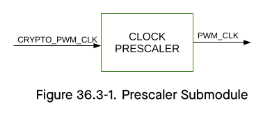
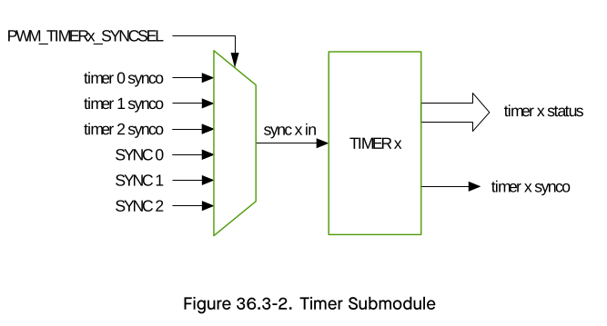
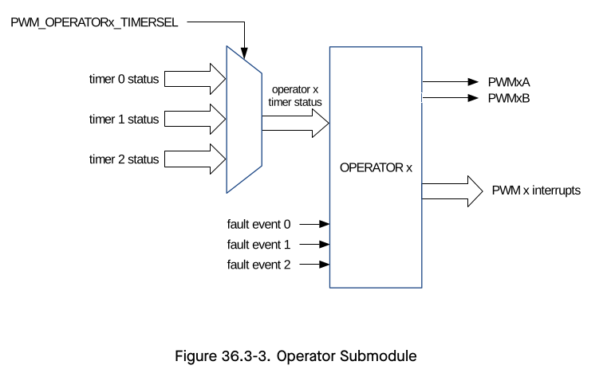
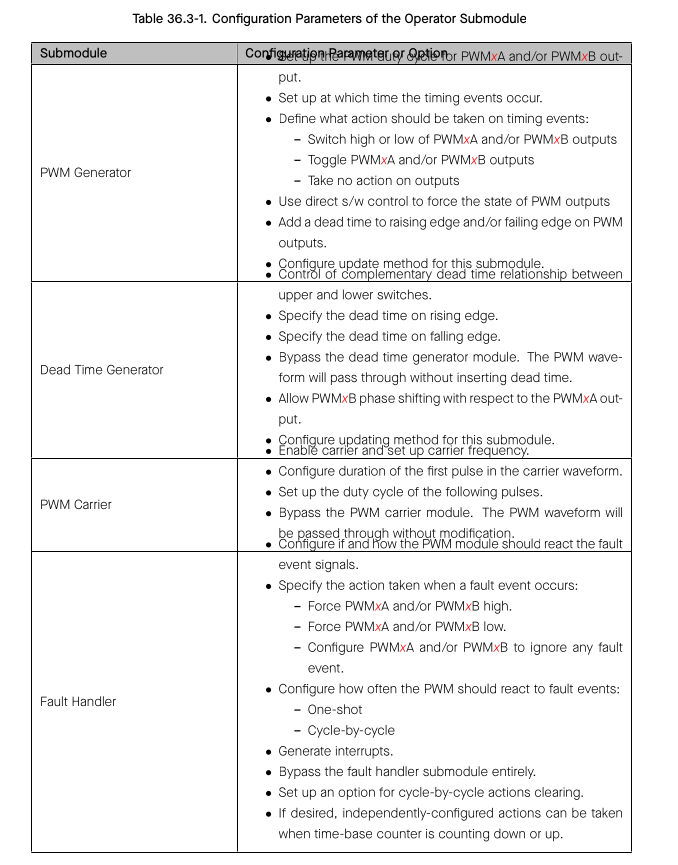
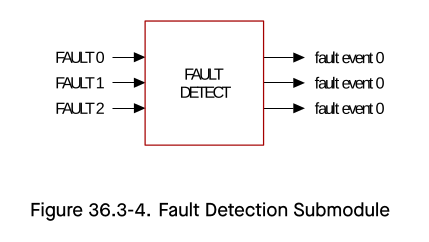

# Cornell Notes

## Topic: Submodules Overview`

## Date: 06/06/2026

---

### Cue Column (Questions, Keywords, or Prompts)

- [Insert question or keyword]
- [Insert question or keyword]
- [Insert question or keyword]

---

### Notes Section (Main Notes)

#### Overview

This section lists the configuration parameters of key submodules. For information on adjusting a specific parameter, e.g., synchronization source of PWM timer, please refer to Section PWM Timer Submodule for details.

##### Prescaler Submodule

Configuration option:
- Scale the `CRYPTO_PWM_CLK`.

##### Timer Submodule

Configuration options:
- Set the PWM timer frequency or period.
- Configure the working mode for the timer:
  - Count-Up Mode: for asymmetric PWM outputs 
  - Count-Down Mode: for asymmetric PWM outputs 
  - Count-Up-Down Mode: for symmetric PWM outputs
- Configure the the reloading phase (including the value and the direction) used during software and hardware synchronization.
- Synchronize the PWM timers with each other. Either hardware or software synchronization may be used.
- Configure the source of the PWM timer’s the synchronization input to one of the seven sources below:
  - The three PWM timer’s synchronization outputs.
  - Three synchronization signals from the GPIO matrix: PWMn_SYNC0_IN, PWMn_SYNC1_IN, PWMn_SYNC2_IN.
  - No synchronization input signal selected
- Configure the source of the PWM timer’s synchronization output to one of the four sources below:
  - Synchronization input signal
  - Event generated when value of the PWM timer is equal to zero
  - Event generated when value of the PWM timer is equal to period
  - Event generated when writing toggling value to MCPWM_TIMERx_SYNC_SW bit
- Configure the method of period updating.

##### Operator Submodule

The configuration parameters of the operator submodule are shown in Table 36.3-1.

##### Fault Detection Submodule

Configuration options:
- Enable fault event generation and configure the polarity of fault event generation for every fault signal

- Generate fault event interrupts

##### Capture Submodule

Configuration options:
- Select the edge polarity and prescaling of the capture input.
- Set up a software-triggered capture.
- Configure the capture timer’s sync trigger and sync phase.
- Software syncs the capture timer.

---

#### Related Use Cases

- [MCPWM Resource Relationships and Software Layers](../03_use_cases/01_overview_and_resource_relationships.md)
- [Operator, Comparator, and Generator Pipeline](../03_use_cases/04_operator_comparator_and_generator.md)
- [Private APIs: clock, prescaler, and submodule mapping](../03_use_cases/15_mcpwm_apis.md#trm-map-clock-prescale)

### Summary Section (Summary of Notes)

[Insert a brief summary of the key ideas and takeaways]
