# Cornell Notes

## Topic: PWM Operator Submodule

## Date: 07/06/2026

---

### Cue Column (Questions, Keywords, or Prompts)

- [Insert question or keyword]
- [Insert question or keyword]
- [Insert question or keyword]

---

### Notes Section (Main Notes)

#### PWM Operator Submodule

The PWM Operator submodule has the following functions

- Generates a PWM signal pair, based on timing references obtained from the corresponding PWM timer.
- Each signal out of the PWM signal pair includes a specific pattern of dead time.
- Superimposes a carrier on the PWM signal, if configured to do so.
- Handles response under fault conditions.

Figure 36.3-13 shows the block diagram of a PWM operator.

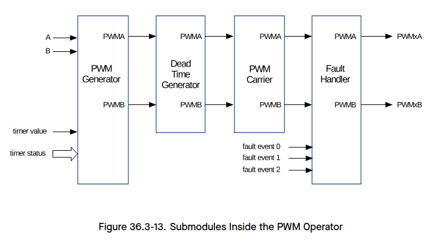

##### PWM Generator Submodule

**Purpose of the PWM Generator Submodule**

In this submodule, important timing events are generated or imported. The events are then converted into specific actions to generate the desired waveforms at the `PWMxA` and `PWMxB` outputs.

The PWM generator submodule performs the following actions:
- Generation of timing events based on time stamps configured using the A and B registers. Events happen when the following conditions are satisfied:
  - **UTEA**: the PWM timer is counting up and its value is equal to register A.
  - **UTEB**: the PWM timer is counting up and its value is equal to register B.
  - **DTEA**: the PWM timer is counting down and its value is equal to register A.
  - **DTEB**: the PWM timer is counting down and its value is equal to register B

- Generation of U/DT1, U/DT2 timing events based on fault or synchronization events.
- Management of priority when these timing events occur concurrently.
- Qualification and generation of set, clear and toggle actions, based on the timing events.
- Controlling of the PWM duty cycle, depending on configuration of the PWM generator submodule.
- Handling of new time stamp values, using shadow registers to prevent glitches in the PWM cycle.

**PWM Operator Shadow Registers**

The time stamp registers A and B, as well as action configuration registers `MCPWM_GENx_A_REG` and `MCPWM_GENx_B_REG` are shadowed. Shadowing provides a way of updating registers in sync with the hardware.

When `MCPWM_GLOBAL_UP_EN` is set to `1`, the shadow registers can be written to the active register at a specified time. The update method fields for time stamp registers A and B are `MCPWM_GEN_A_UPMETHOD` and `MCPWM_GEN_B_UPMETHOD`. The update method field for `MCPWM_GENx_A_REG` and `MCPWM_GENx_B_REG` is `MCPWM_GEN_CFG_UPMETHOD`. Software can also trigger a globally forced update bit 

`MCPWM_GLOBAL_FORCE_UP` which will prompt all registers in the module to be updated according to shadow registers. For a description of the shadow registers, please see 36.3.2.3.

**Timing Events**

For convenience, all timing signals and events are summarized in Table 36.3-2.

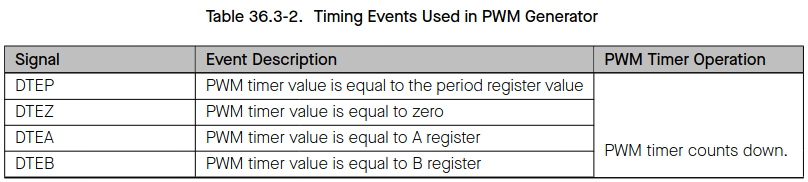 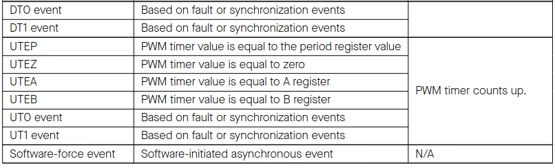

The purpose of a software-force event is to impose non-continuous or continuous changes on the `PWMxA` and `PWMxB` outputs. The change is done asynchronously. Software-force control is handled by the `MCPWM_GENx_FORCE_REG` registers

The selection and configuration of T0/T1 in the PWM generator submodule is independent of the configuration of fault events in the fault handler submodule. A particular trip event may or may not be configured to cause trip action in the fault handler submodule, but the same event can be used by the PWM generator to trigger T0/T1 for controlling PWM waveforms.

It is important to know that when the PWM timer is in count-up-down mode, it will always decrement after a TEP event, and will always increment after a TEZ event. So when the PWM timer is in count-up-down mode, DTEP and UTEZ events will occur, while the events UTEP and DTEZ will never occur

The PWM generator can handle multiple events at the same time. Events are prioritized by the hardware and relevant details are provided in Table 36.3-3 and Table 36.3-4. Priority levels range from 1 (the highest) to 7 (the lowest). Please note that the priority of TEP and TEZ events depends on the PWM timer’s direction.

If the value of A or B is set to be greater than the period, then U/DTEA and U/DTEB will never occur.

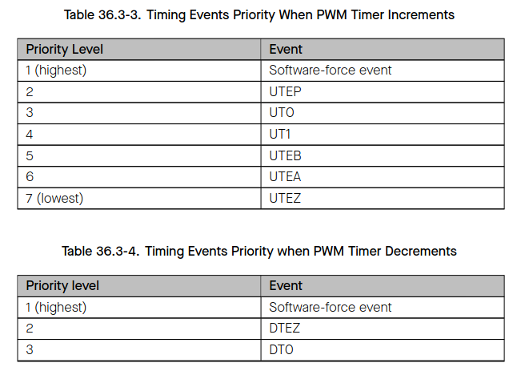 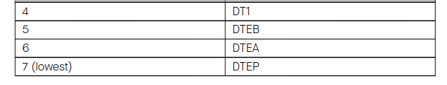

**Notes:**

1. UTEP and UTEZ do not happen simultaneously. When the PWM timer is in count-up mode, UTEP will always happen one cycle earlier than UTEZ, as demonstrated in Figure 36.3-10, so their action on PWM signals will not interrupt each other. When the PWM timer is in count-up-down mode, UTEP will not occur.
2. DTEP and DTEZ do not happen simultaneously. When the PWM timer is in count-down mode, DTEZ will always happen one cycle earlier than DTEP, as demonstrated in Figure 36.3-11, so their action on PWM signals will not interrupt each other. When the PWM timer is in count-up-down mode, DTEZ will not occur.

**PWM Signal Generation**

The PWM generator submodule controls the behavior of outputs `PWMxA` and `PWMxB` when a particular timing event occurs. The timing events are further qualified by the PWM timer’s counting direction (up or down).

Knowing the counting direction, the submodule may then perform an independent action at each stage of the PWM timer counting up or down.

The following actions may be configured on outputs `PWMxA` and `PWMxB`:

- **Set High**: Set the output of `PWMxA` or `PWMxB` to a high level.
- **Clear Low**: Clear the output of `PWMxA` or `PWMxB` by setting it to a low level.
- **Toggle**: Change the current output level of `PWMxA` or `PWMxB` to the opposite value. If it is currently pulled high, pull it low, or vice versa.
- **Do Nothing**: Keep both outputs `PWMxA` and `PWMxB` unchanged. In this state, interrupts can still be triggered.

The configuration of actions on outputs is done by using registers `MCPWM_GENx_A_REG` and `MCPWM_GENx_B_REG`. So, the action to be taken on each output is set independently. Also there is great flexibility in selecting actions to be taken on a given output based on events. More specifically, any event listed in Table 36.3-2 can operate on either output `PWMxA` or `PWMxB`. To check out registers for particular generator 0, 1 or 2, please refer to register description in Section 36.4.

**Waveforms for Common Configurations**

Figure 36.3-14 presents the symmetric PWM waveform generated when the PWM timer is counting up and down. DC 0%–100% modulation can be calculated via the formula below:

$Duty = (Period − A) ÷ Period$

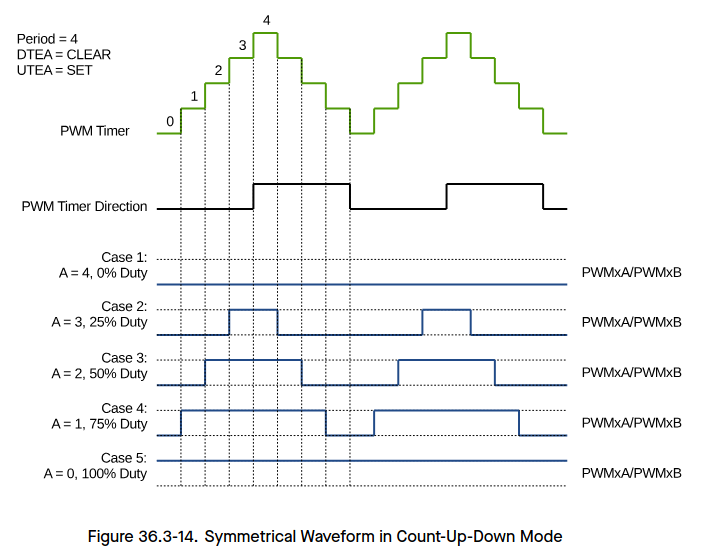

If A matches the PWM timer value and the PWM timer is incrementing, then the PWM output is pulled up. If A matches the PWM timer value while the PWM timer is decrementing, then the PWM output is pulled low.

The PWM waveforms in Figures 36.3-15 to 36.3-18 show some common PWM operator configurations. The following conventions are used in the figures:
- Period A and B refer to the values written in the corresponding registers.
- `PWMxA` and `PWMxB` are the output signals of PWM Operator x.

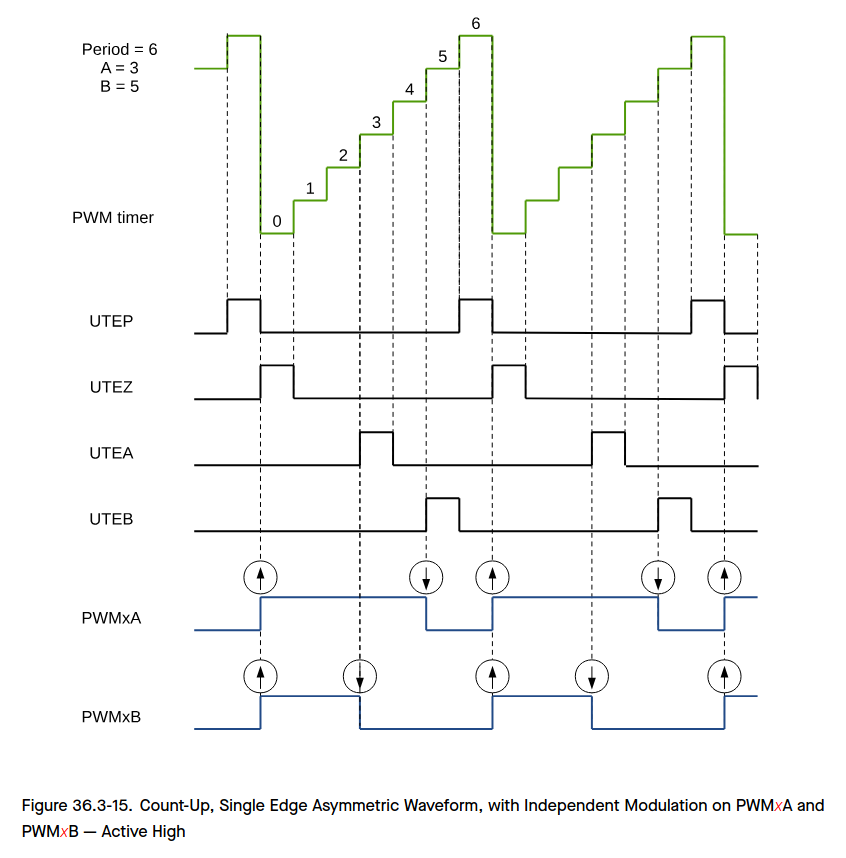

The duty modulation for `PWMxA` is set by B, active high and proportional to B

The duty modulation for `PWMxB` is set by A, active high and proportional to A

$Period = (MCPWM\_TIMERx\_PERIOD + 1) \times T_{PT\_clk}$

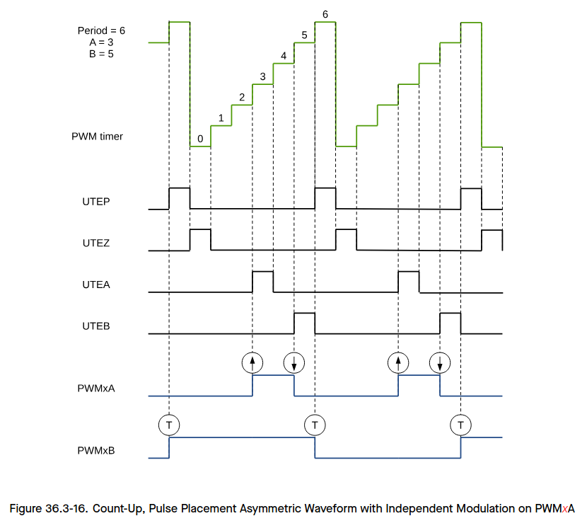

Pulses may be generated anywhere within the PWM cycle (zero – period).

`PWMxA`’s high time duty is proportional to (B – A).

$Period = (MCPWM\_TIMERx\_PERIOD + 1) \times T_{PT\_clk}$

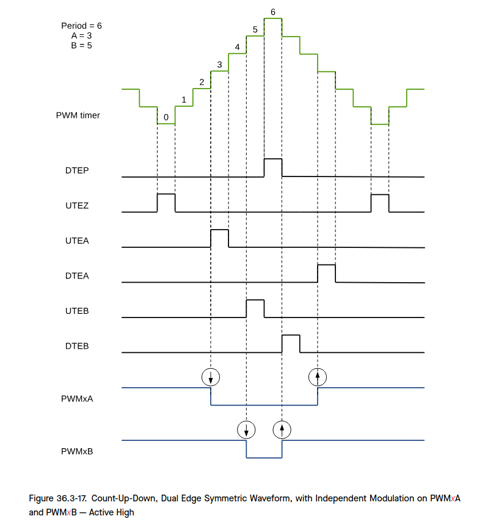

The duty modulation for `PWMxA` is set by A, active high and proportional to A.

The duty modulation for `PWMxB` is set by B, active high and proportional to B.

Outputs `PWMxA` and `PWMxB` can drive independent switches.

$Period = (2 \times MCPWM\_TIMERx\_PERIOD + 1) \times T_{PT\_clk}$

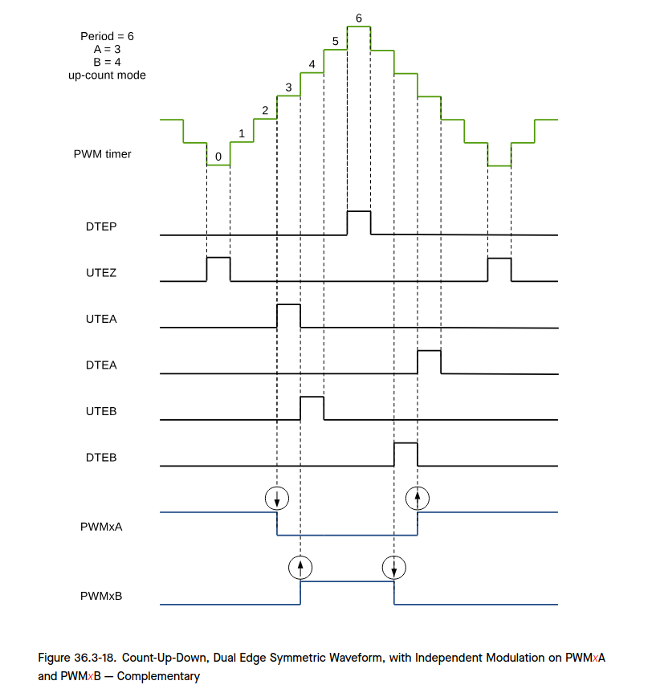

The duty modulation of `PWMxA` is set by A, is active high and proportional to A.

The duty modulation of `PWMxB` is set by B, is active low and proportional to B.

Outputs `PWMx` can drive upper/lower (complementary) switches.

Dead-time = B – A; Edge placement is fully programmable by software. Use the dead-time generator module if another edge delay method is required.

$Period = (2 \times MCPWM\_TIMERx\_PERIOD + 1) \times T_{PT\_clk}$

**Software-Force Events**

There are two types of software-force events inside the PWM generator:

- Non-continuous-immediate (NCI) software-force events
  - Such types of events are immediately effective on PWM outputs when triggered by software. The forcing is non-continuous, meaning the next active timing events will be able to alter the PWM outputs.

- Continuous (CNTU) software-force events
  - Such types of events are continuous. The forced PWM outputs will continue until they are released by software. The events’ triggers are configurable. They can be timing events or immediate events.

Figure 36.3-19 shows a waveform of NCI software-force events. NCI events are used to force PWMxA output low. Forcing on PWMxB is disabled in this case.

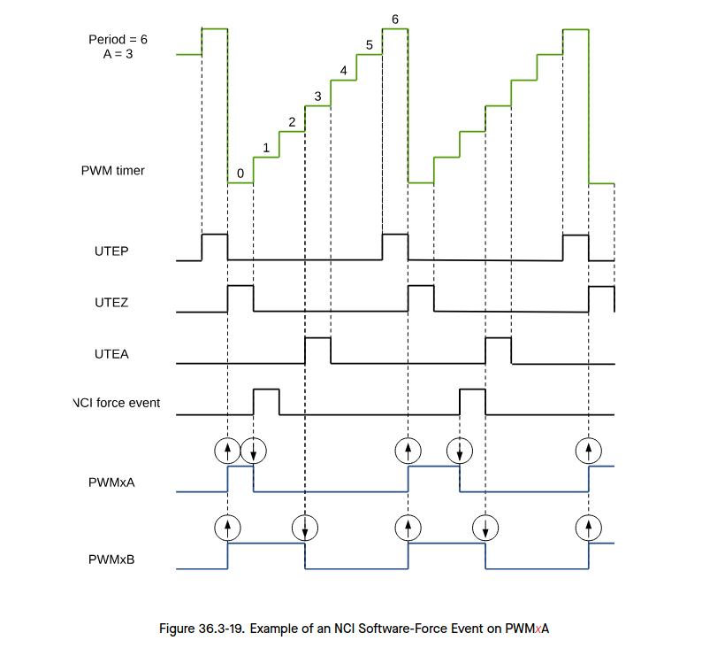

Figure 36.3-20 shows a waveform of CNTU software-force events. UTEZ events are selected as triggers for CNTU software-force events. CNTU is used to force the PWMxB output low. Forcing on PWMxA is disabled.

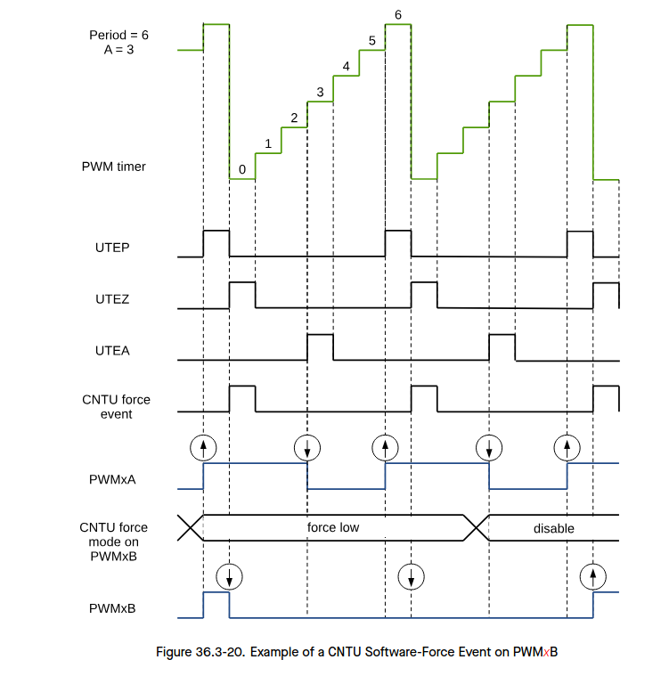

##### Dead Time Generator Submodule

**Purpose of the Dead Time Generator Submodule**

Several options to generate signals on PWMxA and PWMxB outputs, with a specific placement of signal edges, have been discussed in section 36.3.3.1. The required dead time is obtained by altering the edge placement between signals and by setting the signal’s duty cycle. Another option is to control the dead time using a specialized submodule – the Dead Time Generator.

The key functions of the dead time generator submodule are as follows:
- Generating signal pairs (PWMxA and PWMxB) with a dead time from a single PWMxA input
- Creating a dead time by adding delay to signal edges:
  - Rising edge delay (RED) 
  - Falling edge delay (FED)

- Configuring the signal pairs to be:
  - Active high complementary (AHC) 
  - Active low complementary (ALC) 
  - Active high (AH) 
  - Active low (AL)

- This submodule may also be bypassed, if the dead time is configured directly in the generator submodule

**Dead Time Generator’s Shadow Registers**

Delay registers RED and FED are shadowed with registers `MCPWM_DTx_RED_CFG_REG` and `MCPWM_DTx_FED_CFG_REG`. When MCPWM_GLOBAL_UP_EN is set to 1, the shadow registers can be written to the active register at specified time. The update method register for `MCPWM_DTx_RED_CFG_REG` is `MCPWM_DT_RED_UPMETHOD`. The update method register for `MCPWM_DTx_FED_CFG_REG` is `MCPWM_DT_FED_UPMETHOD`. The Software can also trigger a globally forced update bit `MCPWM_GLOBAL_FORCE_UP` which will prompt all registers in the module to be updated according to shadow registers.For the description of shadow registers, please see section 36.3.2.3.

**Highlights for Operation of the Dead Time Generator**

Options for setting up the dead-time submodule are shown in Figure 36.3-21.

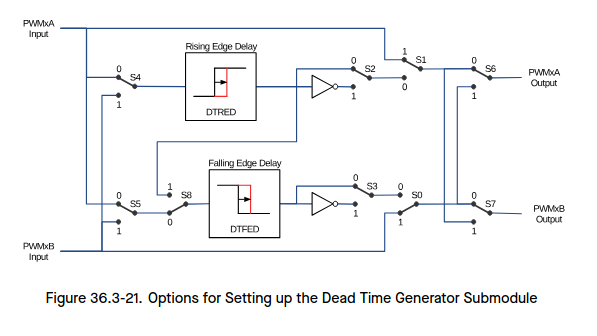

S0-S8 in the figure above are switches controlled by fields in register `MCPWM_DTx_CFG_REG` shown in Table 36.3-5.

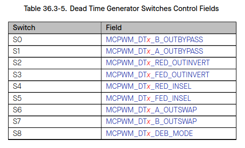

All switch combinations are supported, but not all of them represent the typical modes of use. Table 36.3-6 documents some typical dead time configurations. In these configurations the position of S4 and S5 sets `PWMxA` as the common source of both falling-edge and rising-edge delay. The modes presented in table 36.3-6 may be categorized as follows:

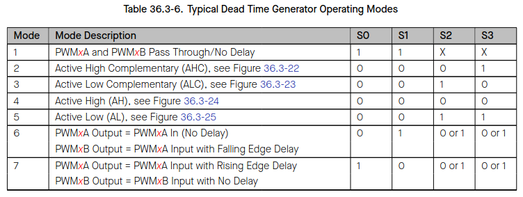

**Note:**
- For all the modes above, the position of the binary switches S4 to S8 is set to 0.

**Mode 1: Bypass delays on both falling (FED) as well as raising edge (RED)**

In this mode the dead time submodule is disabled. Signals `PWMxA` and `PWMxB` pass through without any modifications.

**Mode 2-5: Classical Dead Time Polarity Settings**

These modes represent typical configurations of polarity and should cover the active-high/low modes in available industry power switch gate drivers. The typical waveforms are shown in Figures 36.3-22 to 36.3-25.

**Modes 6 and 7: Bypass delay on falling edge (FED) or rising edge (RED)**

In these modes, either RED (Rising Edge Delay) or FED (Falling Edge Delay) is bypassed. As a result, the corresponding delay is not applied.

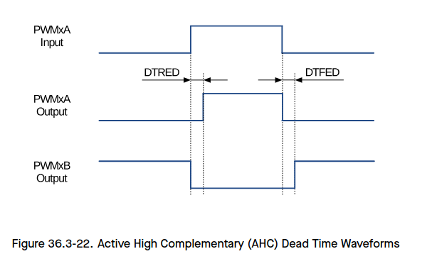

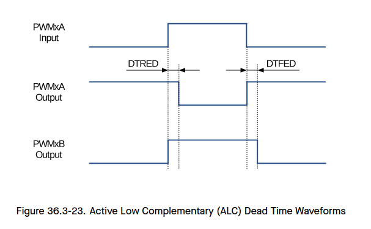

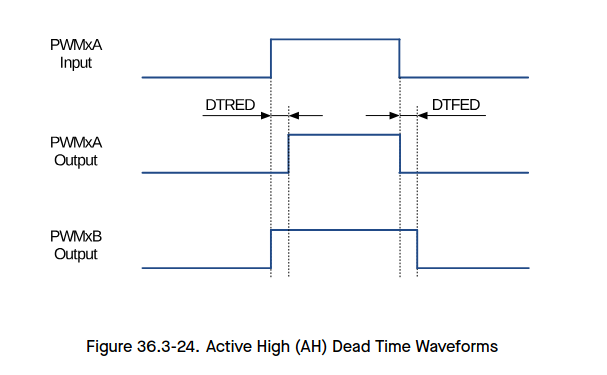

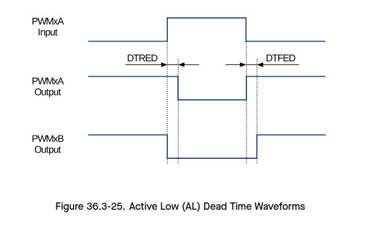

Rising edge (RED) and falling edge (FED) delays may be set up independently. The delay value is programmed using the 16-bit registers `MCPWM_DTx_RED` and `MCPWM_DTx_FED`. The register value represents the number of clock (`DT_clk`) periods by which a signal edge is delayed. `DT_CLK` can be selected from `PWM_clk` or `PT_clk` through register `MCPWM_DTx_CLK_SEL`.

To calculate the delay on falling edge (FED) and rising edge (RED), use the following formulas:

$FED = MCPWM\_DTx\_FED \times T_{DT\_clk}$ 

$RED = MCPWM\_DTx\_RED \times T_{DT\_clk}$

##### PWM Carrier Submodule

The coupling of PWM output to a motor driver may need isolation with a transformer. Transformers deliver only AC signals, while the duty cycle of a PWM signal may range anywhere from 0% to 100%. The PWM carrier submodule passes such a PWM signal through a transformer by using a high frequency carrier to modulate the signal.

**Function Overview**

The following key characteristics of this submodule are configurable:
- Carrier frequency
- Pulse width of the first pulse
- Duty cycle of the second and the subsequent pulses
- Enabling/disabling the carrier function

**Operational Highlights**

The PWM carrier clock (PC_clk) is derived from PWM_clk. The frequency and duty cycle are configured by the `MCPWM_CARRIERx_PRESCALE` and `MCPWM_CARRIERx_DUTY` bits in the `MCPWM_CARRIERx_CFG_REG` register. The purpose of one-shot pulses is to provide high-energy impulse to reliably turn on the power switch. Subsequent pulses sustain the power-on status. The width of a one-shot pulse is configurable with the `MCPWM_CARRIERx_OSHTWTH` bits. Enabling/disabling of the carrier submodule is done with the `MCPWM_CARRIERx_EN` bit.

**Waveform Examples**

Figure 36.3-26 shows an example of waveforms, where a carrier is superimposed on original PWM pulses.
This figure do not show the first one-shot pulse and the duty-cycle control. Related details are covered in the following two sections.

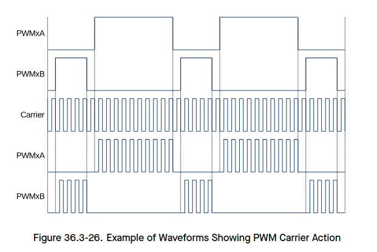

**One-Shot Pulse**

The width of the first pulse is configurable. It may assume one of 16 possible values and is described by the formula below:

$T_{1stpulse} = T_{PWM\_clk} \times 8 \times (MCPWM\_CARRIERx\_PRESCALE + 1) \times (MCPWM\_CARRIERx\_OSHTWTH + 1)$

Where:
- $T_{1stpulse}$ is the period of the PWM clock (PWM_clk).
- $(MCPWM\_CARRIERx\_PRESCALE + 1)$ is the width of the first pulse (whose value ranges from 1 to 16).
- $(MCPWM\_CARRIERx\_OSHTWTH + 1)$ is the PWM carrier clock’s (PC_clk) prescaler value.

The first one-shot pulse and subsequent sustaining pulses are shown in Figure 36.3-27.

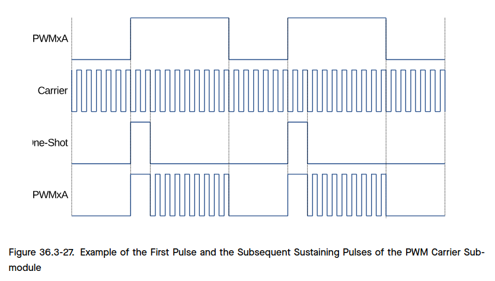

**Duty Cycle Control**

After issuing the first one-shot pulse, the remaining PWM signal is modulated according to the carrier frequency. Users can configure the duty cycle of this signal. Tuning of duty may be required, so that the signal passes through the isolating transformer and can still operate (turn on/off) the motor drive, changing rotation speed and direction.

The duty cycle may be set to one of seven values, using `MCPWM_CARRIERx_DUTY`, or bits [7:5] of register `MCPWM_CARRIERx_CFG_REG`.

Below is the formula for calculating the duty cycle:

$Duty = MCPWM\_CARRIERx\_DUTY ÷ 8$

All seven settings of the duty cycle are shown in Figure 36.3-28.

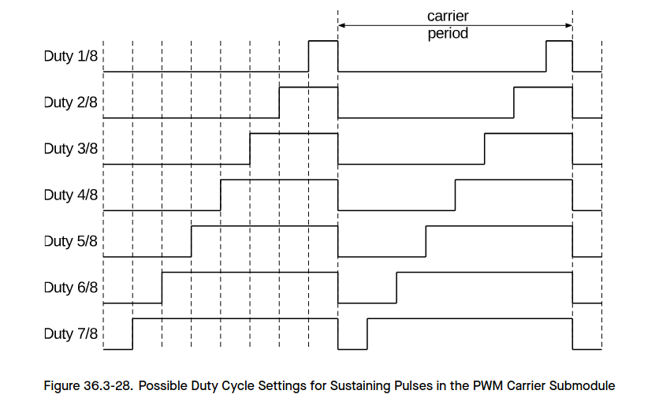

##### Fault Handler Submodule

Each MCPWM peripheral is connected to three fault signals (FAULT0, FAULT1 and FAULT2) which are sourced from the GPIO matrix. These signals are intended to indicate external fault conditions, and may be preprocessed by the fault detection submodule to generate fault events. Fault events can then execute the user code to control MCPWM outputs in response to specific faults.

**Function of Fault Handler Submodule**

The key actions performed by the fault handler submodule are:

- Forcing outputs PWMxA and PWMxB, upon detected fault, to one of the following states:
  - High
  - Low
  - Toggle
  - No action taken
- Execution of one-shot trip (OST) upon detection of over-current conditions/short circuits.
- Cycle-by-cycle tripping (CBC) to provide current-limiting operation.
- Allocation of either one-shot or cycle-by-cycle operation for each fault signal.
- Generation of interrupts for each fault input.
- Support for software-force tripping.
- Enabling or disabling of submodule function as required.

**Operation and Configuration Tips**

This section provides the operational tips and set-up options for the fault handler submodule.

Fault signals coming from pins are sampled and synced in the GPIO matrix. In order to guarantee the successful sampling of fault pulses, each pulse duration must be at least two APB clock cycles. The fault detection submodule will then sample fault signals by using PWM_clk. So, the duration of fault pulses coming from GPIO matrix must be at least one PWM_clk cycle. Differently put, regardless of the period relation between APB clock and PWM_clk, the width of fault signal pulses on pins must be at least equal to the sum of two APB clock cycles and one PWM_clk cycle.

Each level of fault signals, FAULT0 to FAULT2, can be used by the fault handler submodule to generate fault events (fault_event0 to fault_event2). Every fault event can be configured individually to provide CBC action, OST action, or none

- **Cycle-by-Cycle (CBC) action:** When CBC action is triggered, the state of `PWMxA` and `PWMxB` will be changed immediately according to the configuration of fields `MCPWM_FHx_A_CBC_U/D` and `MCPWM_FHx_B_CBC_U/D`. Different actions can be indicted when the PWM timer is incrementing or decrementing. Different CBC action interrupts can be triggered for different fault events. Status field `MCPWM_FHx_CBC_ON` indicates whether a CBC action is on or off. When the fault event is no longer present, CBC actions on `PWMxA/B` will be cleared at a specified point, which is either a `D/UTEP` or `D/UTEZ` event. Field `MCPWM_FHx_CBCPULSE` determines at which event `PWMxA` and `PWMxB` will be able to resume normal actions. Therefore, in this mode, the CBC action is cleared or refreshed upon every PWM cycle
- **One-Shot Trip (OST) action:** When OST action is triggered, the state of `PWMxA` and `PWMxB` will be changed immediately, depending on the setting of fields `MCPWM_FHx_A_OST_U/D` and `MCPWM_FHx_B_OST_U/D`. Different actions can be configured when PWM timer is incrementing or decrementing. Different OST action interrupts can be triggered form different fault events. Status field `MCPWM_FHx_OST_ON` indicates whether an OST action is on or off. The OST actions on `PWMxA/B` are not automatically cleared when the fault event is no longer present. One-shot actions must be cleared manually by setting the rising edge of the `MCPWM_FHx_CLR_OST` bit.

---

### Summary Section (Summary of Notes)

- The PWM generator can handle multiple events simultaneously, with hardware prioritization.
- UTEP and UTEZ events do not occur simultaneously; UTEP happens one cycle earlier than UTEZ in count-up mode.
- DTEP and DTEZ events do not occur simultaneously; DTEZ happens one cycle earlier than DTEP in count-down mode.
- When the PWM timer is in count-up-down mode, UTEP and DTEZ events do not occur.
