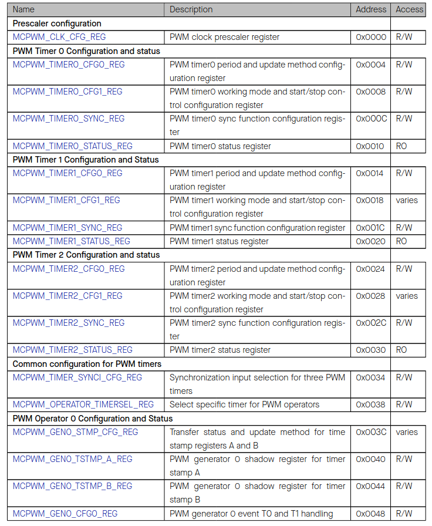
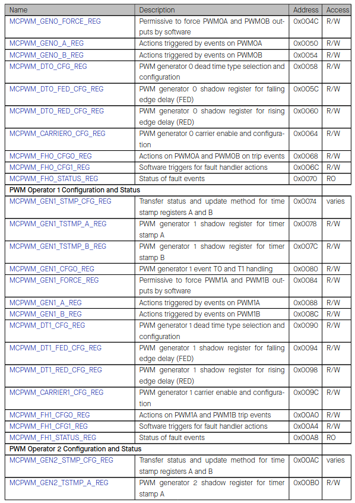
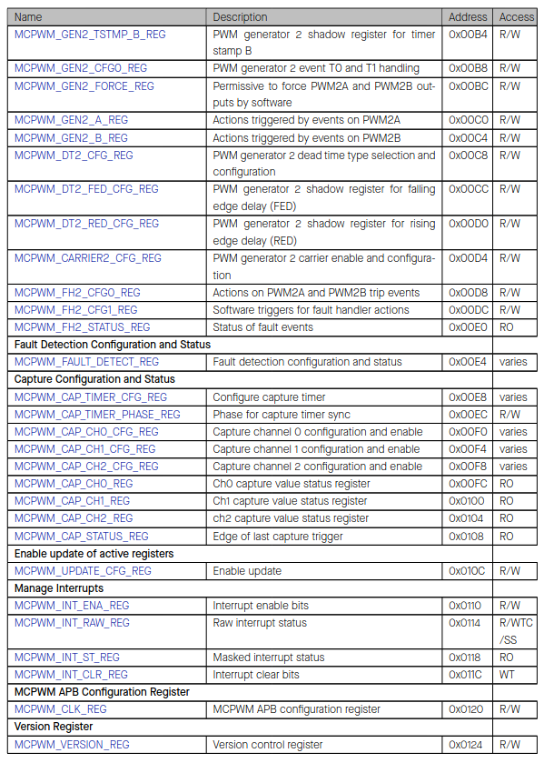

# Cornell Notes

## Topic: Register Summary

## Date: 14/06/2026

---

<strong><em>"DO NOT JUST TALK ABOUT IT — SHOW IT"</em></strong>

---

### Cue Column (Questions, Keywords, or Prompts)

- [Insert question or keyword]
- [Insert question or keyword]
- [Insert question or keyword]

---

### Notes Section (Main Notes)

#### Register Summary

The addresses in this section are relative to Motor Control PWM0 and Motor Control PWM1 base address provided in Table 4.3-3 in section System and Memory.

The abbreviations given in Column **Access** are explained in Section Access Types for Registers.

---

### Summary Section (Summary of Notes)

[Insert a brief summary of the key ideas and takeaways]