# Cornell Notes

## Topic: Registers

`MCPWM_FH0_CBC_ON` (RO):

Set and reset by hardware.

`MCPWM_FH0_OST_ON` (RO):

Set and reset by hardware.
- If set: one-shot mode action is on-going.

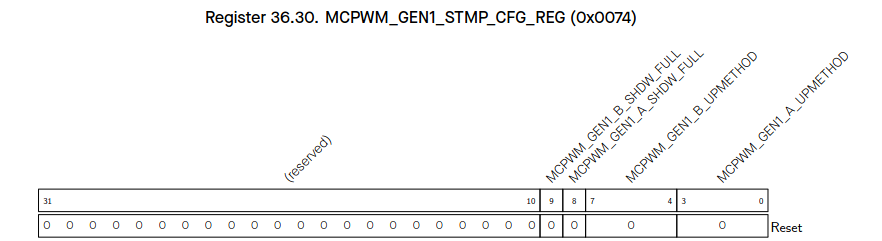

`MCPWM_FH0_CBC_ON` (RO):

Set and reset by hardware.
- If set: cycle-by-cycle mode action is on-going.

`MCPWM_FH0_OST_ON` (RO):

Set and reset by hardware.
- If set: one-shot mode action is on-going.

`MCPWM_GEN1_A_UPMETHOD` (R/W):

Update method for PWM generator 1 time stamp A’s active register.
- When all bits are set to 0: immediately
- When bit0 is set to 1: TEZ
- When bit1 is set to 1: TEP
- When bit2 is set to 1: sync
- When bit3 is set to 1: disable the update

`MCPWM_GEN1_B_UPMETHOD` (R/W):

Update method for PWM generator 1 time stamp B’s active register.
- When all bits are set to 0: immediately
- When bit0 is set to 1: TEZ
- When bit1 is set to 1: TEP
- When bit2 is set to 1: sync
- When bit3 is set to 1: disable the update

`MCPWM_GEN1_A_SHDW_FULL` (R/WTC/SC):

Set and reset by hardware.
- If set: PWM generator 1 time stamp A’s shadow reg is filled and waiting to be transferred to A’s active reg
- If cleared: A’s active reg has been updated with shadow register latest value

`MCPWM_GEN1_B_SHDW_FULL` (R/WTC/SC):

Set and reset by hardware.
- If set: PWM generator 1 time stamp B’s shadow reg is filled and waiting to be transferred to B’s active reg
- If cleared: B’s active reg has been updated with shadow register latest value

---

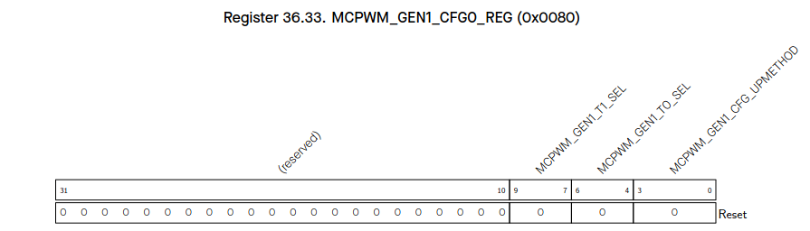

`MCPWM_GEN1_CFG_UPMETHOD` (R/W):

Update method for PWM generator 1’s active register of configuration.
- When all bits are set to 0: immediately
- When bit0 is set to 1: TEZ
- When bit1 is set to 1: sync
- When bit3 is set to 1: disable the update

`MCPWM_GEN1_T0_SEL` (R/W):

Source selection for PWM generator 1 event_t0, take effect immediately.
- 0: fault_event0
- 1: fault_event1
- 2: fault_event2
- 3: sync_taken
- 4: none

`MCPWM_GEN1_T1_SEL` (R/W):

Source selection for PWM generator 1 event_t1, take effect immediately.
- 0: fault_event0 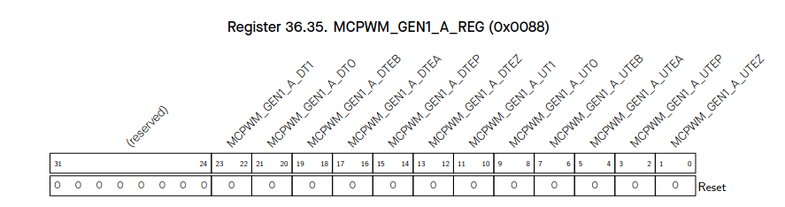

`MCPWM_GEN1_A_UTEZ` (R/W):

Action on PWM1A triggered by event TEZ when timer increasing.
- 0: no change
- 1: low
- 2: high
- 3: toggle

`MCPWM_GEN1_A_UTEP` (R/W):

Action on PWM1A triggered by event TEP when timer increasing.
- 0: no change
- 1: low
- 2: high
- 3: toggle

`MCPWM_GEN1_A_UTEA` (R/W):

Action on PWM1A triggered by event TEA when timer increasing.
- 0: no change
- 1: low
- 2: high
- 3: toggle

`MCPWM_GEN1_A_UTEB` (R/W):

Action on PWM1A triggered by event TEB when timer increasing.
- 0: no change
- 1: low
- 2: high
- 3: toggle

`MCPWM_GEN1_A_UT0` (R/W):

Action on PWM1A triggered by event_t0 when timer increasing.
- 0: no change
- 1: low
- 2: high
- 3: toggle

`MCPWM_GEN1_A_UT1` (R/W):

Action on PWM1A triggered by event_t1 when timer increasing.
- 0: no change
- 1: low
- 2: high
- 3: toggle

`MCPWM_GEN1_A_DTEZ` (R/W):

Action on PWM1A triggered by event TEZ when timer decreasing.
- 0: no change
- 1: low
- 2: high
- 3: toggle

`MCPWM_GEN1_A_DTEP` (R/W):

Action on PWM1A triggered by event TEP when timer decreasing.
- 0: no change
- 1: low
- 2: high
- 3: toggle

`MCPWM_GEN1_A_DTEA` (R/W):

Action on PWM1A triggered by event TEA when timer decreasing.
- 0: no change
- 1: low
- 2: high
- 3: toggle

`MCPWM_GEN1_A_DTEB` (R/W):

Action on PWM1A triggered by event TEB when timer decreasing.
- 0: no change
- 1: low
- 2: high
- 3: toggle

`MCPWM_GEN1_A_DT0` (R/W):

Action on PWM1A triggered by event_t0 when timer decreasing.
- 0: no change
- 1: low
- 2: high
- 3: toggle

`MCPWM_GEN1_A_DT1` (R/W):

Action on PWM1A triggered by event_t1 when timer decreasing.
- 0: no change
- 1: low
- 2: high
- 3: toggle

---

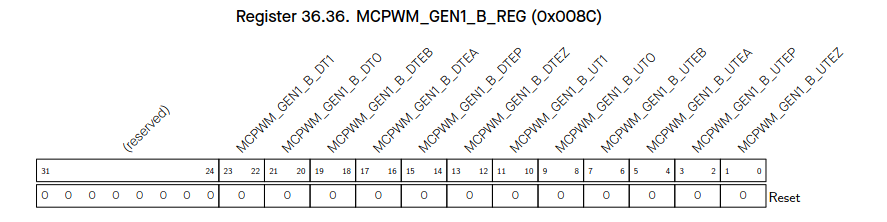

`MCPWM_GEN1_B_UTEZ` (R/W):

Action on PWM1B triggered by event TEZ when timer increasing.
- 0: no change
- 1: low
- 2: high
- 3: toggle

`MCPWM_GEN1_B_UTEP` (R/W):

Action on PWM1B triggered by event TEP when timer increasing.
- 0: no change
- 1: low
- 2: high
- 3: toggle

`MCPWM_GEN1_B_UTEA` (R/W):

Action on PWM1B triggered by event TEA when timer increasing.
- 0: no change
- 1: low
- 2: high
- 3: toggle

`MCPWM_GEN1_B_UTEB` (R/W):

Action on PWM1B triggered by event TEB when timer increasing.
- 0: no change
- 1: low
- 2: high
- 3: toggle

`MCPWM_GEN1_B_UT0` (R/W):

Action on PWM1B triggered by event_t0 when timer increasing.
- 0: no change
- 1: low
- 2: high
- 3: toggle

`MCPWM_GEN1_B_UT1` (R/W):

Action on PWM1B triggered by event_t1 when timer increasing.
- 0: no change
- 1: low
- 2: high
- 3: toggle

`MCPWM_GEN1_B_DTEZ` (R/W):

Action on PWM1B triggered by event TEZ when timer decreasing.
- 0: no change
- 1: low
- 2: high
- 3: toggle

`MCPWM_GEN1_B_DTEP` (R/W):

Action on PWM1B triggered by event TEP when timer decreasing.
- 0: no change
- 1: low
- 2: high
- 3: toggle

`MCPWM_GEN1_B_DTEA` (R/W):

Action on PWM1B triggered by event TEA when timer decreasing.
- 0: no change
- 1: low
- 2: high
- 3: toggle

`MCPWM_GEN1_B_DTEB` (R/W):

Action on PWM1B triggered by event TEB when timer decreasing.
- 0: no change
- 1: low
- 2: high
- 3: toggle

`MCPWM_GEN1_B_DT0` (R/W):

Action on PWM1B triggered by event_t0 when timer decreasing.
- 0: no change
- 1: low
- 2: high
- 3: toggle

`MCPWM_GEN1_B_DT1` (R/W):

Action on PWM1B triggered by event_t1 when timer decreasing.
- 0: no change
- 1: low
- 2: high
- 3: toggle

---

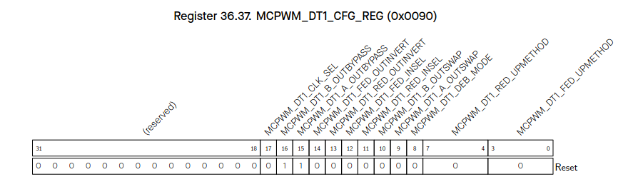

`MCPWM_DT1_FED_UPMETHOD` (R/W):

Update method for FED (falling edge delay) active register.
- 0: immediate
- When bit0 is set to 1: tez
- When bit1 is set to 1: tep
- When bit2 is set to 1: sync
- When bit3 is set to 1: disable the update

`MCPWM_DT1_RED_UPMETHOD` (R/W):

Update method for RED (rising edge delay) active register.
- 0: immediate
- When bit0 is set to 1: tez
- When bit1 is set to 1: tep
- When bit2 is set to 1: sync
- When bit3 is set to 1: disable the update

`MCPWM_DT1_DEB_MODE` (R/W):

S8 in table 36.3-5, dual-edge B mode.
- 0: fed/red take effect on different path separately
- 1: fed/red take effect on B path, A out is in bypass or dulpB mode

`MCPWM_DT1_A_OUTSWAP` (R/W):

S6 in table 36.3-5.

`MCPWM_DT1_B_OUTSWAP` (R/W):

S7 in table 36.3-5.

`MCPWM_DT1_RED_INSEL` (R/W):

S4 in table 36.3-5.

`MCPWM_DT1_FED_INSEL` (R/W):

S5 in table 36.3-5.

`MCPWM_DT1_RED_OUTINVERT` (R/W):

S2 in table 36.3-5.

`MCPWM_DT1_FED_OUTINVERT` (R/W):

S3 in table 36.3-5.

`MCPWM_DT1_A_OUTBYPASS` (R/W):

S1 in table 36.3-5.

`MCPWM_DT1_B_OUTBYPASS` (R/W):

S0 in table 36.3-5.

`MCPWM_DT1_CLK_SEL` (R/W):

Dead time generator 1 clock selection.
- 0: PWM_clk
- 1: PT_clk

---

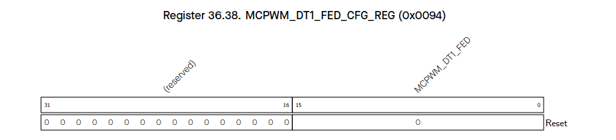

`MCPWM_DT1_FED` (R/W):

Shadow register for FED.

---

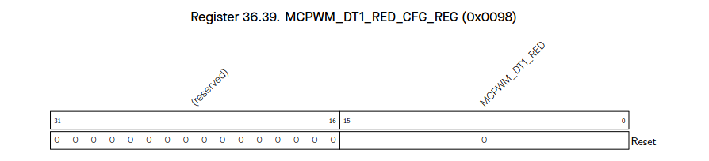

`MCPWM_DT1_RED` (R/W):

Shadow register for RED.

---

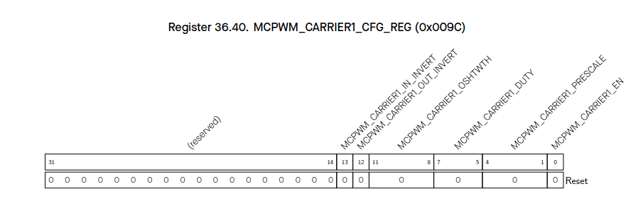

`MCPWM_CARRIER1_EN` (R/W):

When set, carrier1 function is enabled. When cleared, carrier1 is bypassed.

`MCPWM_CARRIER1_PRESCALE` (R/W):

PWM carrier1 clock (PC_clk) prescale value.
Period of PC_clk = period of PWM_clk * (PWM_CARRIER0_PRESCALE + 1).

`MCPWM_CARRIER1_DUTY` (R/W):

Carrier duty selection.
Duty = PWM_CARRIER0_DUTY/8.

`MCPWM_CARRIER1_OSHTWTH` (R/W):

Width of the first pulse in number of periods of the carrier.

`MCPWM_CARRIER1_OUT_INVERT` (R/W):

When set, invert the output of PWM1A and PWM1B for this sub-module.

`MCPWM_CARRIER1_IN_INVERT` (R/W):

When set, invert the input of PWM1A and PWM1B for this sub-module.

---

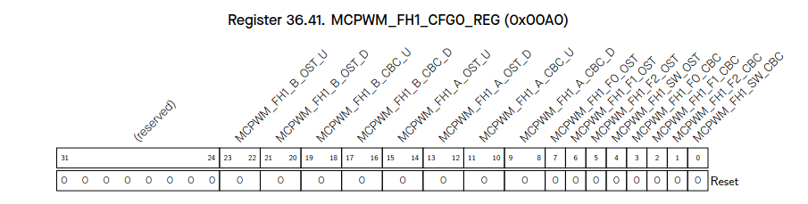

`MCPWM_FH1_SW_CBC` (R/W):

Enable register for software force cycle-by-cycle mode action.
- 0: disable
- 1: enable

`MCPWM_FH1_F2_CBC` (R/W):

event_f2 will trigger cycle-by-cycle mode action.
- 0: disable
- 1: enable

`MCPWM_FH1_F1_CBC` (R/W):

event_f1 will trigger cycle-by-cycle mode action.
- 0: disable
- 1: enable

`MCPWM_FH1_F0_CBC` (R/W):

event_f0 will trigger cycle-by-cycle mode action.
- 0: disable
- 1: enable

`MCPWM_FH1_SW_OST` (R/W):

Enable register for software force one-shot mode action.
- 0: disable
- 1: enable

`MCPWM_FH1_F2_OST` (R/W):

event_f2 will trigger one-shot mode action.
- 0: disable
- 1: enable

`MCPWM_FH1_F1_OST` (R/W):

event_f1 will trigger one-shot mode action.
- 0: disable
- 1: enable

`MCPWM_FH1_F0_OST` (R/W):

event_f0 will trigger one-shot mode action.
- 0: disable
- 1: enable

`MCPWM_FH1_A_CBC_D` (R/W):

Cycle-by-cycle mode action on PWM1A when fault event occurs and timer is decreasing.
- 0: do nothing
- 1: force low
- 2: force high
- 3: toggle

`MCPWM_FH1_A_CBC_U` (R/W):

Cycle-by-cycle mode action on PWM1A when fault event occurs and timer is increasing.
- 0: do nothing
- 1: force low
- 2: force high
- 3: toggle

`MCPWM_FH1_A_OST_D` (R/W):

One-shot mode action on PWM1A when fault event occurs and timer is decreasing.
- 0: do nothing
- 1: force low
- 2: force high
- 3: toggle

`MCPWM_FH1_A_OST_U` (R/W):

One-shot mode action on PWM1A when fault event occurs and timer is increasing.
- 0: do nothing
- 1: force low
- 2: force high
- 3: toggle

`MCPWM_FH1_B_CBC_D` (R/W):

Cycle-by-cycle mode action on PWM1B when fault event occurs and timer is decreasing.
- 0: do nothing
- 1: force low
- 2: force high
- 3: toggle

`MCPWM_FH1_B_CBC_U` (R/W):

Cycle-by-cycle mode action on PWM1B when fault event occurs and timer is increasing.
- 0: do nothing
- 1: force low
- 2: force high
- 3: toggle

`MCPWM_FH1_B_OST_D` (R/W):

One-shot mode action on PWM1B when fault event occurs and timer is decreasing.
- 0: do nothing
- 1: force low
- 2: force high
- 3: toggle

`MCPWM_FH1_B_OST_U` (R/W):

One-shot mode action on PWM1B when fault event occurs and timer is increasing.
- 0: do nothing
- 1: force low
- 2: force high
- 3: toggle

`MCPWM_GEN1_B` (R/W):

PWM generator 1 time stamp B’s shadow register.

---

`MCPWM_GEN1_CFG_UPMETHOD` (R/W):

Update method for PWM generator 1’s active register of configuration.
- When all bits are set to 0: immediately
- When bit0 is set to 1: TEZ
- When bit1 is set to 1: sync
- When bit3 is set to 1: disable the update

`MCPWM_GEN1_T0_SEL` (R/W):

Source selection for PWM generator 1 event_t0, take effect immediately.
- 0: fault_event0
- 1: fault_event1
- 2: fault_event2
- 3: sync_taken
- 4: none

`MCPWM_GEN1_T1_SEL` (R/W):

Source selection for PWM generator 1 event_t1, take effect immediately.
- 0: fault_event0
- 1: fault_event1
- 2: fault_event2
- 3: sync_taken
- 4: none

---

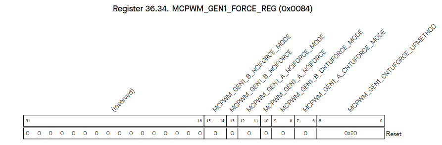

`MCPWM_GEN1_CNTUFORCE_UPMETHOD` (R/W):

Updating method for continuous software force of PWM generator 1.
- When all bits are set to 0: immediately
- When bit0 is set to 1: TEZ
- When bit1 is set to 1: TEP
- When bit2 is set to 1: TEA
- When bit3 is set to 1: TEB
- When bit4 is set to 1: sync
- When bit5 is set to 1: disable update

(TEA/B here and below means an event generated when the timer’s value equals to that of register A/B.)

`MCPWM_GEN1_A_CNTUFORCE_MODE` (R/W):

Continuous software force mode for PWM1A.
- 0: disabled
- 1: low
- 2: high
- 3: disabled

`MCPWM_GEN1_B_CNTUFORCE_MODE` (R/W):

Continuous software force mode for PWM1B.
- 0: disabled
- 1: low
- 2: high
- 3: disabled

`MCPWM_GEN1_A_NCIFORCE` (R/W):

Trigger of non-continuous immediate software-force event for PWM1A.
- Toggle triggers a force event.

`MCPWM_GEN1_A_NCIFORCE_MODE` (R/W):

Non-continuous immediate software force mode for PWM1A.
- 0: disabled
- 1: low
- 2: high
- 3: disabled

`MCPWM_GEN1_B_NCIFORCE` (R/W):

Trigger of non-continuous immediate software-force event for PWM1B.
- Toggle triggers a force event.

`MCPWM_GEN1_B_NCIFORCE_MODE` (R/W):

Non-continuous immediate software force mode for PWM1B.
- 0: disabled
- 1: low
- 2: high
- 3: disabled

`MCPWM_TIMER1_DIRECTION` (RO):

Current direction of PWM timer1 counter. 
- 0: increment.
- 1: decrement.

---

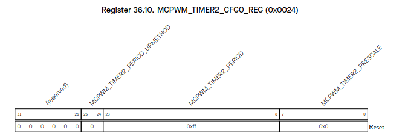

`MCPWM_TIMER2_PRESCALE` (R/W):

Period of PT0_clk = Period of PWM_clk * (PWM_timer2_PRESCALE + 1).

`MCPWM_TIMER2_PERIOD` (R/W):

Period shadow register of PWM timer2.

`MCPWM_TIMER2_PERIOD_UPMETHOD` (R/W):

Update method for active register of PWM timer2 period.

- 0: immediate
- 1: TEZ
- 2: sync
- 3: TEZ | sync

**TEZ** here and below means **T**imer **E**qual **Z**ero event.

---

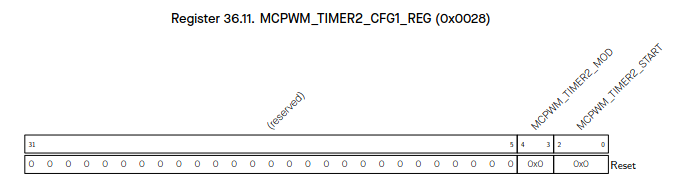

`MCPWM_TIMER2_START` (R/W/SC):

PWM timer2 start and stop control.

- 0: if PWM timer2 starts, then stops at TEZ
- 1: if timer2 starts, then stops at TEP
- 2: PWM timer2 starts and runs on
- 3: timer2 starts and stops at the next TEZ
- 4: timer2 starts and stops at the next TEP.

**TEP** here and below means **T**imer **E**qual **P**eriod event.

`MCPWM_TIMER2_MOD` (R/W):

PWM timer2 working mode.

- 0: freeze.
- 1: increase mode.
- 2: decrease mode.
- 3: up-down mode.

---

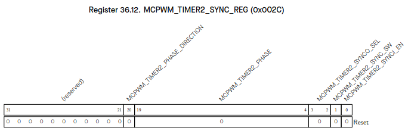

`MCPWM_TIMER2_SYNCI_EN` (R/W):

When set, timer reloading with phase on sync input event is enabled.

`MCPWM_TIMER2_SYNC_SW` (R/W):

Toggling this bit will trigger a software sync.

`MCPWM_TIMER2_SYNCO_SEL` (R/W):

PWM timer2 sync_out selection.
- 0: sync_in
- 1: TEZ
- 2: TEP

The sync_out will always generate when toggling the reg_timer2_sync_sw bit.

`MCPWM_TIMER2_PHASE` (R/W):

Phase for timer reload on sync event.

`MCPWM_TIMER2_PHASE_DIRECTION` (R/W):

Configure the PWM timer2’s direction when timer2 is in up-down mode.
- 0: increase.
- 1: decrease.

---

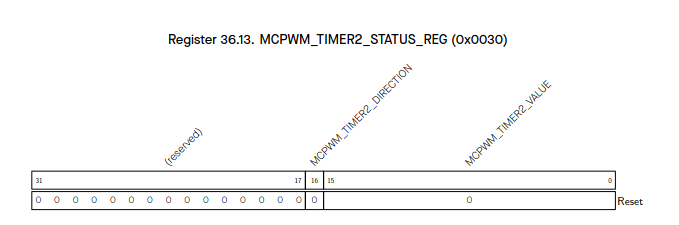

`MCPWM_TIMER2_VALUE` (RO):

Current value of PWM timer2 counter.

`MCPWM_TIMER2_DIRECTION` (RO):

Current direction of PWM timer2 counter.
- 0: increment.
- 1: decrement.

---

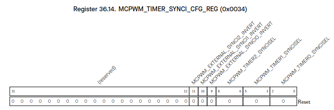

`MCPWM_TIMER0_SYNCISEL` (R/W):

Select sync input for PWM timer0.

- 1: PWM timer0 sync_out
- 2: PWM timer1 sync_out
- 3: PWM timer2 sync_out
- 4: SYNC0 from GPIO matrix
- 5: SYNC1 from GPIO matrix
- 6: SYNC2 from GPIO matrix
- Other values: no sync input selected.

`MCPWM_TIMER1_SYNCISEL` (R/W):

Select sync input for PWM timer1.

- 1: PWM timer0 sync_out
- 2: PWM timer1 sync_out
- 3: PWM timer2 sync_out
- 4: SYNC0 from GPIO matrix
- 5: SYNC1 from GPIO matrix
- 6: SYNC2 from GPIO matrix
- Other values: no sync input selected.

`MCPWM_TIMER2_SYNCISEL` (R/W):

Select sync input for PWM timer2.

- 1: PWM timer0 sync_out
- 2: PWM timer1 sync_out
- 3: PWM timer2 sync_out
- 4: SYNC0 from GPIO matrix
- 5: SYNC1 from GPIO matrix
- 6: SYNC2 from GPIO matrix
- Other values: no sync input selected.

`MCPWM_EXTERNAL_SYNCI0_INVERT` (R/W):

Invert SYNC0 from GPIO matrix.

`MCPWM_EXTERNAL_SYNCI1_INVERT` (R/W):

Invert SYNC1 from GPIO matrix.

`MCPWM_EXTERNAL_SYNCI2_INVERT` (R/W):

Invert SYNC2 from GPIO matrix.

---

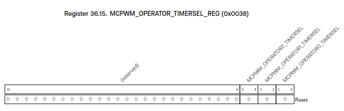

`MCPWM_OPERATOR0_TIMERSEL` (R/W):

Select which PWM timer’s is the timing reference for PWM operator0.
- 0: timer0
- 1: timer1
- 2: timer2

`MCPWM_OPERATOR1_TIMERSEL` (R/W):

Select which PWM timer’s is the timing reference for PWM operator1.
- 0: timer0
- 1: timer1
- 2: timer2

`MCPWM_OPERATOR2_TIMERSEL` (R/W):

Select which PWM timer’s is the timing reference for PWM operator2.
- 0: timer0
- 1: timer1
- 2: timer2

---

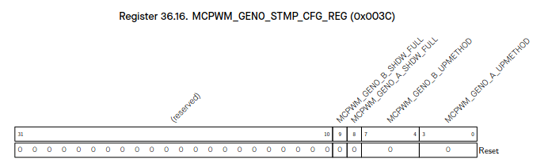

`MCPWM_GEN0_A_UPMETHOD` (R/W):

Update method for PWM generator 0 time stamp A’s active register.
- When all bits are set to 0: immediately
- When bit0 is set to 1: TEZ
- When bit1 is set to 1: TEP
- When bit2 is set to 1: sync
- When bit3 is set to 1: disable the update

`MCPWM_GEN0_B_UPMETHOD` (R/W):

Update method for PWM generator 0 time stamp B’s active register.
- When all bits are set to 0: immediately
- When bit0 is set to 1: TEZ
- When bit1 is set to 1: TEP
- When bit2 is set to 1: sync
- When bit3 is set to 1: disable the update

`MCPWM_GEN0_A_SHDW_FULL` (R/WTC/SC):

Set and reset by hardware. 
- If set, PWM generator 0 time stamp A’s shadow reg is filled and waiting to be transferred to A’s active reg
- If cleared, A’s active reg has been updated with shadow register latest value

`MCPWM_GEN0_B_SHDW_FULL` (R/WTC/SC):

Set and reset by hardware. 
- If set, PWM generator 0 time stamp B’s shadow reg is filled and waiting to be transferred to B’s active reg
- If cleared, B’s active reg has been updated with shadow register latest value

---

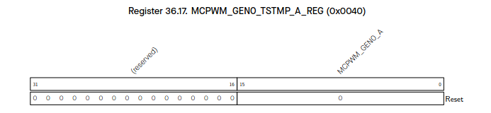

`MCPWM_GEN0_A` (R/W):

PWM generator 0 time stamp A’s shadow register.

---

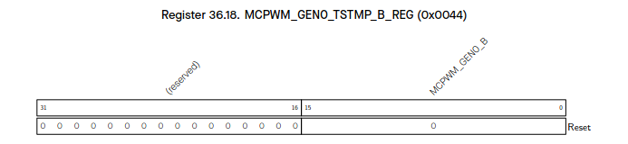

`MCPWM_GEN0_B` (R/W):

PWM generator 0 time stamp B’s shadow register.

---

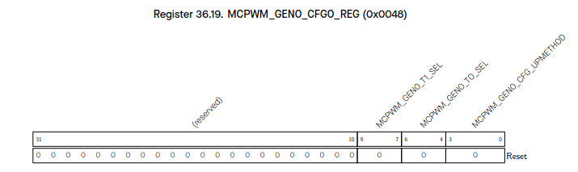

`MCPWM_GEN0_CFG_UPMETHOD` (R/W):

Update method for PWM generator 0’s active register of configuration. 
- When all bits are set to 0: immediately
- When bit0 is set to 1: TEZ
- When bit1 is set to 1: TEP
- When bit2 is set to 1: sync
- When bit3 is set to 1: disable the update

`MCPWM_GEN0_T0_SEL` (R/W):

Source selection for PWM generator 0 event_t0, take effect immediately.
- 0: fault_event0
- 1: fault_event1
- 2: fault_event2
- 3: sync_taken
- 4: none

`MCPWM_GEN0_T1_SEL` (R/W):

Source selection for PWM generator 0 event_t1, take effect immediately.
- 0: fault_event0
- 1: fault_event1
- 2: fault_event2
- 3: sync_taken
- 4: none
 

---

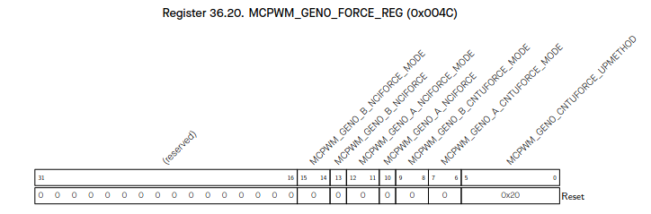

`MCPWM_GEN0_CNTUFORCE_UPMETHOD` (R/W):

Updating method for continuous software force of PWM generator0.
- When all bits are set to 0: immediately
- When bit0 is set to 1: TEZ
- When bit1 is set to 1: TEP
- When bit2 is set to 1: TEA
- When bit3 is set to 1: TEB
- When bit4 is set to 1: sync
- When bit5 is set to 1: disable update

(TEA/B here and below means an event generated when the timer’s value equals to that of register A/B.)

`MCPWM_GEN0_A_CNTUFORCE_MODE` (R/W):

Continuous software force mode for PWM0A.
- 0: disabled
- 1: low
- 2: high
- 3: disabled

`MCPWM_GEN0_B_CNTUFORCE_MODE` (R/W):

Continuous software force mode for PWM0B.
- 0: disabled
- 1: low
- 2: high
- 3: disabled

`MCPWM_GEN0_A_NCIFORCE` (R/W):

Trigger of non-continuous immediate software-force event for PWM0A.
- Toggle triggers a force event.

`MCPWM_GEN0_A_NCIFORCE_MODE` (R/W):

Non-continuous immediate software force mode for PWM0A.
- 0: disabled
- 1: low
- 2: high
- 3: disabled

`MCPWM_GEN0_B_NCIFORCE` (R/W):

Trigger of non-continuous immediate software-force event for PWM0B.
- Toggle triggers a force event.

`MCPWM_GEN0_B_NCIFORCE_MODE` (R/W):

Non-continuous immediate software force mode for PWM0B.
- 0: disabled
- 1: low
- 2: high
- 3: disabled

---

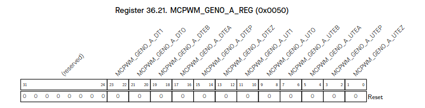

`MCPWM_GEN0_A_UTEZ` (R/W):

Action on PWM0A triggered by event TEZ when timer increasing.
- 0: no change
- 1: low
- 2: high
- 3: toggle

`MCPWM_GEN0_A_UTEP` (R/W):

Action on PWM0A triggered by event TEP when timer increasing.
- 0: no change
- 1: low
- 2: high
- 3: toggle

`MCPWM_GEN0_A_UTEA` (R/W):

Action on PWM0A triggered by event TEA when timer increasing.
- 0: no change
- 1: low
- 2: high
- 3: toggle

`MCPWM_GEN0_A_UTEB` (R/W):

Action on PWM0A triggered by event TEB when timer increasing.
- 0: no change
- 1: low
- 2: high
- 3: toggle

`MCPWM_GEN0_A_UT0` (R/W):

Action on PWM0A triggered by event_t0 when timer increasing.
- 0: no change
- 1: low
- 2: high
- 3: toggle

`MCPWM_GEN0_A_UT1` (R/W):

Action on PWM0A triggered by event_t1 when timer increasing.
- 0: no change
- 1: low
- 2: high
- 3: toggle

`MCPWM_GEN0_A_DTEZ` (R/W):

Action on PWM0A triggered by event TEZ when timer decreasing.
- 0: no change
- 1: low
- 2: high
- 3: toggle

`MCPWM_GEN0_A_DTEP` (R/W):

Action on PWM0A triggered by event TEP when timer decreasing.
- 0: no change
- 1: low
- 2: high
- 3: toggle

`MCPWM_GEN0_A_DTEA` (R/W):

Action on PWM0A triggered by event TEA when timer decreasing.
- 0: no change
- 1: low
- 2: high
- 3: toggle

`MCPWM_GEN0_A_DTEB` (R/W):

Action on PWM0A triggered by event TEB when timer decreasing.
- 0: no change
- 1: low
- 2: high
- 3: toggle

`MCPWM_GEN0_A_DT0` (R/W):

Action on PWM0A triggered by event_t0 when timer decreasing.
- 0: no change
- 1: low
- 2: high
- 3: toggle

`MCPWM_GEN0_A_DT1` (R/W):

Action on PWM0A triggered by event_t1 when timer decreasing.
- 0: no change
- 1: low
- 2: high
- 3: toggle

---

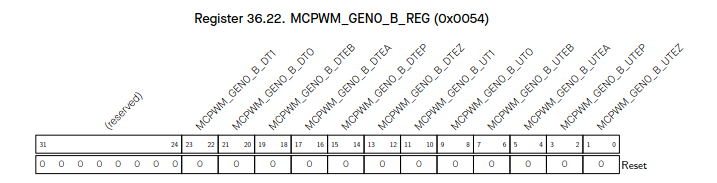 

`MCPWM_GEN0_B_UTEZ` (R/W):

Action on PWM0B triggered by event TEZ when timer increasing.
- 0: no change
- 1: low
- 2: high
- 3: toggle

`MCPWM_GEN0_B_UTEP` (R/W):

Action on PWM0B triggered by event TEP when timer increasing.
- 0: no change
- 1: low
- 2: high
- 3: toggle

`MCPWM_GEN0_B_UTEA` (R/W):

Action on PWM0B triggered by event TEA when timer increasing.
- 0: no change
- 1: low
- 2: high
- 3: toggle

`MCPWM_GEN0_B_UTEB` (R/W):

Action on PWM0B triggered by event TEB when timer increasing.
- 0: no change
- 1: low
- 2: high
- 3: toggle

`MCPWM_GEN0_B_UT0` (R/W):

Action on PWM0B triggered by event_t0 when timer increasing.
- 0: no change
- 1: low
- 2: high
- 3: toggle

`MCPWM_GEN0_B_UT1` (R/W):

Action on PWM0B triggered by event_t1 when timer increasing.
- 0: no change
- 1: low
- 2: high
- 3: toggle

`MCPWM_GEN0_B_DTEZ` (R/W):

Action on PWM0B triggered by event TEZ when timer decreasing.
- 0: no change
- 1: low
- 2: high
- 3: toggle

`MCPWM_GEN0_B_DTEP` (R/W):

Action on PWM0B triggered by event TEP when timer decreasing.
- 0: no change
- 1: low
- 2: high
- 3: toggle

`MCPWM_GEN0_B_DTEA` (R/W):

Action on PWM0B triggered by event TEA when timer decreasing.
- 0: no change
- 1: low
- 2: high
- 3: toggle

`MCPWM_GEN0_B_DTEB` (R/W):

Action on PWM0B triggered by event TEB when timer decreasing.
- 0: no change
- 1: low
- 2: high
- 3: toggle

`MCPWM_GEN0_B_DT0` (R/W):

Action on PWM0B triggered by event_t0 when timer decreasing.
- 0: no change
- 1: low
- 2: high
- 3: toggle

`MCPWM_GEN0_B_DT1` (R/W):

Action on PWM0B triggered by event_t1 when timer decreasing.
- 0: no change
- 1: low
- 2: high
- 3: toggle

---

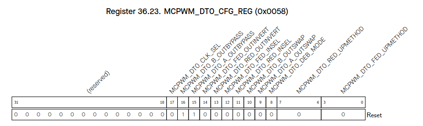

`MCPWM_DT0_FED_UPMETHOD` (R/W):

Update method for FED (rising edge delay) active register.
- When bit0 is set to 1: TEZ
- When bit1 is set to 1: TEP
- When bit2 is set to 1: sync
- When bit3 is set to 1: disable the update

`MCPWM_DT0_RED_UPMETHOD` (R/W):

Update method for RED (rising edge delay) active register.
- When bit0 is set to 1: TEZ
- When bit1 is set to 1: TEP
- When bit2 is set to 1: sync
- When bit3 is set to 1: disable the update

`MCPWM_DT0_DEB_MODE` (R/W):

S8 in table 36.3-5, dual-edge B mode.
- 0: fed/red take effect on different path separately
- 1: fed/red take effect on B path, A out is in bypass or dulpB mode

`MCPWM_DT0_A_OUTSWAP` (R/W):

S6 in table 36.3-5.

`MCPWM_DT0_B_OUTSWAP` (R/W):

S7 in table 36.3-5.

`MCPWM_DT0_RED_INSEL` (R/W):

S4 in table 36.3-5.

`MCPWM_DT0_FED_INSEL` (R/W):

S5 in table 36.3-5.

`MCPWM_DT0_RED_OUTINVERT` (R/W):

S2 in table 36.3-5.

`MCPWM_DT0_FED_OUTINVERT` (R/W):

S3 in table 36.3-5.

`MCPWM_DT0_A_OUTBYPASS` (R/W):

S1 in table 36.3-5.

`MCPWM_DT0_B_OUTBYPASS` (R/W):

S0 in table 36.3-5.

`MCPWM_DT0_CLK_SEL` (R/W):

Dead time generator 0 clock selection.
- 0: PWM_clk
- 1: PT_clk

---

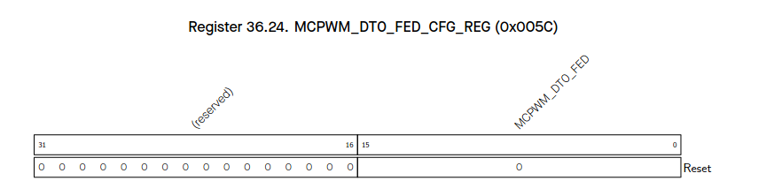

`MCPWM_DT0_FED` (R/W):

Shadow register for FED.

---

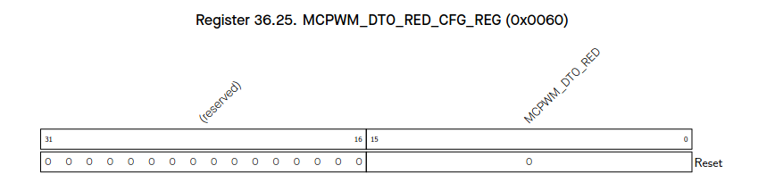

`MCPWM_DT0_RED` (R/W):

Shadow register for RED.

---

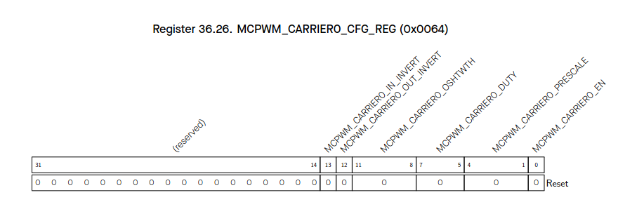

`MCPWM_CARRIER0_EN` (R/W):

Carrier0 function.
- When set: enabled
- When cleared: bypassed

`MCPWM_CARRIER0_PRESCALE` (R/W):

PWM carrier0 clock (PC_clk) prescale value.
Period of PC_clk = period of PWM_clk * (PWM_CARRIER0_PRESCALE + 1).

`MCPWM_CARRIER0_DUTY` (R/W):

Carrier duty selection.
Duty = PWM_CARRIER0_DUTY/8.

`MCPWM_CARRIER0_OSHTWTH` (R/W):

Width of first pulse in number of periods of carrier.

`MCPWM_CARRIER0_OUT_INVERT` (R/W):

Invert output of PWM0A and PWM0B for this sub-module when set.

`MCPWM_CARRIER0_IN_INVERT` (R/W):

Invert input of PWM0A and PWM0B for this sub-module when set.

---

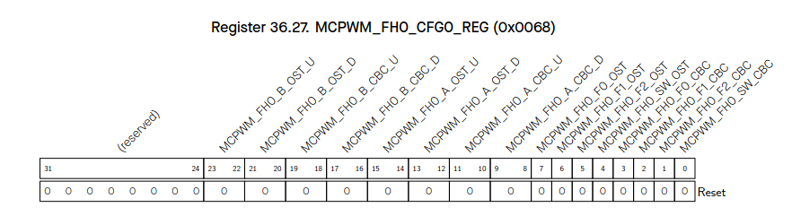

`MCPWM_FH0_SW_CBC` (R/W):

Software force cycle-by-cycle mode action.
- 0: disable
- 1: enable

`MCPWM_FH0_F2_CBC` (R/W):

event_f2 trigger cycle-by-cycle mode action.
- 0: disable
- 1: enable

`MCPWM_FH0_F1_CBC` (R/W):

event_f1 trigger cycle-by-cycle mode action.
- 0: disable
- 1: enable

`MCPWM_FH0_F0_CBC` (R/W):

event_f0 trigger cycle-by-cycle mode action.
- 0: disable
- 1: enable

`MCPWM_FH0_SW_OST` (R/W):

Software force one-shot mode action.
- 0: disable
- 1: enable

`MCPWM_FH0_F2_OST` (R/W):

event_f2 trigger one-shot mode action.
- 0: disable
- 1: enable

`MCPWM_FH0_F1_OST` (R/W):

event_f1 trigger one-shot mode action.
- 0: disable
- 1: enable

`MCPWM_FH0_F0_OST` (R/W):

event_f0 trigger one-shot mode action.
- 0: disable
- 1: enable

`MCPWM_FH0_A_CBC_D` (R/W):

Cycle-by-cycle mode action on PWM0A when fault event occurs and timer is decreasing.
- 0: do nothing
- 1: force low
- 2: force high
- 3: toggle

`MCPWM_FH0_A_CBC_U` (R/W):

Cycle-by-cycle mode action on PWM0A when fault event occurs and timer is increasing.
- 0: do nothing
- 1: force low
- 2: force high
- 3: toggle

`MCPWM_FH0_A_OST_D` (R/W):

One-shot mode action on PWM0A when fault event occurs and timer is decreasing.
- 0: do nothing
- 1: force low
- 2: force high
- 3: toggle

`MCPWM_FH0_A_OST_U` (R/W):

One-shot mode action on PWM0A when fault event occurs and timer is increasing.
- 0: do nothing
- 1: force low
- 2: force high
- 3: toggle

`MCPWM_FH0_B_CBC_D` (R/W):

Cycle-by-cycle mode action on PWM0B when fault event occurs and timer is decreasing.
- 0: do nothing
- 1: force low
- 2: force high
- 3: toggle

`MCPWM_FH0_B_CBC_U` (R/W):

Cycle-by-cycle mode action on PWM0B when fault event occurs and timer is increasing.
- 0: do nothing
- 1: force low
- 2: force high
- 3: toggle

`MCPWM_FH0_B_OST_D` (R/W):

One-shot mode action on PWM0B when fault event occurs and timer is decreasing.
- 0: do nothing
- 1: force low
- 2: force high
- 3: toggle

`MCPWM_FH0_B_OST_U` (R/W):

One-shot mode action on PWM0B when fault event occurs and timer is increasing.
- 0: do nothing
- 1: force low
- 2: force high
- 3: toggle

---

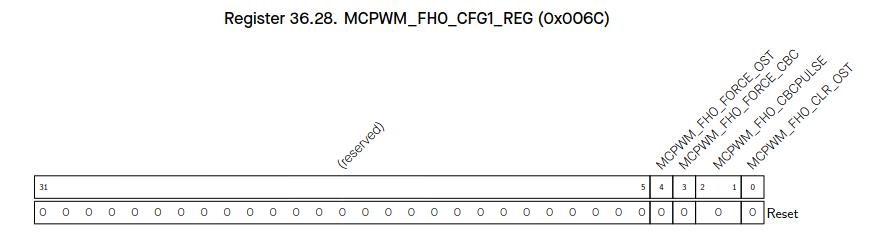

`MCPWM_FH0_CLR_OST` (R/W):

A rising edge will clear ongoing one-shot mode action.

`MCPWM_FH0_CBCPULSE` (R/W):

Cycle-by-cycle mode action refresh moment selection.
- When bit0 is set to 1: TEZ
- When bit1 is set to 1: TEP

`MCPWM_FH0_FORCE_CBC` (R/W):

A toggle triggers a cycle-by-cycle mode action.

`MCPWM_FH0_FORCE_OST` (R/W):

A toggle (software negate its value) triggers a one-shot mode action.

---

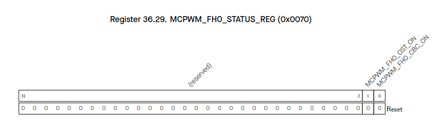

`MCPWM_FH0_CBC_ON` (RO):

Set and reset by hardware.
- If set: cycle-by-cycle mode action is on-going.

`MCPWM_FH0_OST_ON` (RO):

Set and reset by hardware.
- If set: one-shot mode action is on-going.

---

`MCPWM_FH0_CBC_ON` (RO):

Set and reset by hardware.
- If set: cycle-by-cycle mode action is on-going.

`MCPWM_FH0_OST_ON` (RO):

Set and reset by hardware.
- If set: one-shot mode action is on-going.

---

`MCPWM_GEN1_A_UPMETHOD` (R/W):

Update method for PWM generator 1 time stamp A’s active register.
- When all bits are set to 0: immediately
- When bit0 is set to 1: TEZ
- When bit1 is set to 1: TEP
- When bit2 is set to 1: sync
- When bit3 is set to 1: disable the update

`MCPWM_GEN1_B_UPMETHOD` (R/W):

Update method for PWM generator 1 time stamp B’s active register.
- When all bits are set to 0: immediately
- When bit0 is set to 1: TEZ
- When bit1 is set to 1: TEP
- When bit2 is set to 1: sync
- When bit3 is set to 1: disable the update

`MCPWM_GEN1_A_SHDW_FULL` (R/WTC/SC):

Set and reset by hardware.
- If set: PWM generator 1 time stamp A’s shadow reg is filled and waiting to be transferred to A’s active reg
- If cleared: A’s active reg has been updated with shadow register latest value

`MCPWM_GEN1_B_SHDW_FULL` (R/WTC/SC):

Set and reset by hardware.
- If set: PWM generator 1 time stamp B’s shadow reg is filled and waiting to be transferred to B’s active reg
- If cleared: B’s active reg has been updated with shadow register latest value

---

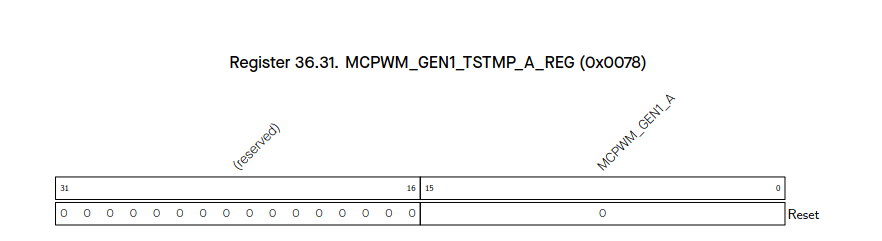

`MCPWM_GEN1_A` (R/W):

PWM generator 1 time stamp A’s shadow register.

---

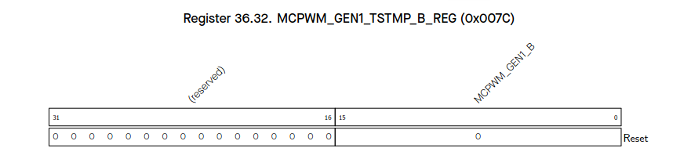

`MCPWM_GEN1_B` (R/W):

PWM generator 1 time stamp B’s shadow register.

---

`MCPWM_GEN1_CFG_UPMETHOD` (R/W):

Update method for PWM generator 1’s active register of configuration.
- When all bits are set to 0: immediately
- When bit0 is set to 1: TEZ
- When bit1 is set to 1: sync
- When bit3 is set to 1: disable the update

`MCPWM_GEN1_T0_SEL` (R/W):

Source selection for PWM generator 1 event_t0, take effect immediately.
- 0: fault_event0
- 1: fault_event1
- 2: fault_event2
- 3: sync_taken
- 4: none

`MCPWM_GEN1_T1_SEL` (R/W):

Source selection for PWM generator 1 event_t1, take effect immediately.
- 0: fault_event0
- 1: fault_event1
- 2: fault_event2
- 3: sync_taken
- 4: none

---

`MCPWM_GEN1_CNTUFORCE_UPMETHOD` (R/W):

Updating method for continuous software force of PWM generator 1.
- When all bits are set to 0: immediately
- When bit0 is set to 1: TEZ
- When bit1 is set to 1: TEP
- When bit2 is set to 1: TEA
- When bit3 is set to 1: TEB
- When bit4 is set to 1: sync
- When bit5 is set to 1: disable update

(TEA/B here and below means an event generated when the timer’s value equals to that of register A/B.)

`MCPWM_GEN1_A_CNTUFORCE_MODE` (R/W):

Continuous software force mode for PWM1A.
- 0: disabled
- 1: low
- 2: high
- 3: disabled

`MCPWM_GEN1_B_CNTUFORCE_MODE` (R/W):

Continuous software force mode for PWM1B.
- 0: disabled
- 1: low
- 2: high
- 3: disabled

`MCPWM_GEN1_A_NCIFORCE` (R/W):

Trigger of non-continuous immediate software-force event for PWM1A.
- Toggle triggers a force event.

`MCPWM_GEN1_A_NCIFORCE_MODE` (R/W):

Non-continuous immediate software force mode for PWM1A.
- 0: disabled
- 1: low
- 2: high
- 3: disabled

`MCPWM_GEN1_B_NCIFORCE` (R/W):

Trigger of non-continuous immediate software-force event for PWM1B.
- Toggle triggers a force event.

`MCPWM_GEN1_B_NCIFORCE_MODE` (R/W):

Non-continuous immediate software force mode for PWM1B.
- 0: disabled
- 1: low
- 2: high
- 3: disabled

---

`MCPWM_GEN1_A_UTEZ` (R/W):

Action on PWM1A triggered by event TEZ when timer increasing.
- 0: no change
- 1: low
- 2: high
- 3: toggle

`MCPWM_GEN1_A_UTEP` (R/W):

Action on PWM1A triggered by event TEP when timer increasing.
- 0: no change
- 1: low
- 2: high
- 3: toggle

`MCPWM_GEN1_A_UTEA` (R/W):

Action on PWM1A triggered by event TEA when timer increasing.
- 0: no change
- 1: low
- 2: high
- 3: toggle

`MCPWM_GEN1_A_UTEB` (R/W):

Action on PWM1A triggered by event TEB when timer increasing.
- 0: no change
- 1: low
- 2: high
- 3: toggle

`MCPWM_GEN1_A_UT0` (R/W):

Action on PWM1A triggered by event_t0 when timer increasing.
- 0: no change
- 1: low
- 2: high
- 3: toggle

`MCPWM_GEN1_A_UT1` (R/W):

Action on PWM1A triggered by event_t1 when timer increasing.
- 0: no change
- 1: low
- 2: high
- 3: toggle

`MCPWM_GEN1_A_DTEZ` (R/W):

Action on PWM1A triggered by event TEZ when timer decreasing.
- 0: no change
- 1: low
- 2: high
- 3: toggle

`MCPWM_GEN1_A_DTEP` (R/W):

Action on PWM1A triggered by event TEP when timer decreasing.
- 0: no change
- 1: low
- 2: high
- 3: toggle

`MCPWM_GEN1_A_DTEA` (R/W):

Action on PWM1A triggered by event TEA when timer decreasing.
- 0: no change
- 1: low
- 2: high
- 3: toggle

`MCPWM_GEN1_A_DTEB` (R/W):

Action on PWM1A triggered by event TEB when timer decreasing.
- 0: no change
- 1: low
- 2: high
- 3: toggle

`MCPWM_GEN1_A_DT0` (R/W):

Action on PWM1A triggered by event_t0 when timer decreasing.
- 0: no change
- 1: low
- 2: high
- 3: toggle

`MCPWM_GEN1_A_DT1` (R/W):

Action on PWM1A triggered by event_t1 when timer decreasing.
- 0: no change
- 1: low
- 2: high
- 3: toggle

---

`MCPWM_GEN1_B_UTEZ` (R/W):

Action on PWM1B triggered by event TEZ when timer increasing.
- 0: no change
- 1: low
- 2: high
- 3: toggle

`MCPWM_GEN1_B_UTEP` (R/W):

Action on PWM1B triggered by event TEP when timer increasing.
- 0: no change
- 1: low
- 2: high
- 3: toggle

`MCPWM_GEN1_B_UTEA` (R/W):

Action on PWM1B triggered by event TEA when timer increasing.
- 0: no change
- 1: low
- 2: high
- 3: toggle

`MCPWM_GEN1_B_UTEB` (R/W):

Action on PWM1B triggered by event TEB when timer increasing.
- 0: no change
- 1: low
- 2: high
- 3: toggle

`MCPWM_GEN1_B_UT0` (R/W):

Action on PWM1B triggered by event_t0 when timer increasing.
- 0: no change
- 1: low
- 2: high
- 3: toggle

`MCPWM_GEN1_B_UT1` (R/W):

Action on PWM1B triggered by event_t1 when timer increasing.
- 0: no change
- 1: low
- 2: high
- 3: toggle

`MCPWM_GEN1_B_DTEZ` (R/W):

Action on PWM1B triggered by event TEZ when timer decreasing.
- 0: no change
- 1: low
- 2: high
- 3: toggle

`MCPWM_GEN1_B_DTEP` (R/W):

Action on PWM1B triggered by event TEP when timer decreasing.
- 0: no change
- 1: low
- 2: high
- 3: toggle

`MCPWM_GEN1_B_DTEA` (R/W):

Action on PWM1B triggered by event TEA when timer decreasing.
- 0: no change
- 1: low
- 2: high
- 3: toggle

`MCPWM_GEN1_B_DTEB` (R/W):

Action on PWM1B triggered by event TEB when timer decreasing.
- 0: no change
- 1: low
- 2: high
- 3: toggle

`MCPWM_GEN1_B_DT0` (R/W):

Action on PWM1B triggered by event_t0 when timer decreasing.
- 0: no change
- 1: low
- 2: high
- 3: toggle

`MCPWM_GEN1_B_DT1` (R/W):

Action on PWM1B triggered by event_t1 when timer decreasing.
- 0: no change
- 1: low
- 2: high
- 3: toggle

---

`MCPWM_DT1_FED_UPMETHOD` (R/W):

Update method for FED (falling edge delay) active register.
- 0: immediate
- When bit0 is set to 1: TEZ
- When bit1 is set to 1: TEP
- When bit2 is set to 1: sync
- When bit3 is set to 1: disable the update

`MCPWM_DT1_RED_UPMETHOD` (R/W):

Update method for RED (rising edge delay) active register.
- 0: immediate
- When bit0 is set to 1: TEZ
- When bit1 is set to 1: TEP
- When bit2 is set to 1: sync
- When bit3 is set to 1: disable the update

`MCPWM_DT1_DEB_MODE` (R/W):

S8 in table 36.3-5, dual-edge B mode.
- 0: fed/red take effect on different path separately
- 1: fed/red take effect on B path, A out is in bypass or dulpB mode

`MCPWM_DT1_A_OUTSWAP` (R/W):

S6 in table 36.3-5.

`MCPWM_DT1_B_OUTSWAP` (R/W):

S7 in table 36.3-5.

`MCPWM_DT1_RED_INSEL` (R/W):

S4 in table 36.3-5.

`MCPWM_DT1_FED_INSEL` (R/W):

S5 in table 36.3-5.

`MCPWM_DT1_RED_OUTINVERT` (R/W):

S2 in table 36.3-5.

`MCPWM_DT1_FED_OUTINVERT` (R/W):

S3 in table 36.3-5.

`MCPWM_DT1_A_OUTBYPASS` (R/W):

S1 in table 36.3-5.

`MCPWM_DT1_B_OUTBYPASS` (R/W):

S0 in table 36.3-5.

`MCPWM_DT1_CLK_SEL` (R/W):

Dead time generator 1 clock selection.
- 0: PWM_clk
- 1: PT_clk

---

`MCPWM_DT1_FED` (R/W):

Shadow register for FED.

---

`MCPWM_DT1_RED` (R/W):

Shadow register for RED.

---

`MCPWM_CARRIER1_EN` (R/W):

When set, carrier1 function is enabled.
- When cleared: carrier1 is bypassed.

`MCPWM_CARRIER1_PRESCALE` (R/W):

PWM carrier1 clock (PC_clk) prescale value.
Period of PC_clk = period of PWM_clk * (PWM_CARRIER0_PRESCALE + 1).

`MCPWM_CARRIER1_DUTY` (R/W):

Carrier duty selection.
Duty = PWM_CARRIER0_DUTY/8.

`MCPWM_CARRIER1_OSHTWTH` (R/W):

Width of the first pulse in number of periods of the carrier.

`MCPWM_CARRIER1_OUT_INVERT` (R/W):

When set, invert the output of PWM1A and PWM1B for this sub-module.

`MCPWM_CARRIER1_IN_INVERT` (R/W):

When set, invert the input of PWM1A and PWM1B for this sub-module.

---

`MCPWM_FH1_SW_CBC` (R/W):

Enable register for software force cycle-by-cycle mode action.
- 0: disable
- 1: enable

`MCPWM_FH1_F2_CBC` (R/W):

event_f2 will trigger cycle-by-cycle mode action.
- 0: disable
- 1: enable

`MCPWM_FH1_F1_CBC` (R/W):

event_f1 will trigger cycle-by-cycle mode action.
- 0: disable
- 1: enable

`MCPWM_FH1_F0_CBC` (R/W):

event_f0 will trigger cycle-by-cycle mode action.
- 0: disable
- 1: enable

`MCPWM_FH1_SW_OST` (R/W):

Enable register for software force one-shot mode action.
- 0: disable
- 1: enable

`MCPWM_FH1_F2_OST` (R/W):

event_f2 will trigger one-shot mode action.
- 0: disable
- 1: enable

`MCPWM_FH1_F1_OST` (R/W):

event_f1 will trigger one-shot mode action.
- 0: disable
- 1: enable

`MCPWM_FH1_F0_OST` (R/W):

event_f0 will trigger one-shot mode action.
- 0: disable
- 1: enable

`MCPWM_FH1_A_CBC_D` (R/W):

Cycle-by-cycle mode action on PWM1A when fault event occurs and timer is decreasing.
- 0: do nothing
- 1: force low
- 2: force high
- 3: toggle

`MCPWM_FH1_A_CBC_U` (R/W):

Cycle-by-cycle mode action on PWM1A when fault event occurs and timer is increasing.
- 0: do nothing
- 1: force low
- 2: force high
- 3: toggle

`MCPWM_FH1_A_OST_D` (R/W):

One-shot mode action on PWM1A when fault event occurs and timer is decreasing.
- 0: do nothing
- 1: force low
- 2: force high
- 3: toggle

`MCPWM_FH1_A_OST_U` (R/W):

One-shot mode action on PWM1A when fault event occurs and timer is increasing.
- 0: do nothing
- 1: force low
- 2: force high
- 3: toggle

`MCPWM_FH1_B_CBC_D` (R/W):

Cycle-by-cycle mode action on PWM1B when fault event occurs and timer is decreasing.
- 0: do nothing
- 1: force low
- 2: force high
- 3: toggle

`MCPWM_FH1_B_CBC_U` (R/W):

Cycle-by-cycle mode action on PWM1B when fault event occurs and timer is increasing.
- 0: do nothing
- 1: force low
- 2: force high
- 3: toggle

`MCPWM_FH1_B_OST_D` (R/W):

One-shot mode action on PWM1B when fault event occurs and timer is decreasing.
- 0: do nothing
- 1: force low
- 2: force high
- 3: toggle

`MCPWM_FH1_B_OST_U` (R/W):

One-shot mode action on PWM1B when fault event occurs and timer is increasing.
- 0: do nothing
- 1: force low
- 2: force high
- 3: toggle

---

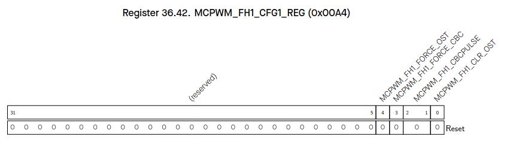

`MCPWM_FH1_CLR_OST` (R/W):

Rising edge clears ongoing one-shot mode action.

`MCPWM_FH1_CBCPULSE` (R/W):

Cycle-by-cycle mode action refresh timing.
- All bits 0: disabled
- bit0=1: TEZ
- bit1=1: TEP
- all bits=1: TEZ/TEP

`MCPWM_FH1_FORCE_CBC` (R/W):

Toggle triggers cycle-by-cycle mode action.

`MCPWM_FH1_FORCE_OST` (R/W):

Toggle (software negate) triggers one-shot mode action.

---

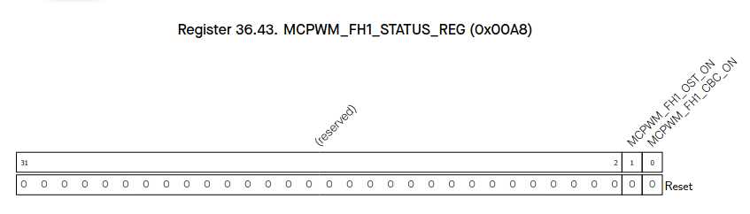

`MCPWM_FH1_CBC_ON` (RO):

Cycle-by-cycle mode action ongoing flag (hw managed).

`MCPWM_FH1_OST_ON` (RO):

One-shot mode action ongoing flag (hw managed).

---

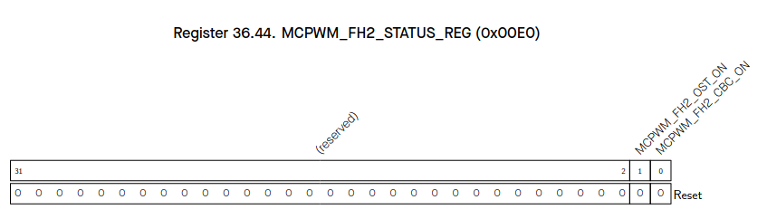

`MCPWM_FH2_CBC_ON` (RO):

Cycle-by-cycle mode action ongoing flag (hw managed).

`MCPWM_FH2_OST_ON` (RO):

One-shot mode action ongoing flag (hw managed).

---

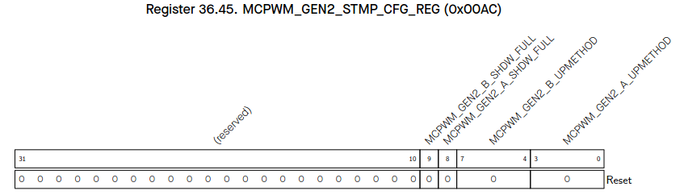

`MCPWM_GEN2_A_UPMETHOD` (R/W):

Update method for PWM generator 2 time stamp A’s active register.
- When all bits are set to 0: immediately
- When bit0 is set to 1: TEZ
- When bit1 is set to 1: TEP
- When bit2 is set to 1: sync
- When bit3 is set to 1: disable the update

`MCPWM_GEN2_B_UPMETHOD` (R/W):

Update method for PWM generator 2 time stamp B’s active register.
- When all bits are set to 0: immediately
- When bit0 is set to 1: TEZ
- When bit1 is set to 1: TEP
- When bit2 is set to 1: sync
- When bit3 is set to 1: disable the update

`MCPWM_GEN2_A_SHDW_FULL` (R/WTC/SC):

Set and reset by hardware.
- If set: PWM generator 2 time stamp A’s shadow reg is filled and waiting to be transferred to A’s active reg
- If cleared: A’s active reg has been updated with shadow register latest value

`MCPWM_GEN2_B_SHDW_FULL` (R/WTC/SC):

Set and reset by hardware.
- If set: PWM generator 2 time stamp B’s shadow reg is filled and waiting to be transferred to B’s active reg
- If cleared: B’s active reg has been updated with shadow register latest value

---

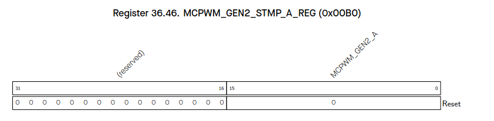

`MCPWM_GEN2_A` (R/W):

PWM generator 2 time stamp A’s shadow register.

---

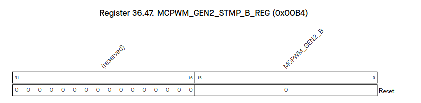

`MCPWM_GEN2_B` (R/W):

PWM generator 2 time stamp B’s shadow register.

---

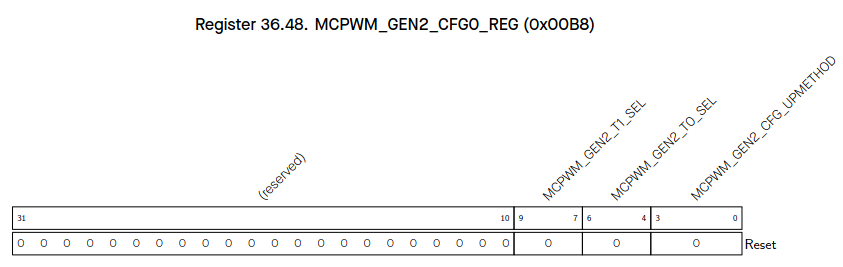

`MCPWM_GEN2_CFG_UPMETHOD` (R/W):

Update method for PWM generator 2’s active register of configuration.
- 0: immediately
- When bit0 is set to 1: TEZ
- When bit1 is set to 1: sync
- When bit3 is set to 1: disable the update

`MCPWM_GEN2_T0_SEL` (R/W):

Source selection for PWM generator 2 event_t0, take effect immediately.
- 0: fault_event0
- 1: fault_event1
- 2: fault_event2
- 3: sync_taken
- 4: none

`MCPWM_GEN2_T1_SEL` (R/W):

Source selection for PWM generator 2 event_t1, take effect immediately.
- 0: fault_event0
- 1: fault_event1
- 2: fault_event2
- 3: sync_taken
- 4: none

---

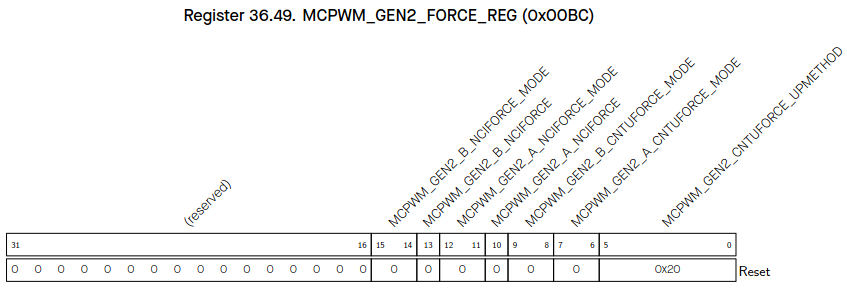

`MCPWM_GEN2_CNTUFORCE_UPMETHOD` (R/W):

Updating method for continuous software force of PWM generator 2.
- When all bits are set to 0: immediately
- When bit0 is set to 1: TEZ
- When bit1 is set to 1: TEP
- When bit2 is set to 1: TEA
- When bit3 is set to 1: TEB
- When bit4 is set to 1: sync
- When bit5 is set to 1: disable update

(TEA/B here and below means an event generated when the timer’s value equals to that of register A/B.)

`MCPWM_GEN2_A_CNTUFORCE_MODE` (R/W):

Continuous software force mode for PWM2A.
- 0: disabled
- 1: low
- 2: high
- 3: disabled

`MCPWM_GEN2_B_CNTUFORCE_MODE` (R/W):

Continuous software force mode for PWM2B.
- 0: disabled
- 1: low
- 2: high
- 3: disabled

`MCPWM_GEN2_A_NCIFORCE` (R/W):

Trigger of non-continuous immediate software-force event for PWM2A.
- Toggle triggers a force event.

`MCPWM_GEN2_A_NCIFORCE_MODE` (R/W):

Non-continuous immediate software force mode for PWM2A.
- 0: disabled
- 1: low
- 2: high
- 3: disabled

`MCPWM_GEN2_B_NCIFORCE` (R/W):

Trigger of non-continuous immediate software-force event for PWM2B.
- Toggle triggers a force event.

`MCPWM_GEN2_B_NCIFORCE_MODE` (R/W):

Non-continuous immediate software force mode for PWM2B.
- 0: disabled
- 1: low
- 2: high
- 3: disabled

---

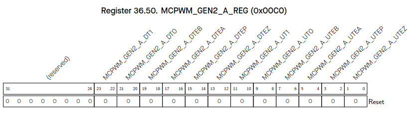

`MCPWM_GEN2_A_UTEZ` (R/W):

Action on PWM2A triggered by event TEZ when timer increasing.
- 0: no change
- 1: low
- 2: high
- 3: toggle

`MCPWM_GEN2_A_UTEP` (R/W):

Action on PWM2A triggered by event TEP when timer increasing.
- 0: no change
- 1: low
- 2: high
- 3: toggle

`MCPWM_GEN2_A_UTEA` (R/W):

Action on PWM2A triggered by event TEA when timer increasing.
- 0: no change
- 1: low
- 2: high
- 3: toggle

`MCPWM_GEN2_A_UTEB` (R/W):

Action on PWM2A triggered by event TEB when timer increasing.
- 0: no change
- 1: low
- 2: high
- 3: toggle

`MCPWM_GEN2_A_UT0` (R/W):

Action on PWM2A triggered by event_t0 when timer increasing.
- 0: no change
- 1: low
- 2: high
- 3: toggle

`MCPWM_GEN2_A_UT1` (R/W):

Action on PWM2A triggered by event_t1 when timer increasing.
- 0: no change
- 1: low
- 2: high
- 3: toggle

`MCPWM_GEN2_A_DTEZ` (R/W):

Action on PWM2A triggered by event TEZ when timer decreasing.
- 0: no change
- 1: low
- 2: high
- 3: toggle

`MCPWM_GEN2_A_DTEP` (R/W):

Action on PWM2A triggered by event TEP when timer decreasing.
- 0: no change
- 1: low
- 2: high
- 3: toggle

`MCPWM_GEN2_A_DTEA` (R/W):

Action on PWM2A triggered by event TEA when timer decreasing.
- 0: no change
- 1: low
- 2: high
- 3: toggle

`MCPWM_GEN2_A_DTEB` (R/W):

Action on PWM2A triggered by event TEB when timer decreasing.
- 0: no change
- 1: low
- 2: high
- 3: toggle

`MCPWM_GEN2_A_DT0` (R/W):

Action on PWM2A triggered by event_t0 when timer decreasing.
- 0: no change
- 1: low
- 2: high
- 3: toggle

`MCPWM_GEN2_A_DT1` (R/W):

Action on PWM2A triggered by event_t1 when timer decreasing.
- 0: no change
- 1: low
- 2: high
- 3: toggle

---

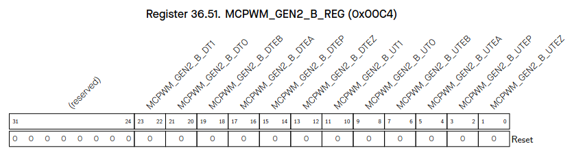

`MCPWM_GEN2_B_UTEZ` (R/W):

Action on PWM2B triggered by event TEZ when timer increasing.
- 0: no change
- 1: low
- 2: high
- 3: toggle

`MCPWM_GEN2_B_UTEP` (R/W):

Action on PWM2B triggered by event TEP when timer increasing.
- 0: no change
- 1: low
- 2: high
- 3: toggle

`MCPWM_GEN2_B_UTEA` (R/W):

Action on PWM2B triggered by event TEA when timer increasing.
- 0: no change
- 1: low
- 2: high
- 3: toggle

`MCPWM_GEN2_B_UTEB` (R/W):

Action on PWM2B triggered by event TEB when timer increasing.
- 0: no change
- 1: low
- 2: high
- 3: toggle

`MCPWM_GEN2_B_UT0` (R/W):

Action on PWM2B triggered by event_t0 when timer increasing.
- 0: no change
- 1: low
- 2: high
- 3: toggle

`MCPWM_GEN2_B_UT1` (R/W):

Action on PWM2B triggered by event_t1 when timer increasing.
- 0: no change
- 1: low
- 2: high
- 3: toggle

`MCPWM_GEN2_B_DTEZ` (R/W):

Action on PWM2B triggered by event TEZ when timer decreasing.
- 0: no change
- 1: low
- 2: high
- 3: toggle

`MCPWM_GEN2_B_DTEP` (R/W):

Action on PWM2B triggered by event TEP when timer decreasing.
- 0: no change
- 1: low
- 2: high
- 3: toggle

`MCPWM_GEN2_B_DTEA` (R/W):

Action on PWM2B triggered by event TEA when timer decreasing.
- 0: no change
- 1: low
- 2: high
- 3: toggle

`MCPWM_GEN2_B_DTEB` (R/W):

Action on PWM2B triggered by event TEB when timer decreasing.
- 0: no change
- 1: low
- 2: high
- 3: toggle

`MCPWM_GEN2_B_DT0` (R/W):

Action on PWM2B triggered by event_t0 when timer decreasing.
- 0: no change
- 1: low
- 2: high
- 3: toggle

`MCPWM_GEN2_B_DT1` (R/W):

Action on PWM2B triggered by event_t1 when timer decreasing.
- 0: no change
- 1: low
- 2: high
- 3: toggle

---

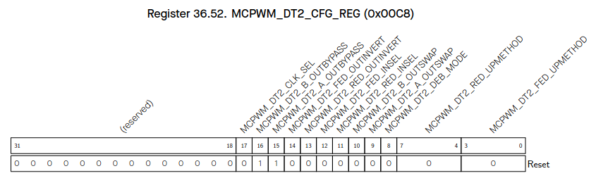

`MCPWM_DT2_FED_UPMETHOD` (R/W):

Update method for FED (falling edge delay) active register.
- 0: immediate
- When bit0 is set to 1: tez
- When bit1 is set to 1: tep
- When bit2 is set to 1: sync
- When bit3 is set to 1: disable the update

`MCPWM_DT2_RED_UPMETHOD` (R/W):

Update method for RED (rising edge delay) active register.
- 0: immediate
- When bit0 is set to 1: tez
- When bit1 is set to 1: tep
- When bit2 is set to 1: sync
- When bit3 is set to 1: disable the update

`MCPWM_DT2_DEB_MODE` (R/W):

S8 in table 36.3-5, dual-edge B mode.
- 0: fed/red take effect on different path separately
- 1: fed/red take effect on B path, A out is in bypass or dulpB mode

`MCPWM_DT2_A_OUTSWAP` (R/W):

S6 in table 36.3-5.

`MCPWM_DT2_B_OUTSWAP` (R/W):

S7 in table 36.3-5.

`MCPWM_DT2_RED_INSEL` (R/W):

S4 in table 36.3-5.

`MCPWM_DT2_FED_INSEL` (R/W):

S5 in table 36.3-5.

`MCPWM_DT2_RED_OUTINVERT` (R/W):

S2 in table 36.3-5.

`MCPWM_DT2_FED_OUTINVERT` (R/W):

S3 in table 36.3-5.

`MCPWM_DT2_A_OUTBYPASS` (R/W):

S1 in table 36.3-5.

`MCPWM_DT2_B_OUTBYPASS` (R/W):

S0 in table 36.3-5.

`MCPWM_DT2_CLK_SEL` (R/W):

Dead time generator 2 clock selection.
- 0: PWM_clk
- 1: PT_clk

---

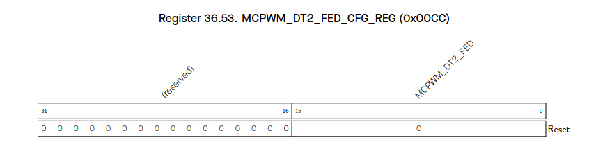

`MCPWM_DT2_FED` (R/W):

Shadow register for FED.

---

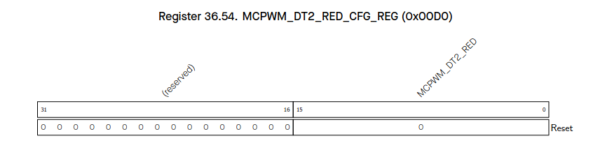

`MCPWM_DT2_RED` (R/W):

Shadow register for RED.

---

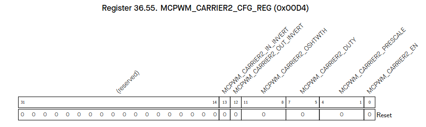

`MCPWM_CARRIER2_EN` (R/W):

When set, carrier2 function is enabled. When cleared, carrier2 is bypassed.

`MCPWM_CARRIER2_PRESCALE` (R/W):

PWM carrier2 clock (PC_clk) prescale value.
Period of PC_clk = period of PWM_clk * (PWM_CARRIER0_PRESCALE + 1).

`MCPWM_CARRIER2_DUTY` (R/W):

Carrier duty selection.
Duty = PWM_CARRIER0_DUTY/8.

`MCPWM_CARRIER2_OSHTWTH` (R/W):

Width of the first pulse in number of periods of the carrier.

`MCPWM_CARRIER2_OUT_INVERT` (R/W):

When set, invert the output of PWM2A and PWM2B for this sub-module.

`MCPWM_CARRIER2_IN_INVERT` (R/W):

When set, invert the input of PWM2A and PWM2B for this sub-module.

---

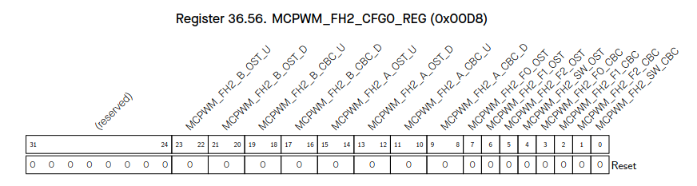

`MCPWM_FH2_SW_CBC` (R/W):

Enable register for software force cycle-by-cycle mode action.
- 0: disable
- 1: enable

`MCPWM_FH2_F2_CBC` (R/W):

event_f2 will trigger cycle-by-cycle mode action.
- 0: disable
- 1: enable

`MCPWM_FH2_F1_CBC` (R/W):

event_f1 will trigger cycle-by-cycle mode action.
- 0: disable
- 1: enable

`MCPWM_FH2_F0_CBC` (R/W):

event_f0 will trigger cycle-by-cycle mode action.
- 0: disable
- 1: enable

`MCPWM_FH2_SW_OST` (R/W):

Enable register for software force one-shot mode action.
- 0: disable
- 1: enable

`MCPWM_FH2_F2_OST` (R/W):

event_f2 will trigger one-shot mode action.
- 0: disable
- 1: enable

`MCPWM_FH2_F1_OST` (R/W):

event_f1 will trigger one-shot mode action.
- 0: disable
- 1: enable

`MCPWM_FH2_F0_OST` (R/W):

event_f0 will trigger one-shot mode action.
- 0: disable
- 1: enable

`MCPWM_FH2_A_CBC_D` (R/W):

Cycle-by-cycle mode action on PWM2A when fault event occurs and timer is decreasing.
- 0: do nothing
- 1: force low
- 2: force high
- 3: toggle

`MCPWM_FH2_A_CBC_U` (R/W):

Cycle-by-cycle mode action on PWM2A when fault event occurs and timer is increasing.
- 0: do nothing
- 1: force low
- 2: force high
- 3: toggle

`MCPWM_FH2_A_OST_D` (R/W):

One-shot mode action on PWM2A when fault event occurs and timer is decreasing.
- 0: do nothing
- 1: force low
- 2: force high
- 3: toggle

`MCPWM_FH2_A_OST_U` (R/W):

One-shot mode action on PWM2A when fault event occurs and timer is increasing.
- 0: do nothing
- 1: force low
- 2: force high
- 3: toggle

`MCPWM_FH2_B_CBC_D` (R/W):

Cycle-by-cycle mode action on PWM2B when fault event occurs and timer is decreasing.
- 0: do nothing
- 1: force low
- 2: force high
- 3: toggle

`MCPWM_FH2_B_CBC_U` (R/W):

Cycle-by-cycle mode action on PWM2B when fault event occurs and timer is increasing.
- 0: do nothing
- 1: force low
- 2: force high
- 3: toggle

`MCPWM_FH2_B_OST_D` (R/W):

One-shot mode action on PWM2B when fault event occurs and timer is decreasing.
- 0: do nothing
- 1: force low
- 2: force high
- 3: toggle

`MCPWM_FH2_B_OST_U` (R/W):

One-shot mode action on PWM2B when fault event occurs and timer is increasing.
- 0: do nothing
- 1: force low
- 2: force high
- 3: toggle

---

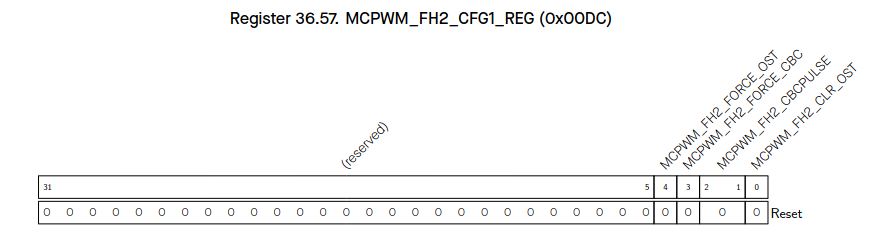

`MCPWM_FH2_CLR_OST` (R/W):

A rising edge will clear on going one-shot mode action.

`MCPWM_FH2_CBCPULSE` (R/W):

Cycle-by-cycle mode action refresh moment selection.
- When bit0 is set to 1: TEZ
- When bit1 is set to 1: TEP

`MCPWM_FH2_FORCE_CBC` (R/W):

A toggle triggers a cycle-by-cycle mode action.

`MCPWM_FH2_FORCE_OST` (R/W):

A toggle (software negate its value) triggers a one-shot mode action.

---

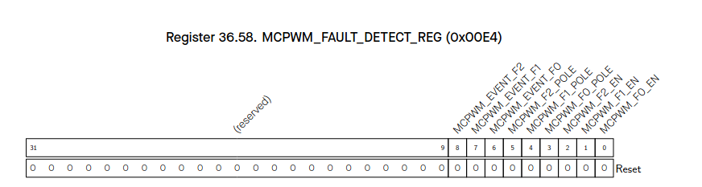

`MCPWM_F0_EN` (R/W):

When set, event_f0 generation is enabled.

`MCPWM_F1_EN` (R/W):

When set, event_f1 generation is enabled.

`MCPWM_F2_EN` (R/W):

When set, event_f2 generation is enabled.

`MCPWM_F0_POLE` (R/W):

Set event_f0 trigger polarity on FAULT0 source from GPIO matrix.
- 0: level low
- 1: level high

`MCPWM_F1_POLE` (R/W):

Set event_f1 trigger polarity on FAULT1 source from GPIO matrix.
- 0: level low
- 1: level high

`MCPWM_F2_POLE` (R/W):

Set event_f2 trigger polarity on FAULT2 source from GPIO matrix.
- 0: level low
- 1: level high

`MCPWM_EVENT_F0` (RO):

Set and reset by hardware. If set, event_f0 is on going.

`MCPWM_EVENT_F1` (RO):

Set and reset by hardware. If set, event_f1 is on going.

`MCPWM_EVENT_F2` (RO):

Set and reset by hardware. If set, event_f2 is on going.

---

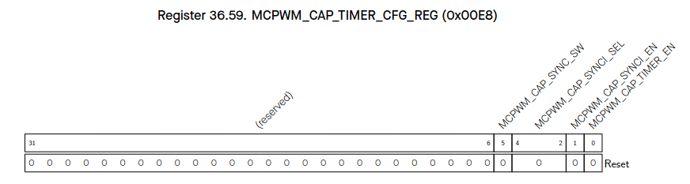

`MCPWM_CAP_TIMER_EN` (R/W):

When set, capture timer incrementing under APB_clk is enabled.

`MCPWM_CAP_SYNCI_EN` (R/W):

When set, capture timer sync is enabled.

`MCPWM_CAP_SYNCI_SEL` (R/W):

Capture module sync input selection.
- 0: none
- 1: timer0 sync_out
- 2: timer1 sync_out
- 3: timer2 sync_out
- 4: SYNC0 from GPIO matrix
- 5: SYNC1 from GPIO matrix
- 6: SYNC2 from GPIO matrix

`MCPWM_CAP_SYNC_SW` (WT):

When reg_cap_synci_en is 1, write 1 will trigger a capture timer sync, capture timer is loaded with value in phase register.

---

`MCPWM_CAP_TIMER_PHASE` (R/W):

Phase value for capture timer sync operation.

---

`MCPWM_CAP0_EN` (R/W):

When set, capture on channel 0 is enabled.

`MCPWM_CAP0_MODE` (R/W):

Edge of capture on channel 0 after prescaling.
- When bit0 is set to 1: enable capture on the falling edge
- When bit1 is set to 1: enable capture on the rising edge

`MCPWM_CAP0_PRESCALE` (R/W):

Value of prescaling on rising edge of CAP0. Prescale value = PWM_CAP0_PRESCALE + 1.

`MCPWM_CAP0_IN_INVERT` (R/W):

When set, CAP0 form GPIO matrix is inverted before prescale.

`MCPWM_CAP0_SW` (WT):

Write 1 will trigger a software forced capture on channel 0.

---

`MCPWM_CAP1_EN` (R/W):

When set, capture on channel 1 is enabled.

`MCPWM_CAP1_MODE` (R/W):

Edge of capture on channel 1 after prescaling.
- When bit0 is set to 1: enable capture on the falling edge
- When bit1 is set to 1: enable capture on the rising edge

`MCPWM_CAP1_PRESCALE` (R/W):

Value of prescaling on rising edge of CAP1. Prescale value = PWM_CAP1_PRESCALE + 1.

`MCPWM_CAP1_IN_INVERT` (R/W):

When set, CAP1 form GPIO matrix is inverted before prescale.

`MCPWM_CAP1_SW` (WT):

Write 1 will trigger a software forced capture on channel 1.

---

`MCPWM_CAP2_EN` (R/W):

When set, capture on channel 2 is enabled.

`MCPWM_CAP2_MODE` (R/W):

Edge of capture on channel 2 after prescaling.
- When bit0 is set to 1: enable capture on the falling edge
- When bit1 is set to 1: enable capture on the rising edge

`MCPWM_CAP2_PRESCALE` (R/W):

Value of prescaling on rising edge of CAP2. Prescale value = PWM_CAP2_PRESCALE + 1.

`MCPWM_CAP2_IN_INVERT` (R/W):

When set, CAP2 form GPIO matrix is inverted before prescale.

`MCPWM_CAP2_SW` (WT):

Write 1 will trigger a software forced capture on channel 2.

---

`MCPWM_CAP0_VALUE` (RO):

Value of last capture on channel 0.

---

`MCPWM_CAP1_VALUE` (RO):

Value of last capture on channel 1.

---

`MCPWM_CAP2_VALUE` (RO):

Value of last capture on channel 2.

---

`MCPWM_CAP0_EDGE` (RO):

Edge of last capture trigger on channel 0.
- 0: rising edge
- 1: falling edge

`MCPWM_CAP1_EDGE` (RO):

Edge of last capture trigger on channel 1.
- 0: rising edge
- 1: falling edge

`MCPWM_CAP2_EDGE` (RO):

Edge of last capture trigger on channel 2.
- 0: rising edge
- 1: falling edge

---

`MCPWM_GLOBAL_UP_EN` (R/W):

The global enable of update of all active registers in MCPWM module.

`MCPWM_GLOBAL_FORCE_UP` (R/W):

A toggle (software invert its value) will trigger a forced update of all active registers in MCPWM module.

`MCPWM_OP0_UP_EN` (R/W):

When set and PWM_GLOBAL_UP_EN is set, update of active registers in PWM operator 0 are enabled.

`MCPWM_OP0_FORCE_UP` (R/W):

A toggle (software invert its value) will trigger a forced update of active registers in PWM operator 0.

`MCPWM_OP1_UP_EN` (R/W):

When set and PWM_GLOBAL_UP_EN is set, update of active registers in PWM operator 1 are enabled.

`MCPWM_OP1_FORCE_UP` (R/W):

A toggle (software invert its value) will trigger a forced update of active registers in PWM operator 1.

`MCPWM_OP2_UP_EN` (R/W):

When set and PWM_GLOBAL_UP_EN is set, update of active registers in PWM operator 2 are enabled.

`MCPWM_OP2_FORCE_UP` (R/W):

A toggle (software invert its value) will trigger a forced update of active registers in PWM operator 2.

---

`MCPWM_TIMER0_STOP_INT_ENA` (R/W):

The enable bit for the interrupt triggered when the timer 0 stops.

`MCPWM_TIMER1_STOP_INT_ENA` (R/W):

The enable bit for the interrupt triggered when the timer 1 stops.

`MCPWM_TIMER2_STOP_INT_ENA` (R/W):

The enable bit for the interrupt triggered when the timer 2 stops.

`MCPWM_TIMER0_TEZ_INT_ENA` (R/W):

The enable bit for the interrupt triggered by a PWM timer 0 TEZ event.

`MCPWM_TIMER1_TEZ_INT_ENA` (R/W):

The enable bit for the interrupt triggered by a PWM timer 1 TEZ event.

`MCPWM_TIMER2_TEZ_INT_ENA` (R/W):

The enable bit for the interrupt triggered by a PWM timer 2 TEZ event.

`MCPWM_TIMER0_TEP_INT_ENA` (R/W):

The enable bit for the interrupt triggered by a PWM timer 0 TEP event.

`MCPWM_TIMER1_TEP_INT_ENA` (R/W):

The enable bit for the interrupt triggered by a PWM timer 1 TEP event.

`MCPWM_TIMER2_TEP_INT_ENA` (R/W):

The enable bit for the interrupt triggered by a PWM timer 2 TEP event.

`MCPWM_FAULT0_INT_ENA` (R/W):

The enable bit for the interrupt triggered when event_f0 starts.

`MCPWM_FAULT1_INT_ENA` (R/W):

The enable bit for the interrupt triggered when event_f1 starts.

`MCPWM_FAULT2_INT_ENA` (R/W):

The enable bit for the interrupt triggered when event_f2 starts.

`MCPWM_FAULT0_CLR_INT_ENA` (R/W):

The enable bit for the interrupt triggered when event_f0 ends.

`MCPWM_FAULT1_CLR_INT_ENA` (R/W):

The enable bit for the interrupt triggered when event_f1 ends.

`MCPWM_FAULT2_CLR_INT_ENA` (R/W):

The enable bit for the interrupt triggered when event_f2 ends.

`MCPWM_OP0_TEA_INT_ENA` (R/W):

The enable bit for the interrupt triggered by a PWM operator 0 TEA event.

`MCPWM_OP1_TEA_INT_ENA` (R/W):

The enable bit for the interrupt triggered by a PWM operator 1 TEA event.

`MCPWM_OP2_TEA_INT_ENA` (R/W):

The enable bit for the interrupt triggered by a PWM operator 2 TEA event.

`MCPWM_OP0_TEB_INT_ENA` (R/W):

The enable bit for the interrupt triggered by a PWM operator 0 TEB event.

`MCPWM_OP1_TEB_INT_ENA` (R/W):

The enable bit for the interrupt triggered by a PWM operator 1 TEB event.

`MCPWM_OP2_TEB_INT_ENA` (R/W):

The enable bit for the interrupt triggered by a PWM operator 2 TEB event.

`MCPWM_FH0_CBC_INT_ENA` (R/W):

The enable bit for the interrupt triggered by a cycle-by-cycle mode action on PWM0.

`MCPWM_FH1_CBC_INT_ENA` (R/W):

The enable bit for the interrupt triggered by a cycle-by-cycle mode action on PWM1.

`MCPWM_FH2_CBC_INT_ENA` (R/W):

The enable bit for the interrupt triggered by a cycle-by-cycle mode action on PWM2.

`MCPWM_FH0_OST_INT_ENA` (R/W):

The enable bit for the interrupt triggered by a one-shot mode action on PWM0.

`MCPWM_FH1_OST_INT_ENA` (R/W):

The enable bit for the interrupt triggered by a one-shot mode action on PWM1.

`MCPWM_FH2_OST_INT_ENA` (R/W):

The enable bit for the interrupt triggered by a one-shot mode action on PWM2.

`MCPWM_CAP0_INT_ENA` (R/W):

The enable bit for the interrupt triggered by capture on channel 0.

`MCPWM_CAP1_INT_ENA` (R/W):

The enable bit for the interrupt triggered by capture on channel 1.

`MCPWM_CAP2_INT_ENA` (R/W):

The enable bit for the interrupt triggered by capture on channel 2.

---

`MCPWM_TIMER0_STOP_INT_RAW` (R/WTC/SS):

The raw status bit for the interrupt triggered when the timer 0 stops.

`MCPWM_TIMER1_STOP_INT_RAW` (R/WTC/SS):

The raw status bit for the interrupt triggered when the timer 1 stops.

`MCPWM_TIMER2_STOP_INT_RAW` (R/WTC/SS):

The raw status bit for the interrupt triggered when the timer 2 stops.

`MCPWM_TIMER0_TEZ_INT_RAW` (R/WTC/SS):

The raw status bit for the interrupt triggered by a PWM timer 0 TEZ event.

`MCPWM_TIMER1_TEZ_INT_RAW` (R/WTC/SS):

The raw status bit for the interrupt triggered by a PWM timer 1 TEZ event.

`MCPWM_TIMER2_TEZ_INT_RAW` (R/WTC/SS):

The raw status bit for the interrupt triggered by a PWM timer 2 TEZ event.

`MCPWM_TIMER0_TEP_INT_RAW` (R/WTC/SS):

The raw status bit for the interrupt triggered by a PWM timer 0 TEP event.

`MCPWM_TIMER1_TEP_INT_RAW` (R/WTC/SS):

The raw status bit for the interrupt triggered by a PWM timer 1 TEP event.

`MCPWM_TIMER2_TEP_INT_RAW` (R/WTC/SS):

The raw status bit for the interrupt triggered by a PWM timer 2 TEP event.

`MCPWM_FAULT0_INT_RAW` (R/WTC/SS):

The raw status bit for the interrupt triggered when event_f0 starts.

`MCPWM_FAULT1_INT_RAW` (R/WTC/SS):

The raw status bit for the interrupt triggered when event_f1 starts.

`MCPWM_FAULT2_INT_RAW` (R/WTC/SS):

The raw status bit for the interrupt triggered when event_f2 starts.

`MCPWM_FAULT0_CLR_INT_RAW` (R/WTC/SS):

The raw status bit for the interrupt triggered when event_f0 ends.

`MCPWM_FAULT1_CLR_INT_RAW` (R/WTC/SS):

The raw status bit for the interrupt triggered when event_f1 ends.

`MCPWM_FAULT2_CLR_INT_RAW` (R/WTC/SS):

The raw status bit for the interrupt triggered when event_f2 ends.

`MCPWM_OP0_TEA_INT_RAW` (R/WTC/SS):

The raw status bit for the interrupt triggered by a PWM operator 0 TEA event.

`MCPWM_OP1_TEA_INT_RAW` (R/WTC/SS):

The raw status bit for the interrupt triggered by a PWM operator 1 TEA event.

`MCPWM_OP2_TEA_INT_RAW` (R/WTC/SS):

The raw status bit for the interrupt triggered by a PWM operator 2 TEA event.

`MCPWM_OP0_TEB_INT_RAW` (R/WTC/SS):

The raw status bit for the interrupt triggered by a PWM operator 0 TEB event.

`MCPWM_OP1_TEB_INT_RAW` (R/WTC/SS):

The raw status bit for the interrupt triggered by a PWM operator 1 TEB event.

`MCPWM_OP2_TEB_INT_RAW` (R/WTC/SS):

The raw status bit for the interrupt triggered by a PWM operator 2 TEB event.

`MCPWM_FH0_CBC_INT_RAW` (R/WTC/SS):

The raw status bit for the interrupt triggered by a cycle-by-cycle mode action on PWM0.

`MCPWM_FH1_CBC_INT_RAW` (R/WTC/SS):

The raw status bit for the interrupt triggered by a cycle-by-cycle mode action on PWM1.

`MCPWM_FH2_CBC_INT_RAW` (R/WTC/SS):

The raw status bit for the interrupt triggered by a cycle-by-cycle mode action on PWM2.

`MCPWM_FH0_OST_INT_RAW` (R/WTC/SS):

The raw status bit for the interrupt triggered by a one-shot mode action on PWM0.

`MCPWM_FH1_OST_INT_RAW` (R/WTC/SS):

The raw status bit for the interrupt triggered by a one-shot mode action on PWM1.

`MCPWM_FH2_OST_INT_RAW` (R/WTC/SS):

The raw status bit for the interrupt triggered by a one-shot mode action on PWM2.

`MCPWM_CAP0_INT_RAW` (R/WTC/SS):

The raw status bit for the interrupt triggered by capture on channel 0.

`MCPWM_CAP1_INT_RAW` (R/WTC/SS):

The raw status bit for the interrupt triggered by capture on channel 1.

`MCPWM_CAP2_INT_RAW` (R/WTC/SS):

The raw status bit for the interrupt triggered by capture on channel 2.

---

`MCPWM_TIMER0_STOP_INT_ST` (RO):

The masked status bit for the interrupt triggered when the timer 0 stops.

`MCPWM_TIMER1_STOP_INT_ST` (RO):

The masked status bit for the interrupt triggered when the timer 1 stops.

`MCPWM_TIMER2_STOP_INT_ST` (RO):

The masked status bit for the interrupt triggered when the timer 2 stops.

`MCPWM_TIMER0_TEZ_INT_ST` (RO):

The masked status bit for the interrupt triggered by a PWM timer 0 TEZ event.

`MCPWM_TIMER1_TEZ_INT_ST` (RO):

The masked status bit for the interrupt triggered by a PWM timer 1 TEZ event.

`MCPWM_TIMER2_TEZ_INT_ST` (RO):

The masked status bit for the interrupt triggered by a PWM timer 2 TEZ event.

`MCPWM_TIMER0_TEP_INT_ST` (RO):

The masked status bit for the interrupt triggered by a PWM timer 0 TEP event.

`MCPWM_TIMER1_TEP_INT_ST` (RO):

The masked status bit for the interrupt triggered by a PWM timer 1 TEP event.

`MCPWM_TIMER2_TEP_INT_ST` (RO):

The masked status bit for the interrupt triggered by a PWM timer 2 TEP event.

`MCPWM_FAULT0_INT_ST` (RO):

The masked status bit for the interrupt triggered when event_f0 starts.

`MCPWM_FAULT1_INT_ST` (RO):

The masked status bit for the interrupt triggered when event_f1 starts.

`MCPWM_FAULT2_INT_ST` (RO):

The masked status bit for the interrupt triggered when event_f2 starts.

`MCPWM_FAULT0_CLR_INT_ST` (RO):

The masked status bit for the interrupt triggered when event_f0 ends.

`MCPWM_FAULT1_CLR_INT_ST` (RO):

The masked status bit for the interrupt triggered when event_f1 ends.

`MCPWM_FAULT2_CLR_INT_ST` (RO):

The masked status bit for the interrupt triggered when event_f2 ends.

`MCPWM_OP0_TEA_INT_ST` (RO):

The masked status bit for the interrupt triggered by a PWM operator 0 TEA event.

`MCPWM_OP1_TEA_INT_ST` (RO):

The masked status bit for the interrupt triggered by a PWM operator 1 TEA event.

`MCPWM_OP2_TEA_INT_ST` (RO):

The masked status bit for the interrupt triggered by a PWM operator 2 TEA event.

`MCPWM_OP0_TEB_INT_ST` (RO):

The masked status bit for the interrupt triggered by a PWM operator 0 TEB event.

`MCPWM_OP1_TEB_INT_ST` (RO):

The masked status bit for the interrupt triggered by a PWM operator 1 TEB event.

`MCPWM_OP2_TEB_INT_ST` (RO):

The masked status bit for the interrupt triggered by a PWM operator 2 TEB event.

`MCPWM_FH0_CBC_INT_ST` (RO):

The masked status bit for the interrupt triggered by a cycle-by-cycle mode action on PWM0.

`MCPWM_FH1_CBC_INT_ST` (RO):

The masked status bit for the interrupt triggered by a cycle-by-cycle mode action on PWM1.

`MCPWM_FH2_CBC_INT_ST` (RO):

The masked status bit for the interrupt triggered by a cycle-by-cycle mode action on PWM2.

`MCPWM_FH0_OST_INT_ST` (RO):

The masked status bit for the interrupt triggered by a one-shot mode action on PWM0.

`MCPWM_FH1_OST_INT_ST` (RO):

The masked status bit for the interrupt triggered by a one-shot mode action on PWM1.

`MCPWM_FH2_OST_INT_ST` (RO):

The masked status bit for the interrupt triggered by a one-shot mode action on PWM2.

`MCPWM_CAP0_INT_ST` (RO):

The masked status bit for the interrupt triggered by capture on channel 0.

`MCPWM_CAP1_INT_ST` (RO):

The masked status bit for the interrupt triggered by capture on channel 1.

`MCPWM_CAP2_INT_ST` (RO):

The masked status bit for the interrupt triggered by capture on channel 2.

---

`MCPWM_TIMER0_STOP_INT_CLR` (WT):

Set this bit to clear the interrupt triggered when the timer 0 stops.

`MCPWM_TIMER1_STOP_INT_CLR` (WT):

Set this bit to clear the interrupt triggered when the timer 1 stops.

`MCPWM_TIMER2_STOP_INT_CLR` (WT):

Set this bit to clear the interrupt triggered when the timer 2 stops.

`MCPWM_TIMER0_TEZ_INT_CLR` (WT):

Set this bit to clear the interrupt triggered by a PWM timer 0 TEZ event.

`MCPWM_TIMER1_TEZ_INT_CLR` (WT):

Set this bit to clear the interrupt triggered by a PWM timer 1 TEZ event.

`MCPWM_TIMER2_TEZ_INT_CLR` (WT):

Set this bit to clear the interrupt triggered by a PWM timer 2 TEZ event.

`MCPWM_TIMER0_TEP_INT_CLR` (WT):

Set this bit to clear the interrupt triggered by a PWM timer 0 TEP event.

`MCPWM_TIMER1_TEP_INT_CLR` (WT):

Set this bit to clear the interrupt triggered by a PWM timer 1 TEP event.

`MCPWM_TIMER2_TEP_INT_CLR` (WT):

Set this bit to clear the interrupt triggered by a PWM timer 2 TEP event.

`MCPWM_FAULT0_INT_CLR` (WT):

Set this bit to clear the interrupt triggered when event_f0 starts.

`MCPWM_FAULT1_INT_CLR` (WT):

Set this bit to clear the interrupt triggered when event_f1 starts.

`MCPWM_FAULT2_INT_CLR` (WT):

Set this bit to clear the interrupt triggered when event_f2 starts.

`MCPWM_FAULT0_CLR_INT_CLR` (WT):

Set this bit to clear the interrupt triggered when event_f0 ends.

`MCPWM_FAULT1_CLR_INT_CLR` (WT):

Set this bit to clear the interrupt triggered when event_f1 ends.

`MCPWM_FAULT2_CLR_INT_CLR` (WT):

Set this bit to clear the interrupt triggered when event_f2 ends.

`MCPWM_OP0_TEA_INT_CLR` (WT):

Set this bit to clear the interrupt triggered by a PWM operator 0 TEA event.

`MCPWM_OP1_TEA_INT_CLR` (WT):

Set this bit to clear the interrupt triggered by a PWM operator 1 TEA event.

`MCPWM_OP2_TEA_INT_CLR` (WT):

Set this bit to clear the interrupt triggered by a PWM operator 2 TEA event.

`MCPWM_OP0_TEB_INT_CLR` (WT):

Set this bit to clear the interrupt triggered by a PWM operator 0 TEB event.

`MCPWM_OP1_TEB_INT_CLR` (WT):

Set this bit to clear the interrupt triggered by a PWM operator 1 TEB event.

`MCPWM_OP2_TEB_INT_CLR` (WT):

Set this bit to clear the interrupt triggered by a PWM operator 2 TEB event.

`MCPWM_FH0_CBC_INT_CLR` (WT):

Set this bit to clear the interrupt triggered by a cycle-by-cycle mode action on PWM0.

`MCPWM_FH1_CBC_INT_CLR` (WT):

Set this bit to clear the interrupt triggered by a cycle-by-cycle mode action on PWM1.

`MCPWM_FH2_CBC_INT_CLR` (WT):

Set this bit to clear the interrupt triggered by a cycle-by-cycle mode action on PWM2.

`MCPWM_FH0_OST_INT_CLR` (WT):

Set this bit to clear the interrupt triggered by a one-shot mode action on PWM0.

`MCPWM_FH1_OST_INT_CLR` (WT):

Set this bit to clear the interrupt triggered by a one-shot mode action on PWM1.

`MCPWM_FH2_OST_INT_CLR` (WT):

Set this bit to clear the interrupt triggered by a one-shot mode action on PWM2.

`MCPWM_CAP0_INT_CLR` (WT):

Set this bit to clear the interrupt triggered by capture on channel 0.

`MCPWM_CAP1_INT_CLR` (WT):

Set this bit to clear the interrupt triggered by capture on channel 1.

`MCPWM_CAP2_INT_CLR` (WT):

Set this bit to clear the interrupt triggered by capture on channel 2.

---

`MCPWM_CLK_EN` (R/W):

Force clock on for this register file.

---

`MCPWM_DATE` (R/W):

Version of this register file.
