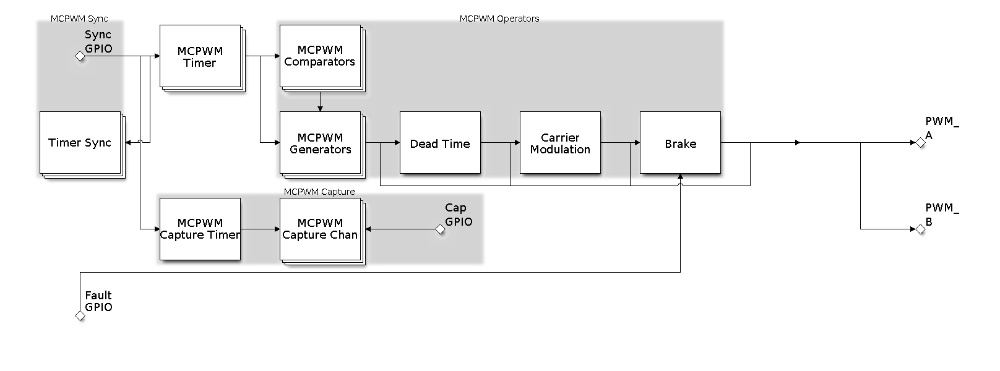

# Cornell Notes

## Topic: Overview and Features - Programming guide

## Date: 22/06/2026

---

<strong><em>"DO NOT JUST TALK ABOUT IT — SHOW IT"</em></strong>

---

### Cue Column (Questions, Keywords, or Prompts)

- What problems is MCPWM designed to solve on ESP32-S3?
- Which hardware submodules participate in waveform generation and measurement?
- Which ESP32-S3 capabilities are unavailable even though common ESP-IDF headers declare them?

---

### Notes Section (Main Notes)

#### Motor Control Pulse Width Modulator (MCPWM)

The MCPWM peripheral is a versatile PWM generator, which contains various submodules to make it a key element in power electronic applications like motor control, digital power, and so on. Typically, the MCPWM peripheral can be used in the following scenarios:

- Digital motor control, e.g., brushed/brushless DC motor, RC servo motor
- Switch mode-based digital power conversion
- Power DAC, where the duty cycle is equivalent to a DAC analog value
- Calculate external pulse width, and convert it into other analog values like speed, - distance
- Generate Space Vector PWM (SVPWM) signals for Field Oriented Control (FOC)

The main submodules are listed in the following diagram:

- **MCPWM Timer**: The time base of the final PWM signal. It also determines the event timing of other submodules.
- **MCPWM Operator**: The key module that is responsible for generating the PWM waveforms. It consists of other submodules, like comparator, PWM generator, dead time, and carrier modulator.
- **MCPWM Comparator**: The compare module takes the time-base count value as input, and continuously compares it to the threshold value configured. When the timer is equal to any of the threshold values, a compare event will be generated and the MCPWM generator can update its level accordingly.
- **MCPWM Generator**: One MCPWM generator can generate a pair of PWM waves, complementarily or independently, based on various events triggered by other submodules like MCPWM Timer and MCPWM Comparator.
- **MCPWM Fault**: The fault module is used to detect the fault condition from outside, mainly via the GPIO matrix. Once the fault signal is active, MCPWM Operator will force all the generators into a predefined state to protect the system from damage.
- **MCPWM Sync**: The sync module is used to synchronize the MCPWM timers, so that the final PWM signals generated by different MCPWM generators can have a fixed phase difference. The sync signal can be routed from the GPIO matrix or from an MCPWM Timer event.
- **MCPWM Dead Time**: This submodule is used to insert extra delay to the existing PWM edges generated in the previous steps.
- **MCPWM Carrier Modulation**: The carrier submodule can modulate a high-frequency carrier signal into PWM waveforms by the generator and dead time submodules. This capability is mandatory for controlling the power-switching elements.
- **Brake**: MCPWM operator can set how to brake the generators when a particular fault is detected. You can shut down the PWM output immediately or regulate the PWM output cycle by cycle, depending on how critical the fault is.
- **MCPWM Capture**: This is a standalone submodule that can work even without the above MCPWM operators. The capture consists one dedicated timer and several independent channels, with each channel connected to the GPIO. A pulse on the GPIO triggers the capture timer to store the time-base count value and then notify you by an interrupt. Using this feature, you can measure a pulse width precisely. What is more, the capture timer can also be synchronized by the MCPWM Sync submodule.

---

#### Related Use Cases

- [MCPWM Resource Relationships and Software Layers](../03_use_cases/01_overview_and_resource_relationships.md)
- [Complete MCPWM Application Sequences](../03_use_cases/13_complete_application_sequences.md)

#### ESP32-S3 capability boundary

ESP32-S3 has two independent MCPWM groups, each with three timers, three operators, six generator outputs, three fault inputs, three synchronization inputs, and one capture timer with three channels. ESP-IDF `v6.0.1` does not enable MCPWM ETM, event-comparator, or sleep-retention support for this target; declarations guarded for other targets are not usable here.

Official guide: [ESP-IDF v6.0.1 MCPWM Programming Guide](https://docs.espressif.com/projects/esp-idf/en/v6.0.1/esp32s3/api-reference/peripherals/mcpwm.html). Hardware provenance: TRM Chapter 36, PDF pp. 1326–1414; begin with [TRM overview](../01_technical_reference_manual/01_overview_and_features.md).

### Summary Section (Summary of Notes)

MCPWM separates time bases, waveform policy, protection, synchronization, and capture into owned resources. Build applications through public handles, keep parent resources alive until their children are deleted, and check ESP32-S3 capability macros before using target-gated APIs.
